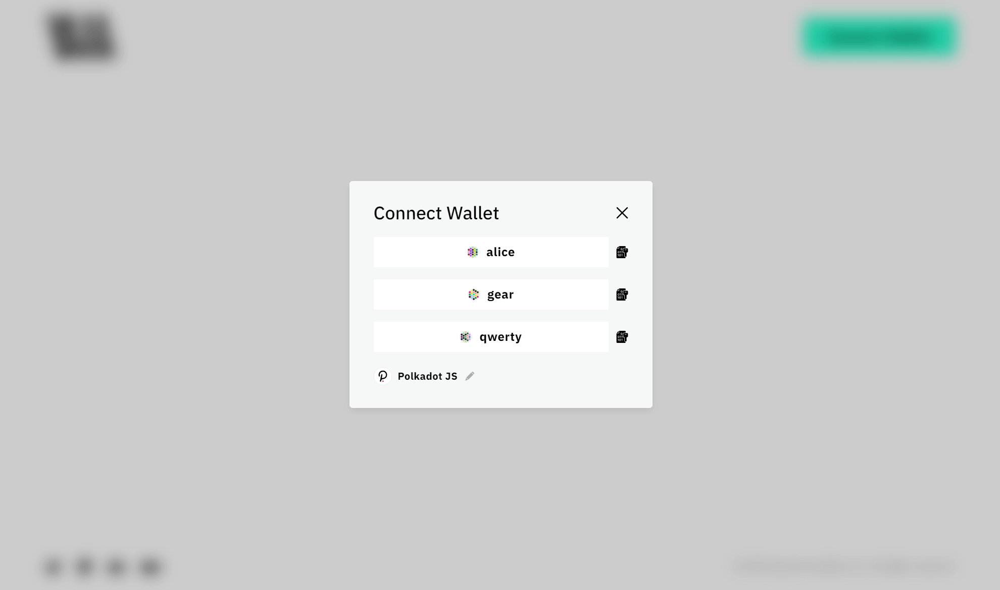

## Accelerate Decentralized App Development

For those looking to swiftly launch decentralized applications (dApps) on the Vara network, the Vara React Application Template (aka `create-vara-app`) offers a pre-configured solution designed to streamline the development process. With its well-thought-out infrastructure and convenient features, this template allows for quick creation and deployment of dApps on the Vara network.

The Vara React Application Template is available in two themed variations:
- **light theme** with Vara logo, [GitHub](https://github.com/gear-foundation/dapps/tree/master/frontend/templates/create-vara-app)
- **dark theme** with Gear logo, [GitHub](https://github.com/gear-foundation/dapps/tree/master/frontend/templates/create-gear-app)

| Home Page | Wallet Connection |
|------|------|
|  |  |
|  |  |

This template is packed with benefits and features that make it an ideal choice for developers seeking efficiency and simplicity in their dApp development workflow.

## Features

Key features of the Vara React Application Template include:

1. **Vara API Connections**: Integrating with the Vara blockchain is made seamless with pre-configured API connections, eliminating the need for manual setup. This enables easy interaction with the blockchain and access to essential functionalities.

2. **Login Interface**: The template includes a pre-built login interface, simplifying the implementation of user authentication and secure management of user access. This allows developers to focus on building core features without worrying about the authentication process.

3. **Vara React-Hooks Support**: Designed to leverage Gear's react-hooks library, the template provides a smooth and intuitive development experience. It includes all necessary environments and configurations for seamless integration of react-hooks into the dApp.

4. **Branded UI-Kit**: The template offers a branded UI-kit to ensure a visually appealing and consistent user interface. Aligned with Gear's branding guidelines, the UI-kit helps create an attractive and professional-looking dApp, allowing developers to concentrate on unique aspects while maintaining a polished design.

The Vara React Application Template is an invaluable resource for developers in the blockchain space, whether experienced or just starting out. It significantly speeds up the dApp development process, simplifies integration with the Vara network, and provides essential features like a robust login interface and branded UI-kit.

## Installation

- Create new project based on **light** themed template (Vara):

    ```sh
    npx degit gear-foundation/dapps/frontend/templates/create-vara-app dApp
    cd dApp
    ```

- Create new project based on **dark** themed template (Gear):

    ```sh
    npx degit gear-foundation/dapps/frontend/templates/create-gear-app dApp
    cd dApp
    ```
