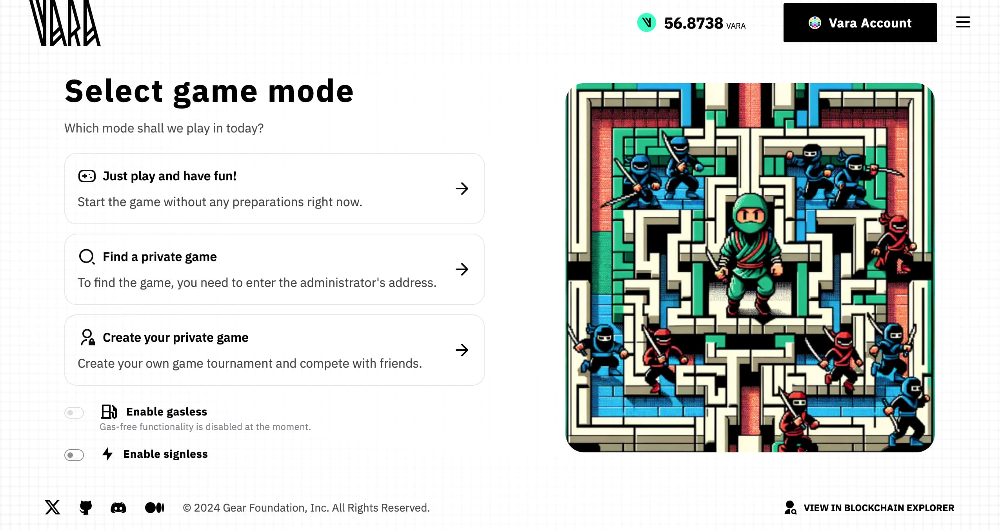

Vara-man is a classic arcade game, the main character is Vara mouse, who must collect all the coins in the allotted time. In the labyrinth, the main character will encounter cat enemies that must be avoided in order to survive and collect all the coins.

The game example uses the [**EZ-Transactions package**](/docs/api/tooling/gasless-txs.md) that simplifies blockchain interactions by enabling gasless and signless transactions. Anyone can use it to integrate into their dApp projects. For more details, visit the [GitHub page](https://github.com/gear-foundation/dapps/tree/master/frontend/packages/ez-transactions).

It implies [vouchers](/docs/api/vouchers.md) that allow users to play with a zero tokens on their balance (**gasless transactions**). This requires activation of the backend to issue vouchers (instructions for voucher integration will be detailed in the article).

Another feature of this example is an option that allos anyone to interact with the dApp without needing to sign in (**signless transactions**). The dApp transaction operates as usual with one difference — a voucher is issued not directly to a user, but to a temporarily created account (sub-account) to which the user grants temporary rights to sign transactions on their behalf in this application.

These features allow users to interact with the game for a certain period without the need to individually sign each transaction. By eliminating the repetitive signing process, this approach streamlines interactions and significantly improves the overall UX efficiency.

The source code, developed using the [Sails](../../build/sails/sails.mdx) framework, is available on [GitHub](https://github.com/gear-foundation/dapps/tree/master/contracts/vara-man). This article describes the program interface, data structure, basic functions and explains their purpose. It can be used as is or modified to suit your own scenarios. The game has several reward modes, one of which requires connecting the fungible token program that needs to be uploaded separately.

Also everyone can play the game via this link - [Play VaraMan](https://vara-man.vara.network/) (VARA tokens are requred for gas fees).

## How to run

1. Build a program
> Additional details regarding this matter can be located within the [README](https://github.com/gear-foundation/dapps/tree/master/contracts/vara-man/README.md) directory of the program.

2. Upload the program to the [Vara Network Testnet](https://idea.gear-tech.io/programs?node=wss%3A%2F%2Ftestnet.vara.network)
> Further details regarding the process of program uploading can be located within the [Getting Started](../../getting-started-in-5-minutes#deploy-your-program-to-the-testnet) section.

3. Build and run user interface
> More information about this can be found in the [README](https://github.com/gear-foundation/dapps/blob/master/frontend/apps/vara-man/README.md) directory of the frontend.

4. **Optional**.
> In case of a reward mode in the form of fungible tokens , build the program as described in the [README](https://github.com/gear-foundation/standards/tree/master/extended-vft/README.md) and upload the program to the [Vara Network Testnet](https://idea.gear-tech.io/programs?node=wss%3A%2F%2Ftestnet.vara.network). After that it will be necessary to send a message `ChangeStatus` to the program to put it in status `StartedWithFungibleToken { ft_address }`, where the address of the loaded program should be specified.

5. **Optional**. Build and run the backend to release vouchers.

## Implementation details

The VaraMan program contains the following information:

```rust title="vara-man/app/src/services/game/mod.rs"
pub struct GameStorage {
    tournaments: HashMap<ActorId, Tournament>,
    players_to_game_id: HashMap<ActorId, ActorId>,
    status: Status,
    config: Config,
    admins: Vec<ActorId>,
    dns_info: Option<(ActorId, String)>,
}
```
* `tournaments` - this field contains the addresses of the players and information about their games
* `players_to_game_id` – this field maps each player's address to the address of the game they are currently playing in.
* `status` - program status
* `config` - program configuration
* `admins` - admins addresses
* `dns_info` - optional field that stores the [dDNS](../Infra/dein.md) address and the program name

Where the structure of the `Tournament` is defined as follows

```rust title="vara-man/app/src/services/game/mod.rs"
pub struct Tournament {
    tournament_name: String,
    admin: ActorId,
    level: Level,
    participants: HashMap<ActorId, Player>,
    bid: u128,
    stage: Stage,
    duration_ms: u32,
}
```
* `tournament_name` - the name of the tournament
* `admin` - the address of the tournament administrator
* `level` - level of difficulty (Easy/Medium/Hard)
* `participants` - a list of players and their corresponding information
* `bid` - the entry fee or wager required to participate in the tournament
* `stage` - the current stage of the tournament (Registration, Started, or Finished)
* `duration_ms` - the duration of the tournament in milliseconds


```rust title="vara-man/app/src/services/game/utils.rs"
pub struct Player {
    pub name: String,
    pub time: u128,
    pub points: u128,
}
```
* `name` - the player's name
* `time` - the total time the player has spent in the game
* `points` - the player's score or points accumulated in the tournament

```rust title="vara-man/app/src/services/game/utils.rs"
pub enum Stage {
    #[default]
    Registration,
    Started(u64),
    Finished(Vec<ActorId>),
}
```
* `Registration` - the tournament is in the registration phase
* `Started(u64)` - the tournament has begun, with a start timestamp
* `Finished(Vec<ActorId>)` - the tournament is completed, and a list of winners is available

The program has several modes:

```rust title="vara-man/app/src/services/game/utils.rs"
pub enum Status {
    #[default]
    Paused,
    StartedUnrewarded,
    StartedWithFungibleToken {
        ft_address: ActorId,
    },
    StartedWithNativeToken,
}
```
* `Paused` - this status means that the game is suspended
* `StartedUnrewarded` - the mode in which the reward is not given
* `StartedWithFungibleToken` - the reward is given in the form of fungible tokens (the fungible token program must be uploaded separately)
* `StartedWithNativeToken` - the reward is given in the form of native tokens

### Initialization

To initialize the game program, the game configuration and the optional DNS address and name must be provided.

```rust title="vara-man/app/services/game/mod.rs"
    pub async fn init(config: Config, dns_id_and_name: Option<(ActorId, String)>) -> Self {
        unsafe {
            STORAGE = Some(GameStorage {
                config,
                admins: vec![msg::source()],
                dns_info: dns_id_and_name.clone(),
                ..Default::default()
            });
        }

        if let Some((id, name)) = dns_id_and_name {
            let request = [
                "Dns".encode(),
                "AddNewProgram".to_string().encode(),
                (name, exec::program_id()).encode(),
            ]
            .concat();

            msg::send_bytes_with_gas_for_reply(id, request, 5_000_000_000, 0, 0)
                .expect("Error in sending message")
                .await
                .expect("Error in `AddNewProgram`");
        }

        Self(())
    }
```

```rust title="vara-man/app/services/game/utils.rs"
pub struct Config {
    pub one_point_in_value: u128,
    pub max_number_gold_coins: u16,
    pub max_number_silver_coins: u16,
    pub points_per_gold_coin_easy: u128,
    pub points_per_silver_coin_easy: u128,
    pub points_per_gold_coin_medium: u128,
    pub points_per_silver_coin_medium: u128,
    pub points_per_gold_coin_hard: u128,
    pub points_per_silver_coin_hard: u128,
    pub gas_for_finish_tournament: u64,
    pub gas_for_mint_fungible_token: u64,
    pub time_for_single_round: u32,
    pub gas_to_delete_session: u64,
    pub minimum_session_duration_ms: u64,
    pub s_per_block: u64,
}
```
* `one_coin_in_value` - the price of one coin in the value system
* `max_number_gold_coins` - the maximum number of gold coins that can be earned in a game
* `max_number_silver_coins` - the maximum number of silver coins that can be earned in a game
* `points_per_gold_coin_easy` - gold coin price at easy level
* `points_per_silver_coin_easy` - silver coin price at easy level
* `points_per_gold_coin_medium` - gold coin price at medium level
* `points_per_silver_coin_medium` - silver coin price at medium level
* `points_per_gold_coin_hard` - gold coin price at hard level
* `points_per_silver_coin_hard` - silver coin price at hard level
* `gas_for_finish_tournament` - the gas required to finish the tournament
* `gas_for_mint_fungible_token` - the gas required to mint fungible tokens as rewards
* `gas_to_delete_session` - the gas required to delete a session
* `minimum_session_duration_ms` - the minimum duration for a session (in milliseconds)
* `s_per_block` - the number of seconds per block for the game timer system

### Action

```rust title="vara-man/app/services/game/mod.rs"
    // user actions
    pub fn create_new_tournament(
        &mut self,
        tournament_name: String,
        name: String,
        level: Level,
        duration_ms: u32,
        session_for_account: Option<ActorId>,
    );
    pub fn register_for_tournament(
        &mut self,
        admin_id: ActorId,
        name: String,
        session_for_account: Option<ActorId>,
    );
    pub fn cancel_register(&mut self, session_for_account: Option<ActorId>);
    pub fn cancel_tournament(&mut self, session_for_account: Option<ActorId>);
    pub fn delete_player(&mut self, player_id: ActorId, session_for_account: Option<ActorId>);
    pub async fn finish_single_game(
        &mut self,
        gold_coins: u16,
        silver_coins: u16,
        level: Level,
        session_for_account: Option<ActorId>,
    );
    pub fn start_tournament(&mut self, session_for_account: Option<ActorId>);
    pub fn record_tournament_result(
        &mut self,
        time: u128,
        gold_coins: u16,
        silver_coins: u16,
        session_for_account: Option<ActorId>,
    );
    pub fn leave_game(&mut self, session_for_account: Option<ActorId>);

    // action for the program itself (for delayed messages)
    pub fn finish_tournament(&mut self, admin_id: ActorId, time_start: u64);

    // admin actions
    pub fn change_status(&mut self, status: Status);
    pub fn change_config(&mut self, config: Config);
    pub fn add_admin(&mut self, new_admin_id: ActorId);
    pub async fn kill(&mut self, inheritor: ActorId);

```

### Event

```rust title="vara-man/app/services/game/mod.rs"
pub enum Event {
    GameFinished {
        winners: Vec<ActorId>,
        participants: Vec<(ActorId, Player)>,
        prize: u128,
    },
    SingleGameFinished {
        gold_coins: u16,
        silver_coins: u16,
        points: u128,
        maximum_possible_points: u128,
        maximum_number_gold_coins: u16,
        maximum_number_silver_coins: u16,
        prize: u128,
        player_address: ActorId,
    },
    NewTournamentCreated {
        tournament_name: String,
        name: String,
        level: Level,
        bid: u128,
    },
    PlayerRegistered {
        admin_id: ActorId,
        name: String,
        bid: u128,
    },
    RegisterCanceled,
    TournamentCanceled {
        admin_id: ActorId,
    },
    PlayerDeleted {
        player_id: ActorId,
    },
    ResultTournamentRecorded {
        gold_coins: u16,
        silver_coins: u16,
        time: u128,
        points: u128,
        maximum_possible_points: u128,
        maximum_number_gold_coins: u16,
        maximum_number_silver_coins: u16,
        player_address: ActorId,
    },
    GameStarted,
    AdminAdded(ActorId),
    StatusChanged(Status),
    ConfigChanged(Config),
    LeftGame,
    Killed {
        inheritor: ActorId,
    },
}
```

### Logic

#### Create a Tournament: 

A new tournament is created by specifying the tournament name, difficulty level, and duration. The player who creates it becomes the admin, and participants can later join.

```rust title="vara-man/app/services/game/funcs.rs"
pub fn create_new_tournament(
    storage: &mut GameStorage,
    sessions: &HashMap<ActorId, SessionData>,
    tournament_name: String,
    name: String,
    level: Level,
    duration_ms: u32,
    session_for_account: Option<ActorId>,
) -> Result<Event, GameError> {
    let msg_src = msg::source();
    let msg_value = msg::value();

    let player = get_player(
        sessions,
        &msg_src,
        &session_for_account,
        ActionsForSession::CreateNewTournament,
    );
    if storage.status == Status::Paused {
        msg::send_with_gas(msg_src, "", 0, msg_value).expect("Error in sending the value");
        return Err(GameError::GameIsPaused);
    }

    if storage.tournaments.contains_key(&player) {
        msg::send_with_gas(msg_src, "", 0, msg_value).expect("Error in sending the value");
        return Err(GameError::AlreadyHaveTournament);
    }
    let mut participants = HashMap::new();
    participants.insert(
        player,
        Player {
            name: name.clone(),
            time: 0,
            points: 0,
        },
    );
    let game = Tournament {
        tournament_name: tournament_name.clone(),
        admin: player,
        level,
        participants,
        bid: msg_value,
        stage: Stage::Registration,
        duration_ms,
    };
    storage.tournaments.insert(player, game);
    storage.players_to_game_id.insert(player, player);
    Ok(Event::NewTournamentCreated {
        tournament_name,
        name,
        level,
        bid: msg_value,
    })
}
```

#### Register for the Tournament:
Players can register for the tournament by providing their name and placing a bid. This bid must match the one set for the tournament, and players will be added to the participants list.

```rust title="vara-man/app/services/game/funcs.rs"
pub fn register_for_tournament(
    storage: &mut GameStorage,
    sessions: &HashMap<ActorId, SessionData>,
    admin_id: ActorId,
    name: String,
    session_for_account: Option<ActorId>,
) -> Result<Event, GameError> {
    let msg_src = msg::source();
    let msg_value = msg::value();
    let player = get_player(
        sessions,
        &msg_src,
        &session_for_account,
        ActionsForSession::RegisterForTournament,
    );
    let reply = register(storage, player, msg_value, admin_id, name);
    if reply.is_err() {
        msg::send_with_gas(msg_src, "", 0, msg_value).expect("Error in sending the value");
    }
    reply
}

fn register(
    storage: &mut GameStorage,
    player: ActorId,
    msg_value: u128,
    admin_id: ActorId,
    name: String,
) -> Result<Event, GameError> {
    if storage.status == Status::Paused {
        return Err(GameError::GameIsPaused);
    }

    if storage.players_to_game_id.contains_key(&player) {
        return Err(GameError::SeveralRegistrations);
    }
    let game = storage
        .tournaments
        .get_mut(&admin_id)
        .ok_or(GameError::NoSuchGame)?;

    if game.stage != Stage::Registration {
        return Err(GameError::WrongStage);
    }
    if game.participants.len() >= MAX_PARTICIPANTS.into() {
        return Err(GameError::SessionFull);
    }
    if game.bid != msg_value {
        return Err(GameError::WrongBid);
    }

    game.participants.insert(
        player,
        Player {
            name: name.clone(),
            time: 0,
            points: 0,
        },
    );
    storage.players_to_game_id.insert(player, admin_id);
    Ok(Event::PlayerRegistered {
        admin_id,
        name,
        bid: msg_value,
    })
}
```

#### Start the Tournament:
Once the tournament has enough participants, the admin can start the tournament. A delayed message is sent, which ensures the tournament will be completed after a set duration.

```rust title="vara-man/app/services/game/funcs.rs"
pub fn start_tournament(
    storage: &mut GameStorage,
    sessions: &HashMap<ActorId, SessionData>,
    session_for_account: Option<ActorId>,
) -> Result<Event, GameError> {
    let msg_src = msg::source();
    let player = get_player(
        sessions,
        &msg_src,
        &session_for_account,
        ActionsForSession::StartTournament,
    );
    if storage.status == Status::Paused {
        return Err(GameError::GameIsPaused);
    }
    let game = storage
        .tournaments
        .get_mut(&player)
        .ok_or(GameError::NoSuchGame)?;

    if game.stage != Stage::Registration {
        return Err(GameError::WrongStage);
    }
    let time_start = exec::block_timestamp();
    game.stage = Stage::Started(time_start);

    let request = [
        "VaraMan".encode(),
        "FinishTournament".to_string().encode(),
        (player, time_start).encode(),
    ]
    .concat();
    msg::send_bytes_with_gas_delayed(
        exec::program_id(),
        request,
        storage.config.gas_for_finish_tournament,
        0,
        game.duration_ms / 3_000 + 1,
    )
    .expect("Error in sending message");
    Ok(Event::GameStarted)
}
```

#### Record Results During the Game:
As the tournament progresses, players can submit their game results, including the time played, the number of gold and silver coins collected.

```rust title="vara-man/app/services/game/funcs.rs"
pub fn record_tournament_result(
    storage: &mut GameStorage,
    sessions: &HashMap<ActorId, SessionData>,
    time: u128,
    gold_coins: u16,
    silver_coins: u16,
    session_for_account: Option<ActorId>,
) -> Result<Event, GameError> {
    if gold_coins > storage.config.max_number_gold_coins
        || silver_coins > storage.config.max_number_silver_coins
    {
        return Err(GameError::ExceededLimit);
    }
    let msg_src = msg::source();
    let player = get_player(
        sessions,
        &msg_src,
        &session_for_account,
        ActionsForSession::RecordTournamentResult,
    );
    let admin_id = storage
        .players_to_game_id
        .get(&player)
        .ok_or(GameError::NoSuchPlayer)?;
    let game = storage
        .tournaments
        .get_mut(admin_id)
        .ok_or(GameError::NoSuchGame)?;

    if !matches!(game.stage, Stage::Started(_)) {
        return Err(GameError::WrongStage);
    }

    let player = game
        .participants
        .get_mut(&player)
        .ok_or(GameError::NoSuchPlayer)?;

    let (points_for_gold, points_for_silver) = storage
        .config
        .get_points_per_gold_coin_for_level(game.level);
    let points = points_for_gold * gold_coins as u128 + points_for_silver * silver_coins as u128;
    let maximum_possible_points = points_for_gold * storage.config.max_number_gold_coins as u128
        + points_for_silver * storage.config.max_number_silver_coins as u128;
    player.time += time;
    player.points += points;

    Ok(Event::ResultTournamentRecorded {
        gold_coins,
        silver_coins,
        time: player.time,
        points: player.points,
        maximum_possible_points,
        maximum_number_gold_coins: storage.config.max_number_gold_coins,
        maximum_number_silver_coins: storage.config.max_number_silver_coins,
        player_address: msg_src,
    })
}
```

#### Finish the Tournament:
After the tournament duration ends, the program automatically finishes the game. The tournament results are calculated by determining which player(s) earned the highest points in the shortest time. The prize is distributed equally among the winners, and the game stage is marked as finished, concluding the tournament.

```rust title="vara-man/app/services/game/funcs.rs"
pub fn finish_tournament(
    storage: &mut GameStorage,
    admin_id: ActorId,
    time_start: u64,
) -> Result<Event, GameError> {
    if msg::source() != exec::program_id() {
        return Err(GameError::AccessDenied);
    }
    let game = storage
        .tournaments
        .get_mut(&admin_id)
        .ok_or(GameError::NoSuchGame)?;

    if game.stage != Stage::Started(time_start) {
        return Err(GameError::WrongStage);
    }

    let mut winners = Vec::new();
    let mut max_points = 0;
    let mut min_time = u128::MAX;

    for (actor_id, player) in game.participants.iter() {
        if player.points > max_points {
            max_points = player.points;
            min_time = player.time;
            winners.clear();
            winners.push(*actor_id);
        } else if player.points == max_points {
            if player.time < min_time {
                min_time = player.time;
                winners.clear();
                winners.push(*actor_id);
            } else if player.time == min_time {
                winners.push(*actor_id);
            }
        }
    }

    let prize = game.bid * game.participants.len() as u128 / winners.len() as u128;
    if prize != 0 {
        winners.iter().for_each(|id| {
            msg::send_with_gas(*id, "", 0, prize).expect("Error in sending value");
        });
    }
    game.stage = Stage::Finished(winners.clone());
    
    let participants: Vec<(ActorId, Player)> = game.participants.clone().into_iter().collect();

    Ok(Event::GameFinished {
        winners,
        participants,
        prize,
    })
}
```

#### Single-Player Mode Completion:
In addition to the multiplayer tournament mode, a single-player mode is also available. When a player finishes a single-player game, their results, including the number of gold and silver coins collected, are recorded. Depending on the game's status, the player either receives native tokens or fungible tokens as a reward.
If the game status is `StartedWithFungibleToken`, the function sends a request to a fungible token program (FT) to mint the corresponding amount of tokens and assign them to the player. In the other case, if the game status is `StartedWithNativeToken`, the player is rewarded directly with the game's native tokens.

```rust title="vara-man/app/services/game/funcs.rs"
pub async fn finish_single_game(
    storage: &mut GameStorage,
    sessions: &HashMap<ActorId, SessionData>,
    gold_coins: u16,
    silver_coins: u16,
    level: Level,
    session_for_account: Option<ActorId>,
) -> Result<Event, GameError> {
    if gold_coins > storage.config.max_number_gold_coins
        || silver_coins > storage.config.max_number_silver_coins
    {
        return Err(GameError::ExceededLimit);
    }

    let msg_src = msg::source();
    let _player = get_player(
        sessions,
        &msg_src,
        &session_for_account,
        ActionsForSession::FinishSingleGame,
    );
    let (points_for_gold, points_for_silver) =
        storage.config.get_points_per_gold_coin_for_level(level);
    let points = points_for_gold * gold_coins as u128 + points_for_silver * silver_coins as u128;
    let maximum_possible_points = points_for_gold * storage.config.max_number_gold_coins as u128
        + points_for_silver * storage.config.max_number_silver_coins as u128;
    let prize = storage.config.one_point_in_value * points;

    if storage.status == Status::StartedWithNativeToken {
        msg::send_with_gas(msg_src, "", 0, prize).expect("Error in sending value");
    } else if let Status::StartedWithFungibleToken { ft_address } = storage.status {
        let value: U256 = prize.into();
        let request = vft_io::Mint::encode_call(msg_src, value);

        msg::send_bytes_with_gas_for_reply(
            ft_address,
            request,
            storage.config.gas_for_mint_fungible_token,
            0,
            0,
        )
        .expect("Error in sending a message")
        .await
        .expect("Error in mint Fungible Token");
    }
    Ok(Event::SingleGameFinished {
        gold_coins,
        silver_coins,
        prize,
        points,
        maximum_possible_points,
        maximum_number_gold_coins: storage.config.max_number_gold_coins,
        maximum_number_silver_coins: storage.config.max_number_silver_coins,
        player_address: msg_src,
    })
}
```

## Query

```rust title="vara-man/app/services/game/mod.rs"
    pub fn config(&self) -> &'static Config {
        &self.get().config
    }

    pub fn admins(&self) -> &'static Vec<ActorId> {
        &self.get().admins
    }

    pub fn status(&self) -> &'static Status {
        &self.get().status
    }

    pub fn get_tournament(&self, player_id: ActorId) -> Option<(TournamentState, Option<u64>)> {
        let storage = self.get();
        if let Some(admin_id) = storage.players_to_game_id.get(&player_id) {
            if let Some(tournament) = storage.tournaments.get(admin_id) {
                let tournament_state = TournamentState {
                    tournament_name: tournament.tournament_name.clone(),
                    admin: tournament.admin,
                    level: tournament.level,
                    participants: tournament.participants.clone().into_iter().collect(),
                    bid: tournament.bid,
                    stage: tournament.stage.clone(),
                    duration_ms: tournament.duration_ms,
                };
                let time = match tournament.stage {
                    Stage::Started(start_time) => Some(exec::block_timestamp() - start_time),
                    _ => None,
                };
                Some((tournament_state, time))
            } else {
                None
            }
        } else {
            None
        }
    }

    pub fn all(&self) -> VaraManState {
        (*self.get()).clone().into()
    }
```

* `config` - Returns the game configuration settings
* `admins` - Returns the list of administrators responsible for managing the game
* `status` - Returns the current status of the program
* `get_tournament` - Retrieves the current tournament information for a player, including details like the tournament name, admin, participants, bid, and the stage. It also calculates the time elapsed since the tournament started, if applicable.
* `all` - Returns the entire state of the VaraMan game, including all the current tournaments, players, and settings.


## Source code

The source code of this example of VaraMan Game program and the example of an implementation of its testing is available on [gear-foundation/dapp/contracts/vara-man](https://github.com/gear-foundation/dapps/tree/master/contracts/vara-man).

See also an example of the smart contract testing implementation based on `gtest`: [gear-foundation/dapps/vara-man/tests](https://github.com/gear-foundation/dapps/tree/master/contracts/vara-man/app/tests).

For more details about testing programs written on Gear, refer to the [Program Testing](/docs/build/testing) article.
