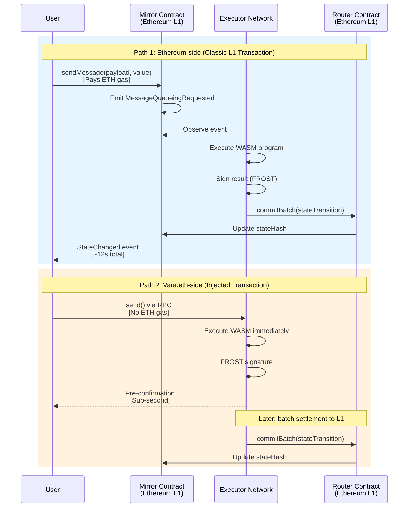

# Sending Messages

Messages are the fundamental way to interact with Vara.eth programs. Every user action — whether a token transfer, a game move, or a state query — is a message sent to a program's Mirror contract on Ethereum.

## Message Structure

| Field       | Description                                              |
| ----------- | -------------------------------------------------------- |
| `payload`   | Encoded method call and arguments (SCALE or ABI-encoded) |
| `value`     | Optional ETH amount (wei) sent to the program            |
| `callReply` | Whether to request an on-chain reply                     |

## Two Sending Paths

Vara.eth offers two distinct paths for sending messages, each with different trade-offs:

| Path | How | Cost | Latency | Use Case |
| --- | --- | --- | --- | --- |
| **Ethereum-side** | Transaction to Mirror contract on L1 | ETH gas + wVARA | ~12s (L1 block) | On-chain settlement, value transfers |
| **Vara.eth-side (Injected)** | Direct to validator nodes | No ETH gas | Sub-second | Pre-confirmations, fast UX |



<Callout type="tip" title="When to Use Each Path">
  **Ethereum-side**: On-chain value transfer, Solidity composability, L1 receipts. **Vara.eth-side**: Instant feedback
  for users (Web2-like UX) when immediate L1 settlement is not required.
</Callout>

Both paths are supported by the [`@vara-eth/api`](https://github.com/gear-tech/gear-js/blob/main/apis/vara-eth/README.md) SDK.

→ [RPC API](/docs/vara-eth/reference/rpc-api)

## Ethereum-Side: Mirror Contract

### CLI

```bash
ethexe tx send-message "$PROGRAM_ID" "0x..." 0 \
  --ethereum-rpc "$RPC" \
  --ethereum-router "$ROUTER" \
  --sender "$SENDER"
```

### TypeScript SDK

```typescript
import { getMirrorClient } from '@vara-eth/api';

const mirror = getMirrorClient(programId, signer, publicClient);

// Send message (payload encoded via sails-js)
const tx = await mirror.sendMessage(payload, 0n);
await tx.send();

// Wait for reply
const { waitForReply } = await tx.setupReplyListener();
const { payload: replyPayload, replyCode, value } = await waitForReply;
```

### Etherscan (with ABI)

If the program was deployed with ABI, navigate to the Mirror on [Etherscan](https://hoodi.etherscan.io), go to "Write as Proxy", and call methods directly.

### From Solidity

```solidity
IMirror mirror = IMirror(mirrorAddress);
mirror.sendMessage(payload, false);
```

→ [Solidity Integration](/docs/vara-eth/integrate/solidity-integration)

## Vara.eth-Side: Injected Transactions

Injected transactions are sent **directly to Vara.eth validator nodes**, bypassing Ethereum entirely. They are signed with your Ethereum private key but submitted off-chain — no ETH gas costs, sub-second execution.

This is the primary mechanism for **pre-confirmations**.

```typescript
import { VaraEthApi, WsVaraEthProvider } from '@vara-eth/api';

const api = new VaraEthApi(new WsVaraEthProvider('ws://vara-eth-node:9944'), ethereumClient);

// Create and send injected transaction
const injected = await api.createInjectedTransaction({
  destination: programId,
  payload: encodedPayload,
  value: 0n,
});

// Send and wait for reply with FROST signature
const promise = await injected.sendAndWaitForPromise();
await promise.validateSignature(); // Verify validator signatures
```

## Message Lifecycle

```
User sends tx → Mirror queues → Executors detect → WASM executes → Batch commits → State updated
```

1. User sends a transaction to the Mirror contract on Ethereum L1
2. Mirror emits `MessageQueueingRequested` event with the payload
3. Executors observe the event and queue the message for processing
4. The program's WASM code executes the message handler
5. Results (state transition, replies, events) are included in the next batch
6. The Router commits the batch to Ethereum, updating the Mirror's `stateHash`

## Handling Replies

### On-Chain Replies

Set `callReply = true` when sending. The program's reply is emitted as a `Reply` event on the Mirror when the batch is committed.

```typescript
// Listen for replies
mirror.on('Reply', (payload, value, replyTo, replyCode) => {
  if (replyCode === '0x00000000') {
    // Success — decode payload
  }
});
```

### Pre-Confirmed Replies (Off-Chain)

For instant feedback, use injected transactions via Vara.eth RPC and wait for the signed promise:

```typescript
const injected = await api.createInjectedTransaction({
  destination: programId,
  payload: encodedPayload,
  value: 0n,
});

const promise = await injected.sendAndWaitForPromise();
await promise.validateSignature();
// Decode promise.payload
```

→ [Events & State Reading](/docs/vara-eth/interact/events-state-reading)

## Sending with Value

### Ether Value (via `sendMessage`)

Programs can also receive native Ether. The `sendMessage` function on the Mirror is `payable`:

```typescript
// Send message with Ether
const mirror = new ethers.Contract(mirrorAddress, mirrorAbi, signer);
await mirror.sendMessage(payload, false, {
  value: ethers.parseEther('0.1'), // Send 0.1 ETH
});
```

<Callout type="note" title="wVARA vs ETH">
  Sending a message with `sendMessage` transfers **ETH** (Owned Balance). Funding execution requires **wVARA**
  top-up to Executable Balance.
  <br />
  <br />
  → [Funding Executable Balance](/docs/vara-eth/interact/funding-executable-balance)
</Callout>

## Gas Considerations

As a user, you only pay **ETH gas** for the L1 transaction to the Mirror. You do not pay for the off-chain execution — that's covered by the program's Executable Balance (the [reverse gas model](/docs/vara-eth/economics/reverse-gas-model)).

Typical gas costs on Ethereum L1:

| Operation                | Gas                 |
| ------------------------ | ------------------- |
| `sendMessage`            | ~60,000-100,000 gas |
| `sendReply`              | ~60,000-100,000 gas |
| `executableBalanceTopUp` | ~50,000-80,000 gas  |
