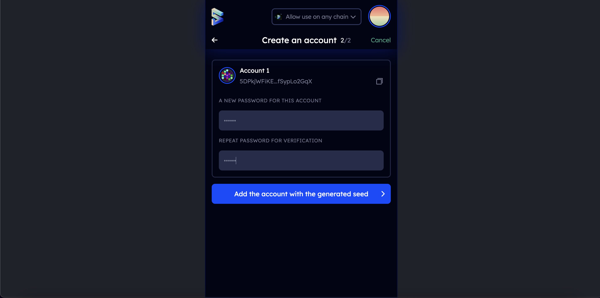

A Substrate account can be used across all Substrate-based networks, including Vara. Since Vara is built on Substrate, any sr25519-compatible keypair works seamlessly on Vara as well.

There are several ways to generate a Substrate account described in this article, depending on whether using a desktop or a mobile device.

## Key Information and Security 

For most users, popular and reliable wallets will suffice. For creating a cold wallet for storing funds, consider using [Ledger](ledger.mdx) or [Polkadot Vault](polkadot-vault.mdx) (formerly Parity Signer).

Two key features make up an account - an address and a key (keypair):

- **Address**: The public aspect of the account. Essentially a location to send transactions to and from.
- **Key**: The private part of the account. Enables access to the address.

The only way to access an account is via its private key (using the seed (or mnemonic) phrase or the account's JSON file and a password).

### Storing the Key Safely

The seed phrase is the key to the account. If access to the account is lost due to changing devices, forgetting the password, or losing the JSON file, the account can be restored using the seed. This also means someone else can access the account if they have the seed.

Store the seed in secure places like encrypted hard drives, non-digital devices, or ideally, paper. Also, take precautions to prevent physical damage to the copy, like fire and water, and make multiple copies stored in different locations.

Never store the seed on a device that is or ever will be connected to the internet.

### Storing the Account's JSON File

The account's JSON file is encrypted with a password. This means it can be imported into any wallet, but the password is needed to do so successfully. While there is this additional layer of security - a password - it is still important to use highly secure passwords that are not used elsewhere. Make a note of this password offline.

## Via SubWallet

SubWallet is a comprehensive non-custodial wallet solution for Polkadot, Substrate, and Ethereum ecosystems. SubWallet's vision is to become a Web3 multiverse gateway, allowing users to enjoy multichain services with ease and absolute security. Connecting and using blockchain-based applications is smoother with SubWallet Browser Extension and SubWallet Mobile App.

1. Install SubWallet extension and mobile app [here](https://subwallet.app/download.html).

2. Open SubWallet by clicking on the logo in the browser menu bar.

3. Click the `Create new account` button:


4. Create a master password and click `Continue`.

:::note
SubWallet cannot help restore the password once it is lost as the wallet is non-custodial. Recover the account using the seed if the master password is forgotten.
:::


5. Keep the seed phrase in a safe place and never disclose it to anyone. After saving it, click `I have kept it somewhere safe` to move on.



6. The wallet has been successfully created!


## Via Talisman

Talisman is a popular non-custodial wallet for creating and managing Substrate accounts. Connected to Web3 applications across various networks, Talisman browser extension allows for storing, sending, and receiving assets. It is one of the easiest and most secure ways of creating a Substrate account.

1. Install Talisman extension for the browser [here](https://talisman.xyz/).

2. Open the extension by clicking on the logo in the menu bar.

3. In the opened application, click "New wallet":


4. Enter a strong password:


And that's it. The wallet has been created:


:::warning Note!
Don't forget to save the seed phrase by clicking the `Backup Now` button. If this step is skipped, it can be done later from Settings.
:::

## Via Polkadot.js Browser Extension

The Polkadot.js browser extension is the original application created by Parity Technologies for managing Substrate accounts. This method involves installing the Polkadot.js plugin and using it as a "virtual vault" separate from the browser to store private keys and sign transactions.

1. Install the extension via the following links:

Install on [Chromium](https://chrome.google.com/webstore/detail/polkadot%7Bjs%7D-extension/mopnmbcafieddcagagdcbnhejhlodfdd?hl=en)-based browser.

Install on [Firefox](https://addons.mozilla.org/en-US/firefox/addon/polkadot-js-extension).

2. Open the extension by clicking on the logo in the menu bar.

3. Click the large plus button to create a new account. Alternatively, navigate to the smaller plus icon in the top right and select "Create New Account".


4. Save the `seed phrase` in a safe place using the security advice at the beginning of this article.


5. Specify the name of the account and a strong password for making transactions. Click "Add the account with the generated seed".


:::note
The password chosen here will be used to encrypt this account's information. Re-enter it when attempting to process any kind of outgoing transaction or when using it to cryptographically sign a message. This password is stored locally on the browser extension.
:::

A new account has now been successfully created using the Polkadot.js browser extension.

## Via Mobile App

For accessing accounts on a mobile device, the following multi-chain wallets can be used:

[](https://subwallet.app/)

[](https://novawallet.io/)

Check all supported wallets [here](https://wiki.polkadot.network/docs/build-wallets).

## Via Console

If the `Gear` or `Vara` node is installed, generate a new `seed phrase` using the command:

```sh
./gear key generate --network vara
```

Then `import` the generated seed phrase into any convenient wallet.

## How to Get Your Address in Vara Format

To display your account address in the Vara format, you can use the [Vara Explorer](https://vara.subscan.io/). Simply paste any Substrate-compatible address into the search bar - the resulting account information will be shown in Vara format automatically.

If you need to manually convert an address into Vara format, you can use third-party tools such as:
- [ss58.org](https://ss58.org/)
- [Polkadot Subscan Format Transform Tool](https://polkadot.subscan.io/tools/format_transform)

These tools allow you to convert addresses between different SS58 formats used across Substrate-based networks, including Vara.

## Frequently Asked Questions

#### Is this account portable?

> Yes, access the account on a different device or wallet of choice as long as the account's seed phrase or JSON file associated with the account is available.

#### Can transactions be done directly in the Polkadot.js browser extension?

> The Polkadot.js browser extension does not have functionality to make transactions directly.
> To make transactions, launch [Gear Idea](https://idea.gear-tech.io) on the browser.
> Before making any transactions, allow Gear Idea to access the account.
> The browser extension holds the account information. Choose which websites get to access this information.

#### Does Vara support hard wallets?

> Yes! Vara currently supports [Ledger](ledger.mdx) and [Polkadot Vault](polkadot-vault.mdx).
