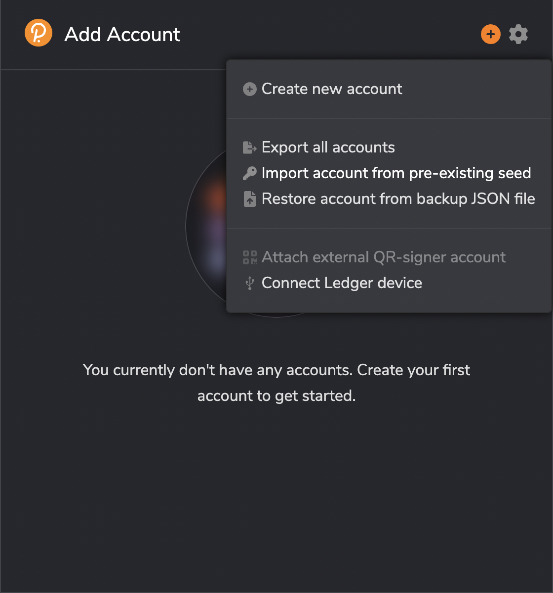
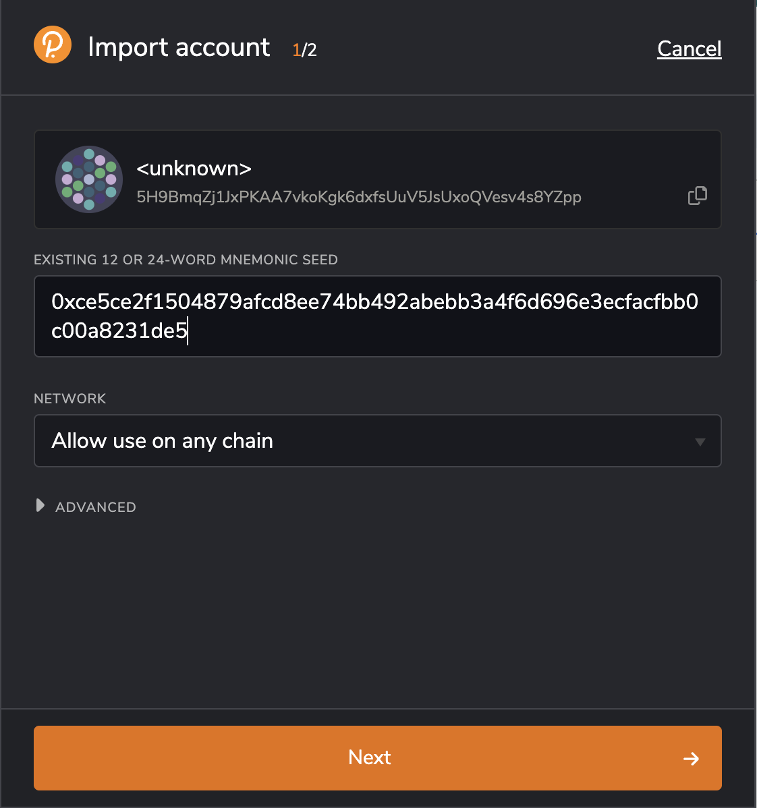

This guide covers the steps to claim the Stage 2 airdrop for Gear Testnet supporters.

## Step 1: Locate Your `key_store` File for Your Node

Before proceeding with the Vara Airdrop claim, make sure you have your `key_store` file for your node. You can find detailed instructions on how to locate this file on the [Vara Wiki](https://wiki.gear-tech.io/docs/node/backup-restore/#network-key).

Alternatively, you can use the following script for our system:

- [gear-key-finder-aarch64-apple-darwin.tar.xz](https://get.gear.rs/gear-key-finder-aarch64-apple-darwin.tar.xz)
- [gear-key-finder-x86_64-apple-darwin.tar.xz](https://get.gear.rs/gear-key-finder-x86_64-apple-darwin.tar.xz)
- [gear-key-finder-x86_64-pc-windows-msvc.zip](https://get.gear.rs/gear-key-finder-x86_64-pc-windows-msvc.zip)
- [gear-key-finder-x86_64-unknown-linux-gnu.tar.xz](https://get.gear.rs/gear-key-finder-x86_64-unknown-linux-gnu.tar.xz)
- [gear-key-finder-x86_64-unknown-linux-musl.tar.xz](https://get.gear.rs/gear-key-finder-x86_64-unknown-linux-musl.tar.xz)

Example of using the script:

```bash
curl https://get.gear.rs/gear-key-finder-x86_64-unknown-linux-musl.tar.xz | tar xJ
./gear-key-finder

Key found in "gear/gear_staging_testnet_v7":
0x594e73d9d448247093040e1530e9096c1f40e4c40dfbea2d0f9067acd9044f32

```

:::note
Note: if you used gear-key-finder you can skip step 2 and 3
:::

## Step 2: Convert Your Key into Hex Format

Once you have your key file (e.g., `secret_ed25519`), navigate to the directory where the key is located and run the following command:

```bash
xxd -p secret_ed25519 | tr -d '\n'
```

The result will be a hexadecimal representation of your key, for example: `ce5ce2f1504879afcd8ee74bb492abebb3a4f6d696e3ecfacfbb0c00a8231de5`

## Step 3: Add '0x' Prefix to the Hex Key

Before importing your key, add the '0x' prefix to the hexadecimal key.

For example, the result should look like: `0xce5ce2f1504879afcd8ee74bb492abebb3a4f6d696e3ecfacfbb0c00a8231de5`

## Step 4: Import the Account in Polkadot.js or Your Wallet

- Open Polkadot.js extension or your preferred wallet.
- Choose the option to "Import account from a pre-existing seed."
- Paste the hex key (with '0x' prefix) when prompted.





## Step 5: Go to the Claim Page

Once your account is imported, go to the claim page on the Vara claim page https://vara.network/claim.

## Step 6: Connect Your Account

Connect your imported account to the claim page. This will allow you to check and claim your Vara Airdrop.

Congratulations! You have successfully claimed your Vara Airdrop.
