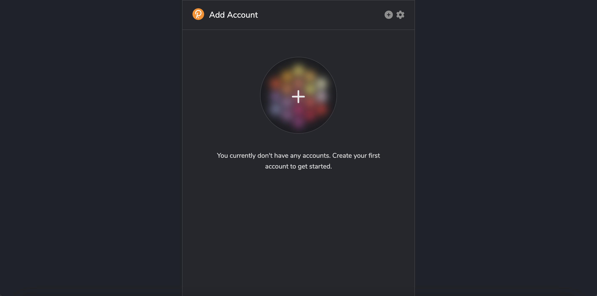
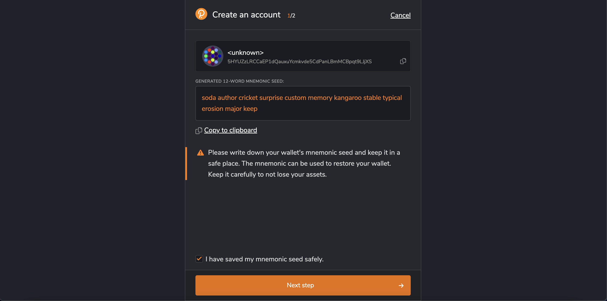

A Substrate account enables connection to applications across Polkadot, Kusama and their Parachains. There are several ways to generate a Substrate account described in this article, depending on whether you are using a desktop or a mobile device.

The Vara Network is Substrate-based, which means that any keypair compatible with the sr25519 will also work on Vara.

## Key information and security

For most users, the use of popular and reliable wallets will be enough.
If you need to create a cold wallet for storing funds, then you should pay attention to [Polkadot Vault](polkadot-vault.mdx) (previously Parity Signer). In the future we will also add Ledger support.

There are two key features that make up an account - an address and a key (keypair):

- An address is the public aspect of the account. This is essentially a location that you can send transactions to and from.
- A key is the private part of the account. This is what enables you to access the address.

The only way to access your account is via your private key (using the seed (or mnemonic) phrase or your account's JSON file and a password).

### Storing your key safely

Your seed phrase is the key to your account. If you lose access to your account, by changing the device, forgetting the password, or losing the JSON file, you can restore your account by using the seed. This also means that someone else can have access to your account if they also have access to your seed.

We recommend that you store your seed in secure places like encrypted hard drives, non-digital devices or ideally, paper. We also recommend that you take other safety precautions to prevent this copy from physical damage, for example fire and water, and make multiple copies stored in different locations.

You should never store your seed on a device that is, or ever will be, connected to the internet.

### Storing your accounts JSON file

Your account's JSON file is encrypted with a password. This means that while you can import into any wallet, you will need to use the password to do so successfully. As there is this additional layer of security - a password - you don't have to be as cautious about securing it. However, it's worth using highly secure passwords that are not used for anything else. It would be best if you made a note of this password offline.

## Via SubWallet

SubWallet is the comprehensive non-custodial wallet solution for Polkadot, Substrate & Ethereum ecosystems. With the mission of bringing users closer to Web3, SubWallet's vision is to become a Web3 multiverse gateway through which users can enjoy multichain services with utmost ease and absolute security. Connecting and using blockchain-based applications is smoother than ever with SubWallet Browser Extension & SubWallet Mobile App.

1. Install SubWallet extension & mobile app [here](https://subwallet.app/download.html).

2. Open SubWallet by clicking on the logo in the browser menu bar.

3. Click the `Create new account` button:


4. Create a master password and click `Continue`.

:::note
SubWallet cannot help you restore the password once it is lost as the wallet is non-custodial. You can recover your account using the seed if you forget your master password.
:::


5. Keep your seed phrase in a safe place and never disclose it to anyone. After you have saved it, click `I have kept it somewhere safe` to move on.


6. Congratulations, your wallet has been successfully created!


## Via Talisman

`Talisman` is a popular non-custodial wallet for creating and managing Substrate accounts. Being connected to Web3 applications across various networks, Talisman browser extension allows to store, send and receive assets. The Talisman browser extension is one of the easiest and secure ways of creating a Substrate account.

1. Install Talisman extension for your browser [here](https://talisman.xyz/)

2. Open the extension by clicking on the logo in the menu bar.

3. In the opened application, click "New wallet":


4. Enter a strong password:


And that's it. Your wallet has been created:


:::warning Note!
Don't forget to save your seed phrase by clicking the `Backup Now` button. If you will skip this step, you can do it later from Settings.
:::

## Via Polkadot.js browser extension

The polkadot.js browser extension is the original application created by Parity Technologies for managing Substate accounts. This method involves installing the polkadot.js plugin and using it as a "virtual vault" that's separate from your browser to store your private keys and sign transactions.

1. You can install the extension via the following links.

Install on [Chromium](https://chrome.google.com/webstore/detail/polkadot%7Bjs%7D-extension/mopnmbcafieddcagagdcbnhejhlodfdd?hl=en)-based browser.

Install on [FireFox](https://addons.mozilla.org/en-US/firefox/addon/polkadot-js-extension).

2. Open the extension by clicking on the logo in the menu bar

3. Click the large plus button to create a new account. Alternatively, you can navigate to the smaller plus icon in the top right and select "Create New Account".



4. Save the `seed phrase` in a safe place using the security advices at the beginning of this article.



5. Specify the name of your account and a strong password for making transactions. Click "Add the account with the generated seed".


:::note
The password that you choose here will be used to encrypt this account's information. You will need to re-enter it when attempting to process any kind of outgoing transaction, or when using it to cryptographically sign a message. This password is stored locally on the browser extension.
:::

You've now successfully created a new account using the polkadot.js browser extension.

## Via mobile app

If you need access to your accounts on a mobile device, then you can use the following mobile wallets for the Polkadot/Kusama ecosystem:

[](https://subwallet.app/) 

[](https://novawallet.io/)

All supported wallets you can check [here](https://wiki.polkadot.network/docs/build-wallets).

## Via console

If you have `Gear` or `Vara` node installed, you can generate a new `seed phrase` using the command:

```sh
./gear key generate --network vara
```

And then `import` the generated seed phrase into any convenient wallet.

## How to get your address in the Vara Network format

:::note Skip these steps if you have an account created via Polkadot.js browser extension

1. Install Polkadot browser extension from here: https://polkadot.js.org/extension/ and import your account via Seed prase or JSON file.
2. Go to https://polkadot.js.org/apps, allow this web application to interact with Polkadot extension in the prompt window.
   :::

- To see your account in the Vara Network format, just go to https://polkadot.js.org/apps/?rpc=wss%3A%2F%2Frpc.vara-network.io#/accounts.
- The address will be shown in the Vara format (with `kG…` or `kD…` prefix). Copy the address if you want to share it with someone.


## Frequently Asked Questions

#### Is this account portable?

> Yes, you can access your account on a different device or wallet of your choice as long as you have the account's seed
> phrase or JSON file associated with the account.

#### Can I transact directly in the polkadot.js browser extension?

> There isn't functionality to make transactions directly in the polkadot.js browser extension.
> To make transactions, you need to launch [Gear Idea](https://idea.gear-tech.io) on your browser.
> Before you can make any transactions, you have to allow Gear Idea to access your account.
> The browser extension is what holds your account information. You choose which websites get to access this information.

#### Does vara support hard wallets?

> Yes! At the moment Vara supports [Parity Signer](polkadot-vault.mdx). Also in the future we will support Leger.

#### How to get your address in the Vara Network format?

> The Vara address prefix is 137. To see your account in the Vara Network format, just go to https://polkadot.js.org/apps/?rpc=wss%3A%2F%2Frpc.vara-network.io#/accounts
