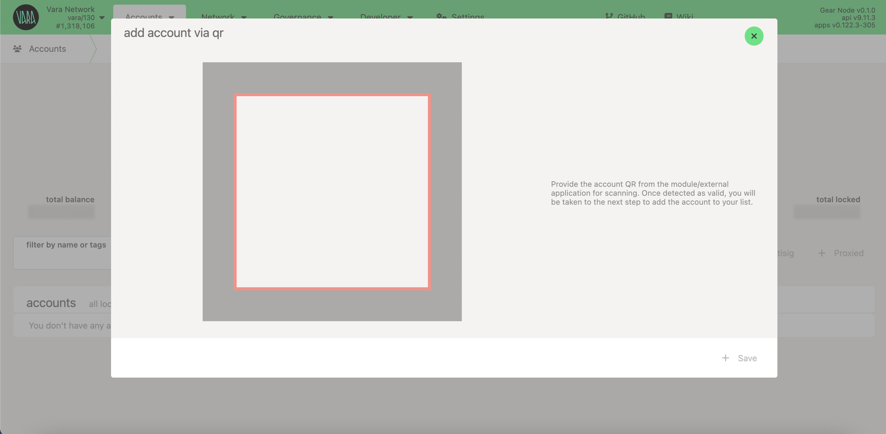
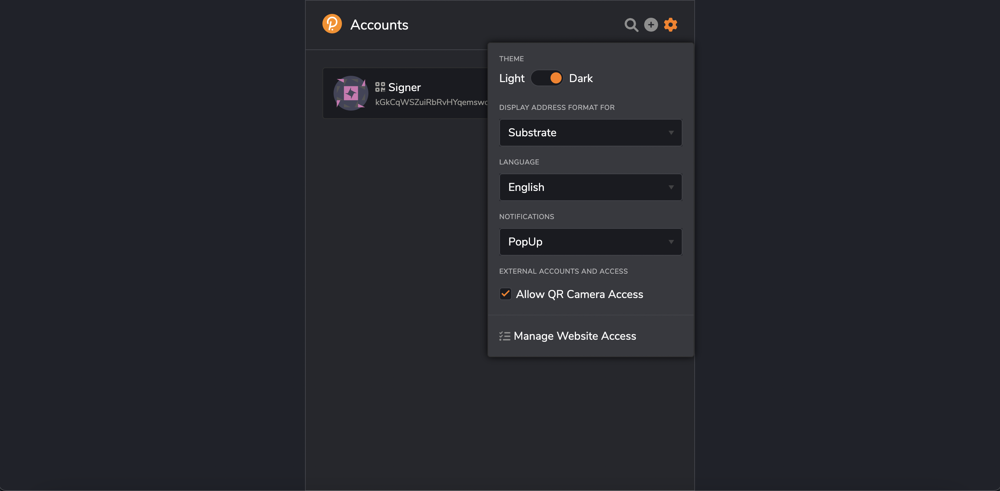
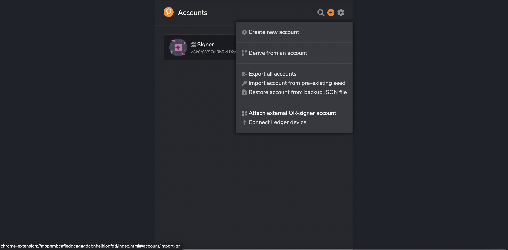

import googleURL from './img/google-play-badge.png';
import appleURL from './img/app-store-badge.png';

# Vara cold storage via Polkadot Vault (formerly Parity Signer)

Polkadot Vault allows you to turn any mobile device based on Android or iOS into a real cold wallet. Your private keys are kept secure offline at all times and transactions are signed in an air-gapped way via QR-codes. A huge advantage is the completely open and transparent source code of [the product](https://github.com/paritytech/parity-signer).

Vara Network completely supports working with Polkadot Vault.

## Installation

There are several ways to get the Polkadot Vault.

Download from the application store for your device:

  {' '}
  

Download directly from the GitHub:

https://github.com/paritytech/parity-signer/releases

## Create your keys

:::info
Once Polkadot Vault is installed, your device should never go online. You must turn off or even physically remove the smartphone's Wifi, Mobile Network, and Bluetooth to ensure that the mobile phone containing these accounts will not be exposed to any online threat. Switching to airplane mode suffices in many cases.
:::

1. Go offline, open your Polkadot Vault application, accept Privacy Policy, create your PIN code.

2. Click the `New seed` button to generate and store your private keys. Backup your seed phrase on paper or try other reliable methods.

## Add Vara Network

To sign messages/transactions, and transfer funds to and from Vara account you need to add Vara Network into the app.

1. Open your Polkadot Vault and tap the `scan` button

2. Go to [Metadata Portal](https://metadata.novasama.io/#/vara), switch to `Chain Specs` tab

3. Scan the `spec QR code` with your device to add Vara network.

After spec scanning you can select Vara Network for your account:

## Add network Metadata

To sign and broadcast your transaction, we will also need the metadata of the given network. Polkadot Vault can be easily updated with the latest blockchain metadata while staying offline.

To get the latest blockchain metadata:

1. Open your Polkadot Vault and select tab `scan`

2. Again go to [Metadata Portal](https://metadata.novasama.io/#/vara)

3. In the `Metadata` tab, scan video QR with metadata frames. Wait for `Parsing multipart data` is completed.

:::info
Scanning QR with metadata could take some time. Remember to update the Polkadot Vault to the latest version of metadata, you will need to do the scan again. We generate new QR's with each runtime upgrade of the network.
:::

When all metadata is uploaded, Polkadot Vault will be ready to work with the Vara Network.

## How to use

Polkadot Vault allows you to sign transactions using an air-gapped way. You scan a QR code with details about your transaction, then generate a code already signed on your offline device and deliver it as confirmation. Many applications support this feature.

### SubWallet

1. For instructions on how to use Polkadot Vault with SubWallet Extension, see [here](https://docs.subwallet.app/main/extension-user-guide/account-management/attach-a-polkadot-vault-previously-parity-signer-account).

2. For instructions on how to use Polkadot Vault with SubWallet Mobile, see [here](https://docs.subwallet.app/main/mobile-app-user-guide/account-management/attach-a-polkadot-vault-previously-parity-signer-account).

3. For visual instructions, see the video [here](https://youtu.be/9qKf_FrwzxE?si=_hQJj9tp2sQ--rpV).

### Nova Wallet

Nova Wallet also supports Polkadot Vault. More details are [here](https://docs.novawallet.io/nova-wallet-wiki/welcome-to-nova-wallet/hardware-wallets).

### Polkadot.\{js\}

To import your hard wallet account into Polkadot.js:

1. You should go to [Accounts](https://polkadot.js.org/apps/#/accounts) section and click the `from QR` button.

2. In the Polkadot Vault app, select your account and network.

3. Show your code to the camera.

Done! Now, when making transactions from this account, you will sign them with your Polkadot Vault app using QR codes.

### Polkadot.\{js\} extension

1. In your Polkadot.\{js\} extension allow QR camera access

2. Click <keyboard>+</keyboard> to import new account and choose `Attach external QR-signer account` option:

3. Show your account QR-code to the camera. Done!
