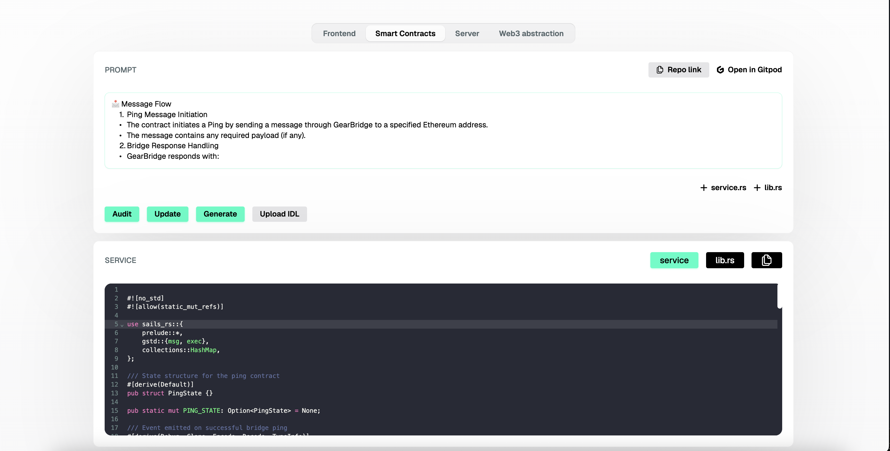

# AI Code Generator

AI Code Generator is an experimental web-based tool for generating and auditing Gear programs, as well as creating frontend and backend components for Web3 applications. Designed specifically for the Vara Network, it leverages AI models trained on a large corpus of Rust-based projects developed within the ecosystem — spanning both contract logic and user interface layers.

The training dataset includes a wide variety of applications: from simple token contracts and NFT minting to complex decentralized games and advanced use cases involving zero-knowledge (ZK) technologies. This deep contextual training allows the tool to assist users in rapidly prototyping and deploying feature-rich dApps tailored for Vara.

AI Code Generator is available for public use and experimentation. Users can access the tool directly via the following link:

👉 [AI Code Generator](https://ai-codegen.vara.network/)

## Use Cases

- **Rapid Experimentation**: AI Code Generator is ideal for quick ideation and proof-of-concept development.

- **Educational Tool**: For newcomers to smart contract development and the Gear Protocol, AI Code Generator offers an accessible and low-friction way to learn.

- **Prototyping Full-Stack dApps**: The tool supports not only smart contract generation, but also creates companion frontend UIs and backend logic.

- **Pre-deployment Contract Review**: Integrated auditing support helps highlight common issues and suggests improvements.

