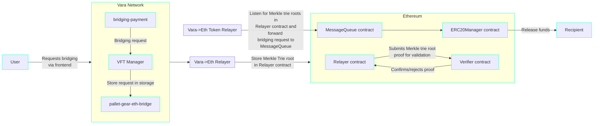

# Bridge Architecture

## Overview
This page provides a technical overview of the Vara Bridge architecture, without covering every component in exhaustive detail. The goal is to give readers a high-level understanding of how the Bridge operates. For complete technical information, please refer to the [Gear Bridges repository](https://github.com/gear-tech/gear-bridges).

Vara Bridge uses Plonky2 circuits to implement cryptographic primitives, forming a secure foundation for cross-chain operations. Plonky2 is a zero-knowledge (ZK) proof system that provides efficient and scalable proofs. By using these circuits, Vara Bridge preserves transaction integrity and greatly reduces the possibility of manipulation. The proof mechanism also guarantees that specific pallet states are finalized and included in the Vara Network before those states are relayed to Ethereum. Verified within a Gnark circuit, these proofs help maintain trust and accuracy as data moves across chains.

## Bridge Components
The Vara Bridge consists of several distinct parts, including on-chain components on both Vara and Ethereum, as well as off-chain components for securely relaying message proofs.

### Components on Vara Network

- **VFT programs**: Deployments of the VFT token standard, capable of transferring, burning, and minting VFT tokens. Each unique token has its own VFT standard deployment on Vara.

- **VFT Manager**: A single application that receives VFT tokens from users, burns them, and emits a message to the `pallet-gear-eth-bridge` Built-in actor. This message indicates which token is being bridged, the token amount, and the intended Ethereum recipient.

- **Bridging Built-in Actor**: A new Built-in Actor serving as the entry point for the generic bridging protocol. It takes messages from any actor on the Vara Network and forwards them to the Bridging pallet.

- **Bridging Pallet**: Accepts messages from the Bridge Built-in Actor and stores them in specialized data structure (a binary Merkle trie).

- **Ethereum-Event-Client**: A program on Vara that can verify whether a specific event was included in a particular block. It consults the `checkpoint-light-client` to confirm the validity of that block.

- **Historical-Proxy**: A program on Vara that maintains historical `ethereum-event-client` program addresses and routes requests to the `ethereum-event-client` instance responsible for processing the requested transaction.

### Components on Ethereum

- **ERC20Manager**: Implements the `IMessageQueueReceiver` interface and functions as a vault for ERC-20 tokens, permitting users to deposit tokens and manage withdrawals. It processes messages relayed by the `MessageQueue` and accepts only properly formatted and authorized messages.

- **MessageQueue**: Verifies proofs of message inclusion in a Merkle trie, whose root is stored in the `Relayer`. It ensures each message is processed exactly once by storing nonces for all of the processed messages. After successful verification, it calls the target `IMessageQueueReceiver` contract (e.g., `ERC20Manager`).

- **Relayer**: Receives a Merkle trie root proof from the Prover and submits it to the `Verifier` for validation using `PlonkVerifier`. Once the proof is confirmed, the `Relayer` records the validated Merkle trie root and block number, so the `MessageQueue` can authenticate messages.

- **Verifier**: Uses a `PlonkVerifier` to check gnark proofs demonstrating that a Merkle trie root belongs to a finalized Vara block. By verifying the Merkle trie root’s integrity, it ensures the data that arrives at the `Relayer` is genuine, facilitating the rest of the bridging process.

### Components on Both Networks

- **Bridging Payment**: Implemented as a Program on Vara and as a smart contract on Ethereum, both versions have the same functions. When a bridging request is received, they charge fees and pass the request to the respective smart contract/program that executes it. A token relayer can then monitor events indicating the request has been processed (and fees paid) and finalize the request on the other chain, using its own funds to pay transaction fees.

### Off-Chain Components
In addition to the on-chain components, there are relayer nodes responsible for transferring data between Vara and Ethereum:

- **Vara→Ethereum Protocol relayer**: Reads the Vara state, creates ZK proofs, and sends them to Ethereum. It produces two kinds of ZK proofs:  
  - Proof of authority set changes  
  - Proof of Merkle trie root inclusion in the `pallet-gear-eth-bridge` storage

- **Ethereum→Vara Protocol relayer**: Tracks `sync committee` changes and the blocks they sign on Ethereum. It then updates the `checkpoint-light-client` state on Vara.

- **Ethereum→Vara Token relayer** and **Vara→Ethereum Token relayer**: Monitor events from `bridging-payment` services and handle cross-chain actions to ensure messages are delivered correctly.

For transfers from Ethereum to the Vara Network, there is also a lazy Ethereum light client:

- **Checkpoint-Light-Client**: A lazy Ethereum light client that keeps track of the `sync committee` validator set and confirms block headers using it.

## Proof Generation and Verification
The Ethereum smart contracts handle messages and their proofs originating from Vara Network. On Vara, each message is kept in a binary Merkle trie. The Merkle root of this trie—a concise, verifiable representation of all messages—is recorded in the `pallet-gear-eth-bridge` storage. This setup guarantees that messages can be thoroughly verified when they reach Ethereum. The `Prover` component generates a zero-knowledge proof (ZK proof) indicating that a given Merkle trie root is stored in the pallet’s storage at a particular finalized block. This proof is then sent to Ethereum.

In the Vara Bridge, the `Prover` component is carried out by the `Vara→Ethereum relayer`, which enables trustless relaying of Merkle trie roots from the `pallet-gear-eth-bridge` to Ethereum.

Proof creation relies on **proof composition**, in which proofs are generated and verified before being merged into higher-level proofs. It also incorporates **recursive proofs** that use IVC (Incrementally Verifiable Computation). This approach breaks the computation into incremental steps and proves them iteratively, for example, updating the validator set from genesis to the latest block.

## Token Transfer Workflows
### From Vara Network to Ethereum

From a broad standpoint, the user starts a bridging request in the frontend, giving the bridge permission to spend the specified tokens. After deducting any necessary fees, the bridging process leads to the burning of tokens on Vara Network, producing a message. This message is relayed by the Built-in actor and stored in Vara’s storage. Subsequently, an off-chain relayer forwards this message to the Ethereum relayer contract. Once the Merkle proof is validated, the ERC-20 Manager releases the corresponding funds to the user on Ethereum.

1. **Transfer Initiation**  
   The user starts a bridging request in the Bridge frontend, permitting the `VFT Manager` to spend the user’s tokens.

2. **Token Burning on Vara**  
   The `VFT Manager` burns the tokens on Vara Network and sends a message to initiate bridging. This message goes to the Bridge Built-in Actor, which forwards it to the `pallet-gear-eth-bridge`.

3. **Inclusion in Pallet Storage**  
   The `pallet-gear-eth-bridge` places the message into a specialized binary Merkle trie.

4. **Proof Generation and Transmission**  
   The `Vara→Ethereum relayer` reads from `pallet-gear-eth-bridge` storage and produces a zero-knowledge (ZK) proof indicating that the message is included in a finalized Vara block. The relayer submits this proof to Ethereum, storing it in the `Relayer` contract.

5. **Proof Verification on Ethereum**  
   Prompted by the `Vara→Ethereum Token Relayer`, the `MessageQueue` contract retrieves the Merkle root from the `Relayer` contract. It verifies the Merkle proof and, if successful, passes the message on to the `ERC20Manager`.

6. **Release of Funds**  
   The `ERC20Manager` releases the tokens to the user’s account on Ethereum.

### From Ethereum to Vara Network

In brief, the user submits a bridging request in the frontend, allowing the bridge to spend the chosen ERC-20 tokens. After fees are deducted, the tokens are locked or burned on Ethereum, triggering an event. An off-chain relayer carries this event to Vara for validation against the Ethereum checkpoint-light-client. After confirmation, the historical-proxy instructs the **VFT Manager** to mint or transfer tokens on Vara, giving the user the equivalent number of tokens. Below is the expanded version:

1. **Transfer Initiation**  
   The user initiates a bridging request in the Bridge frontend. They authorize the `bridging-payment` contract to spend their ERC-20 tokens by calling `approve` on the relevant ERC-20 contract on Ethereum.

2. **Token Locking/Burning on Ethereum**  
   After receiving the request, the `bridging-payment` instructs the `ERC20Manager` to lock or burn the ERC-20 tokens. The resulting event signals that these tokens are removed from circulation or escrowed for bridging.

3. **Block Checkpoint and Event Submission**  
   Once the event is emitted, the `Ethereum→Vara Protocol relayer` (or a similar entity) provides a newer Ethereum block reference (at a block number beyond the burn/lock event) to the `checkpoint-light-client` on Vara. Then, the relayer forwards the event to the `historical-proxy`, which supervises the on-chain validation.

4. **Event Verification**  
   The `historical-proxy` requests the `ethereum-event-client` to verify that the block containing the burn/lock event is a valid, finalized Ethereum block. The `ethereum-event-client` consults the `checkpoint-light-client` to confirm finality. Once validated, the `historical-proxy` proceeds with bridging.

5. **Bridging on Vara**  
   Having confirmed the event, the `historical-proxy` sends the user’s bridging request to the `VFT Manager`. The `VFT Manager` calls the suitable `VFT program` for the locked/burned ERC-20 tokens. Depending on the token model:  
   - **Transfer**: If the total supply resides on Vara, the vft program simply transfers tokens.  
   - **Mint**: If the token supply is on Ethereum, the vft program mints new tokens on Vara.

6. **Release of Tokens on Vara**  
   Finally, the `VFT program` either mints or transfers the bridged tokens to the user’s address on Vara, concluding the Ethereum→Vara bridging process.