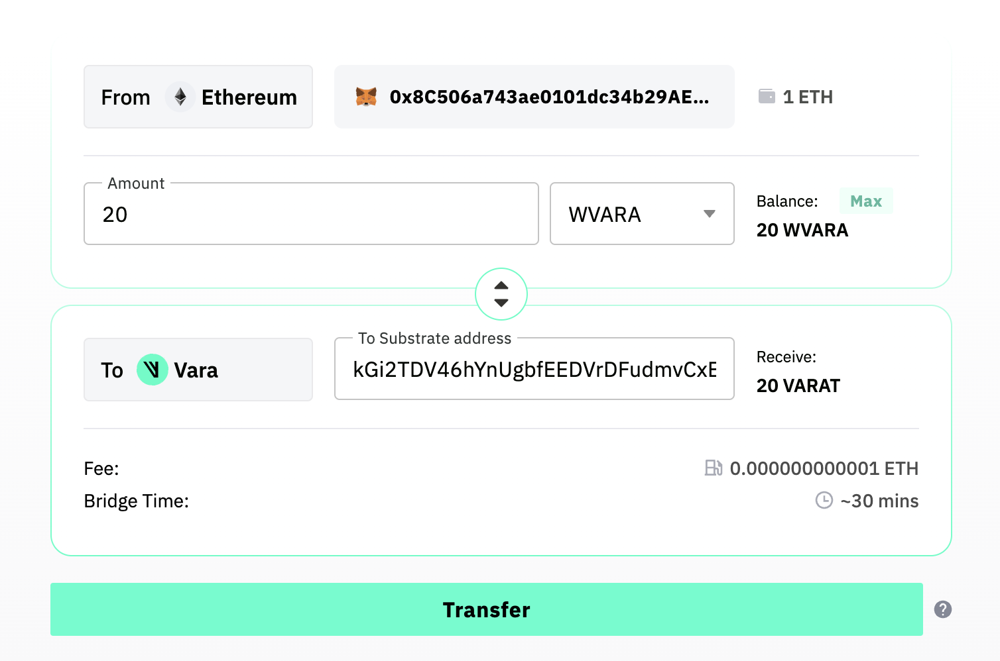
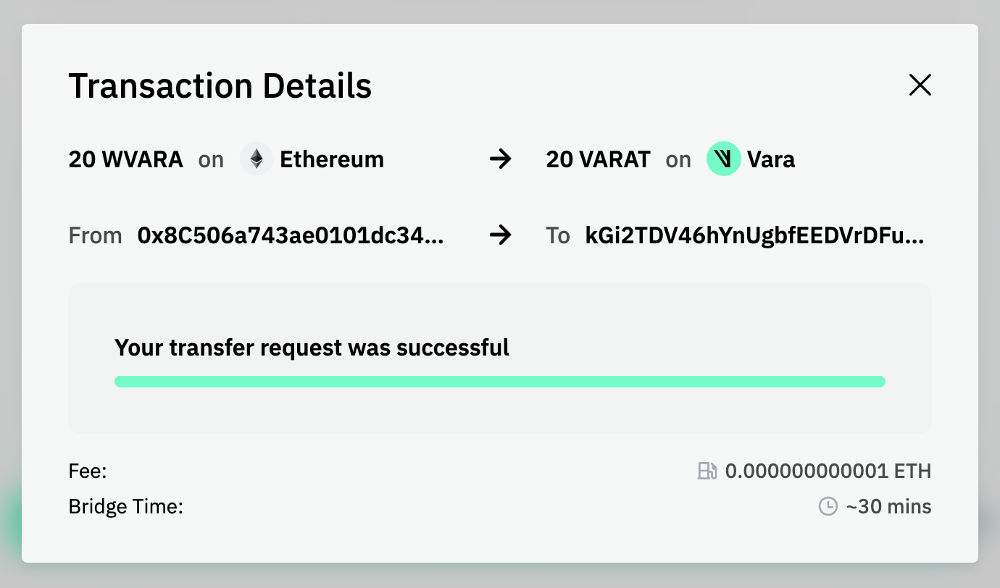
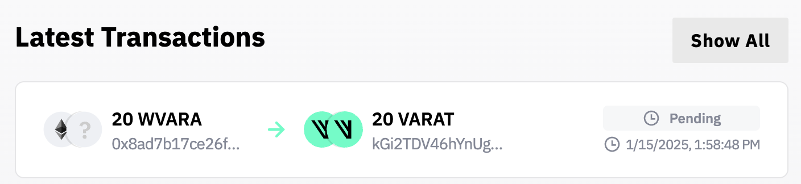

# Vara Bridge

:::note
The Vara Bridge is currently live on Ethereum Holesky Testnet.
:::

## Introduction

Vara Bridge is a trustless ZK-based cross-chain bridge that facilitates seamless and secure token transfers between Ethereum and Vara Network. It is the first deployment of the Gear Bridge Protocol, a more general trustless cross-chain protocol enabling the transfer of information between the Ethereum network and blockchains based on Gear Protocol.

## Bridge Architecture
### Trustless ZK-Based Architecture
The core of Vara Bridge's security is its use of ZK proofs. This cryptographic technique allows the verification of transactions without revealing underlying information, ensuring privacy while maintaining trustlessness. The ZK-based architecture ensures that cross-chain transfers are executed in a way that protects user data and prevents fraudulent activities.

Vara Bridge leverages Plonky2 circuits to implement cryptographic primitives, which are essential for the secure operation of the bridge. Plonky2 is a powerful zero-knowledge (ZK) proof system that allows efficient and scalable proofs, making it well-suited for cross-chain operations. By utilizing these circuits, Vara Bridge ensures the integrity of transactions and minimizes the risk of manipulation. The proof mechanism also guarantees that specific pallet states are securely finalized and included in Vara Network before being relayed to Ethereum. Verified within a Gnark circuit, these proofs play a key role in maintaining trust and correctness as transactions move across chains.

### Bridge Components 
#### Components on Vara Network:

- **VFT programs:** These are deployments of the VFT token standard, capable of transferring, burning, and minting VFT tokens. For each distinct token there exists a separate deployment of the VFT standard on Vara.
- **VFT Manager:** A single application, which receives VFT tokens from users, burns them, and emits a message to the `pallet-gear-eth-bridge` Built-in actor. This message contains information about which token is being bridged, how much of it, and the recipient of funds on the Ethereum network.
- **Bridging Built-in Actor:** A new Built-in Actor, which serves as the entry point into the generic bridging protocol. It receives messages from any actor on the Vara Network and relays them to Bridging pallet.
- **Bridging Pallet:** Receives messages from the Bridge Built-in Actor and stores them in a specialized storage (a binary Merkle trie).

#### Components on Ethereum:

- **ERC-20 Treasury:** A treasury contract that accepts user funds and releases them. Release can only be triggered by a message relayed over the bridge from the VFT Manager.
- **Message Queue:** …

Additionally, there exists a special smart contract responsible to handle payment of the bridging service on both Ethereum and Vara. It collects fees, relays bridging requests, and relies on relayers to process transactions across chains using their own funds, requiring users to trust the relayer for secure execution.

#### Offchain Components
In addition to the onchain components on both Vara and Ethereum there exist relayer nodes to securely transfer the information from one network 
to the other. These relayers hook to the events produced by bridging payment services and perform cross-chain actions to guarantee message delivery.
For example, the Vara to Ethereum token relayer collects bridging fees from user on Vara Network. 
When the merkle root that contain this message will be relayed to Ethereum, this relayer will send transaction to the `MessageQueue` that will trigger transfer from `ERC20Manager` to the user.

### Vara to Ethereum Token transfer
From a high-level perspective, the user initiates a bridging request through the frontend, authorizing the bridge to spend the specified tokens. After deducting the necessary fees, the bridging process begins, resulting in the burning of tokens on Vara Network. This action generates a message, which is relayed through the built-in actor and stored in Vara Network’s storage. Subsequently, an off-chain relayer submits this message to the Ethereum relayer contract. Upon verification through a Merkle proof, the ERC-20 treasury releases the corresponding funds to the user on Ethereum.
More specifically, the flow of information from Vara Network to Ethereum is as follows:

1. **Transfer Initiation:** The user initiates a bridging request through the Bridge frontend, authorizing the VFT Manager to spend the specified tokens on the user’s behalf.
2. **Token Burning on Vara:** The VFT Manager burns the corresponding tokens on Vara Network and emits a message to initiate the bridging process. This message is sent to the Bridge Built-in Actor, which relays it to the underlying Bridging pallet.
3. **Inclusion in Pallet Storage:** The Bridging pallet stores the message in a specialized data structure called a Merkle trie.
4. **Proof Generation and Transmission:** The Vara➝Ethereum relayer reads the storage of the Bridging pallet and generates a zero-knowledge proof (ZK proof) for the inclusion of the message in the pallet's storage in a finalized block of Vara Network. The relayer then transmits the proof of inclusion to the Ethereum network, where it is stored in the relayer contract.
5. **Proof Verification on Ethereum:** The message queue contract reads the Merkle root from the relayer contract, verifies the submitted Merkle proof, and, upon successful verification, relays the message to the ERC-20 treasury.
6. **Release of Funds:** The ERC-20 treasury releases the funds to the user's account on Ethereum.

## Supported Tokens
- VARA ([wVARA](https://holesky.etherscan.io/token/0x1ebbdad5274735fd2651d872a25abb19d6b025f0) on Ethereum)
- ETH

## How to use Vara Bridge
### Bridging from Vara Network to Ethereum
:::tip
This walkthrough uses Vara's Testnet and VARAT tokens. You can obtain a test balance by following the steps provided [here](docs/idea/account.md#get-test-balance).
:::

1. Connecting your Wallet: Connect your Substrate wallet to the Vara Bridge.
2. Select the token to be transferred: Select `VARAT` from the dropdown menu and enter the amount of tokens you want to transfer.
3. Select the receiving Ethereum Holesky address: In the next line enter a valid ERC20 address to which the tokens should be bridged.
4. Start the bridging process: Press the `Transfer` button to initiate the bridging process. The bridging fee and bridging time is displayed right above the button.

5. Sign and approve the transfer of your tokens.

Afterwards you can find your bridging transaction in the list of all transactions. Once the bridging is completed, the status will change from "pending" to "completed".

:::note
After transferring tokens from VARA to Ethereum, you may need to manually add the VARA token contract to your wallet for the balance to be displayed. 
:::

### Bridging from Ethereum to Vara Network
:::tip
This walkthrough uses Vara’s Testnet and VARAT tokens. To initiate the bridging process to the Vara Testnet, you will need a small balance of Ethereum Holesky (ETH) tokens.
:::

1. Connecting your Wallet: Connect your Ethereum wallet to the Vara Bridge.
2. Select the token to be transferred: Select `WVARA` from the dropdown menu and enter the amount of tokens you want to transfer.
3. Select the receiving Vara address: In the next line enter a valid VARA address to which the tokens should be bridged.
4. Start the bridging process: Press the `Transfer` button to initiate the bridging process. The bridging fee and bridging time is displayed right above the button.

5. Sign and approve the transfer of your tokens.

Afterwards you can find your bridging transaction in the list of all transactions. Once the bridging is completed, the status will change from "pending" to "completed".

