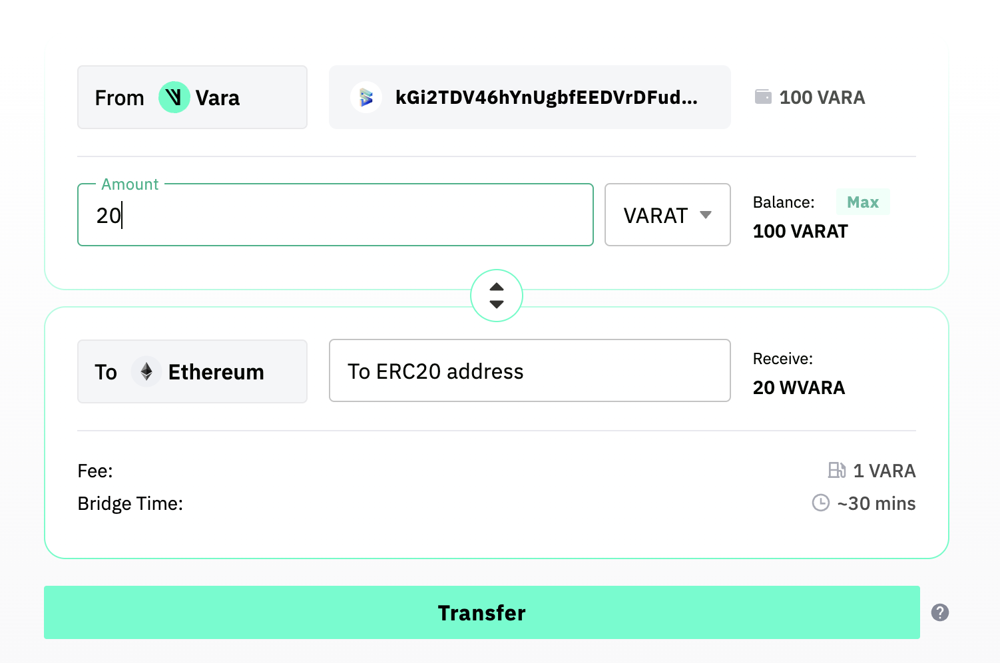
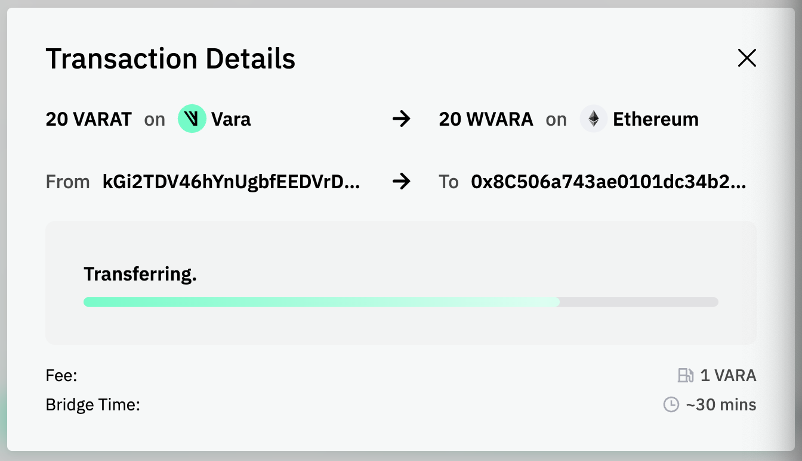
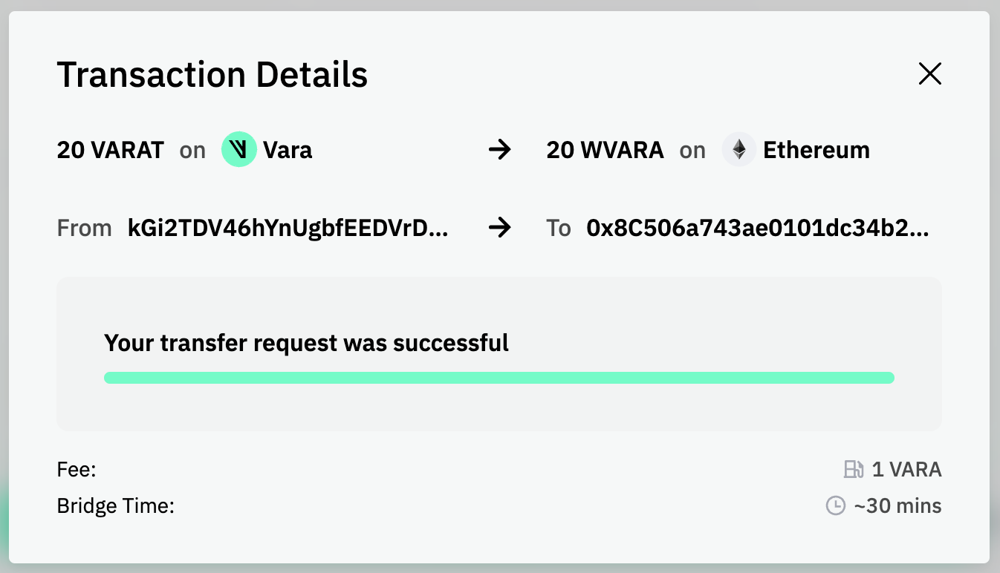
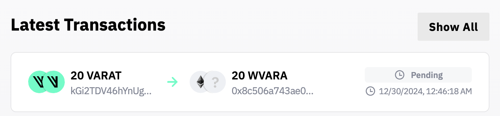
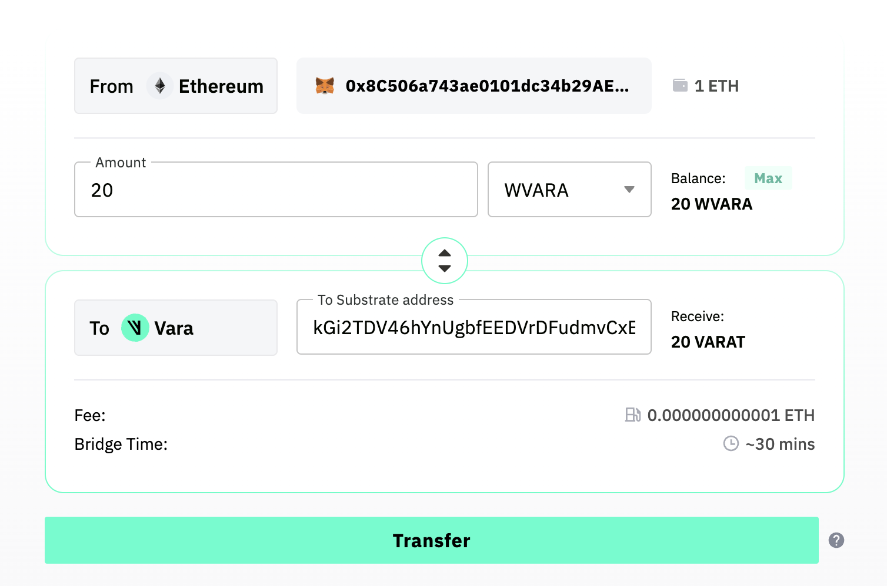
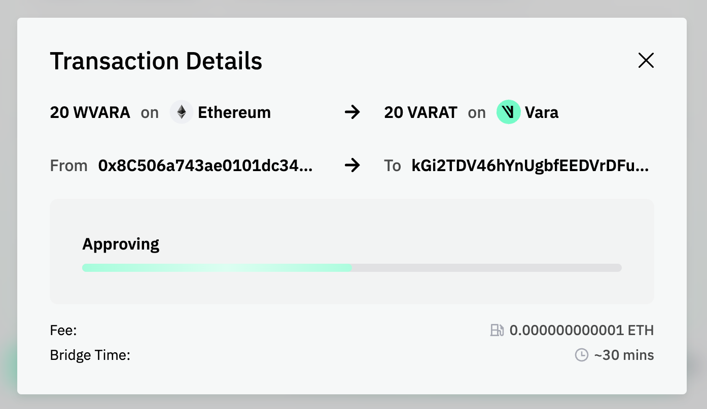
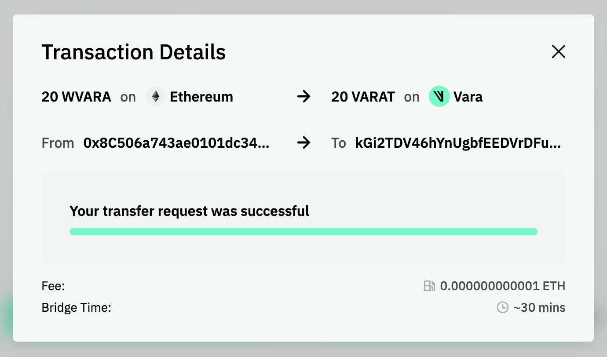
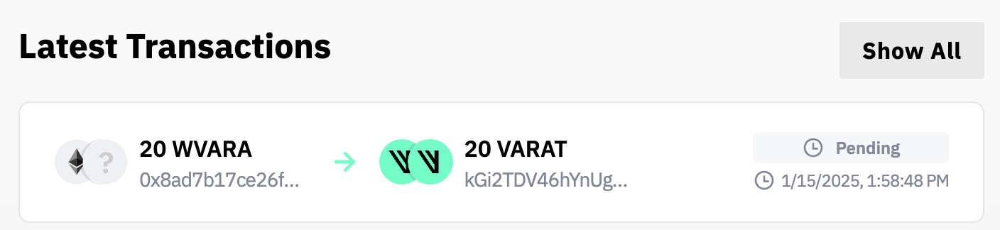

# Use Vara Bridge
This page provides a guide on bridging supported VFT tokens from Vara Network to their corresponding wrapped ERC-20 tokens on Ethereum, and vice versa.

## Prerequisites

- A Substrate wallet (for example, **SubWallet**)
- An Ethereum wallet (for example, **MetaMask**)

---

## Bridging from Vara Network to Ethereum

:::tip
This tutorial uses Vara's Testnet and **VARAT** tokens. You can acquire a test balance by following the steps [here](docs/idea/account.md#get-test-balance).
:::

1. **Connect Your Wallet**  
   Connect your Substrate wallet to the Vara Bridge.

2. **Select the Token to Transfer**  
   Choose **VARAT** from the dropdown menu and specify the number of tokens to transfer.

3. **Enter the Receiving Ethereum Address**  
   In the next field, provide a valid ERC-20 address on Ethereum Holesky where you want the tokens sent.

4. **Initiate the Bridging Process**  
   Click **Transfer** to start bridging. The bridging fee and estimated transfer time are displayed above the button.

5. **Sign and Approve**  
   Confirm the transfer of your tokens in your wallet.

After initiating the transfer, your bridging transaction appears in the list of all transactions. When the process completes, the status changes from **pending** to **completed**.

:::note
After sending tokens from Vara to Ethereum, you may need to manually add the **VARA token contract** to your Ethereum wallet to view your updated balance.
:::

---

## Bridging from Ethereum to Vara Network

:::tip
This walkthrough also uses Vara’s Testnet and **VARAT** tokens. To start bridging to the Vara Testnet, you will need a small **ETH** balance on Ethereum Holesky.
:::

1. **Connect Your Wallet**  
   Connect your Ethereum wallet to the Vara Bridge.

2. **Select the Token to Transfer**  
   Choose **WVARA** from the dropdown and specify how many tokens you want to bridge.

3. **Enter the Receiving Vara Address**  
   In the next field, provide a valid **Vara** address where the tokens will be delivered.

4. **Initiate the Bridging Process**  
   Click **Transfer** to begin bridging. The fee and estimated transfer time appear above the button.

5. **Sign and Approve**  
   Authorize the transfer of your tokens in your Ethereum wallet.

After the transaction is submitted, your bridging request appears in the transaction list. When the bridging is complete, its status changes from **pending** to **completed**.

