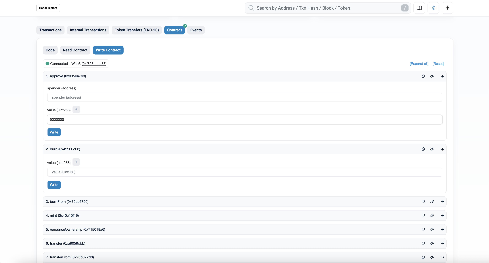
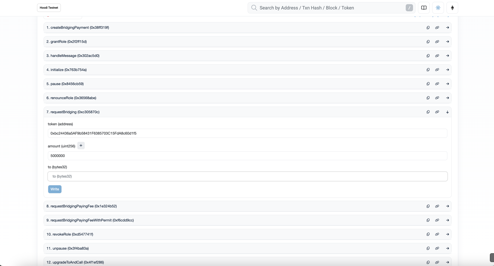
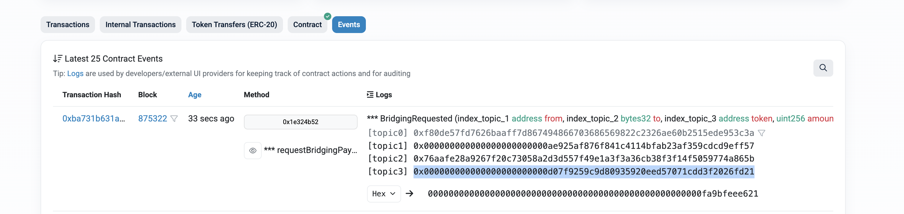
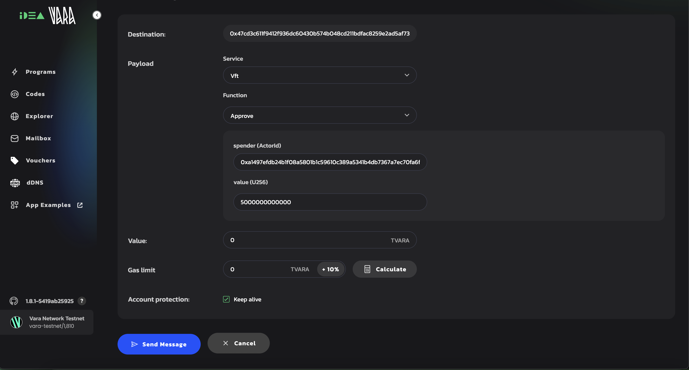
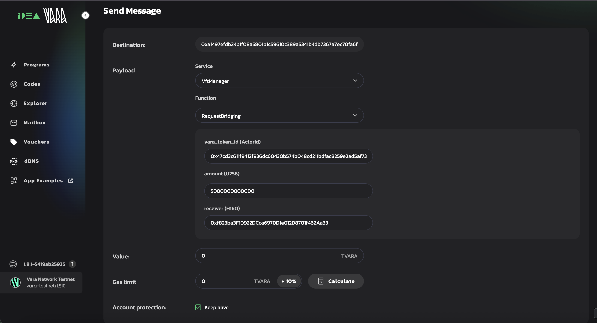
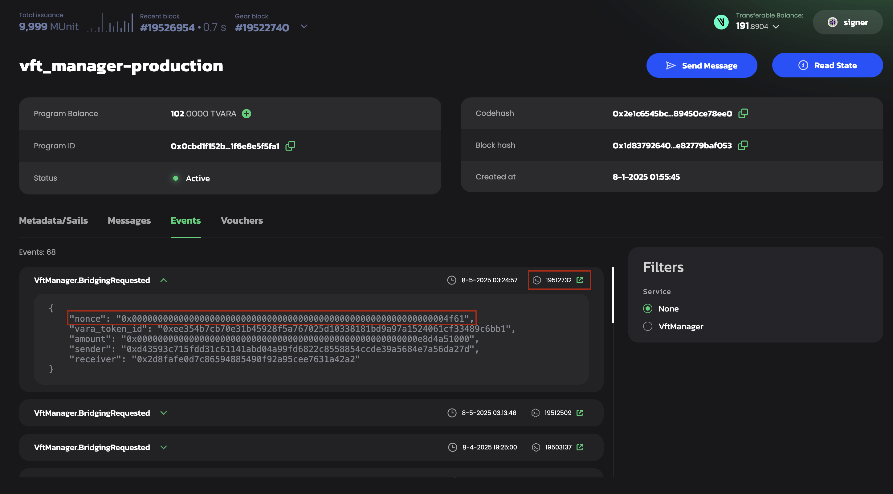
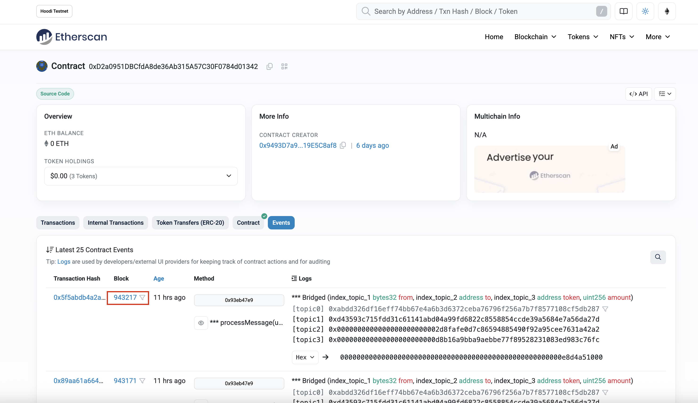
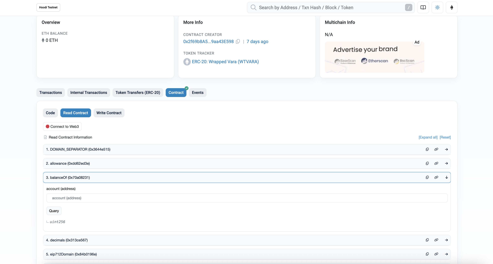

import { eth, vara } from '@site/src/addresses/bridge-addresses.js';

# Manual Message Bridging

This guide describes how to manually push a message across the bridge between Vara network and Ethereum network if the **Relayer is unavailable**. All steps are illustrated for `USDT` token as an example, but the same process applies to any supported token or arbitrary cross-chain message.

:::note
If the Relayer is unavailable, any bridging message remains stored on-chain and can be relayed manually at any time. 
No message is lost; manual relay simply finalizes the process and completes delivery.
:::

:::important
Always verify all contract addresses before bridging.

Addresses in this guide are for current test deployments.

**Whether you’re bridging messages on testnet or mainnet, the up-to-date contract addresses can always be found in the [Vara Bridge Developer Hub](https://wiki.vara.network/docs/bridge/developer_hub).**
:::

## Bridging Ethereum → Vara

### 1. Approve Token Transfer



- **Open** the <a href={`https://hoodi.etherscan.io/address/${eth.usdt}`}>test USDT contract on Hoodi Etherscan</a>.
- Go to **Contract → Write Contract** tab.
- Click **Connect to Web3** and select a wallet with sender’s account.
- Use the `approve` method:
  - **spender:** <code>{eth.erc20ManagerProxy}</code> (Erc20Manager Proxy address on Hoodi)
  - **value:** Amount to transfer (USDT uses 6 decimals, so `1 USDT = 1_000_000`, `5 USDT = 5_000_000`)

### 2. Initiate Bridging



- **Open** <a href={`https://hoodi.etherscan.io/address/${eth.erc20ManagerProxy}#writeProxyContract`}>Erc20Manager Proxy contract on Hoodi Etherscan</a>.
- Go to **Contract → Write as Proxy**.
- Connect wallet if needed.
- Use the `requestBridging` method:
  - **token:** <code>{eth.usdt}</code> (USDT address)
  - **amount:** Same as above or less (≤ approved amount)
  - **to:** Recipient address on Vara (hex string, e.g., convert from SS58 on <a href="https://ss58.org">ss58.org</a>)
- **Send** the transaction.

At this point, Erc20Manager emits a `BridgingRequested` event.

### 3. Relay Event Data to Vara

The final step is to relay proof of the bridging event from Ethereum to the Vara network. This means providing evidence that the required Ethereum block was finalized and that a transaction containing the relevant event (`BridgingRequested`) was actually included and executed on-chain.



To do this:

- **Find the transaction hash** that emitted the `BridgingRequested` event.
- This is visible in the event list after submitting the bridging transaction.
- This hash serves as the unique reference to the on-chain proof and will be used by the relayer to gather and submit all necessary data from Ethereum to Vara.

Next, run the Gear Bridge Relayer Docker container, providing it with the transaction hash and other required parameters.

```sh
docker pull ghcr.io/gear-tech/bridge-relayer:main.1037c949fb897aa855ec117830747e6fb16749c4
```

> Latest Docker images for the Gear Bridge Relayer are published at: [https://github.com/gear-tech/gear-bridges/pkgs/container/bridge-relayer](https://github.com/gear-tech/gear-bridges/pkgs/container/bridge-relayer)

<pre>
{`docker run --rm -it --platform linux/amd64 \
ghcr.io/gear-tech/bridge-relayer:main.1037c949fb897aa855ec117830747e6fb16749c4 \
gear-eth-manual \
  --tx-hash <TX_HASH> \
  --checkpoint-light-client ${vara.checkpointLightClient} \
  --historical-proxy ${vara.historicalProxy} \
  --receiver-program ${vara.vftManager} \
  --ethereum-endpoint "wss://hoodi-reth-rpc.gear-tech.io/ws" \
  --ethereum-beacon-rpc https://hoodi-nimbus-rpc.gear-tech.io \
  --gear-domain wss://testnet.vara.network \
  --gear-port 443 \
  --gear-suri "<SUBSTRATE_MNEMONIC_PHRASE>"
`}
</pre>

Replace `<TX_HASH>` with your transaction hash.  
Replace `<SUBSTRATE_MNEMONIC_PHRASE>` with the **mnemonic phrase for the Vara account** that pays for network fees.

:::note
**After submitting the proof, the finalization (rewarding) process is not instant.**  
You must first wait until the light client on Vara includes the required Ethereum block (usually about 15–20 minutes after the bridging transaction is mined).  
Only after this synchronization can the proof be submitted and verified on-chain.

Once the cross-chain proof is accepted, the transferred tokens will appear on Vara.
:::

To confirm the result, check the state of the **wrapped USDT token program** on Vara using the `balanceOf` function.  
This can be done on <a href={`https://idea.gear-tech.io/programs/${vara.wusdt}?node=wss%3A%2F%2Ftestnet-archive.vara.network`}>IDEA</a>:  
- Click "Read state"
- Select `balanceOf`
- Enter the recipient address

The updated balance will reflect the received tokens after successful bridging.

---

## Bridging Vara → Ethereum

The bridging procedure from Vara to Ethereum is **very similar** to the reverse direction described above.

The user interacts with the **VftManager program** on Vara. The bridging flow consists of the following main steps:

### 0. (Optional) Tokenize TVARA to VFT

If your tokens are not yet tokenized as VFT (Vara Fungible Tokens), you need to convert your TVARA using the `VftNativeExchange::Mint` message.  
This will mint the desired amount of VFT in <a href={`https://idea.gear-tech.io/programs/${vara.tokenizedVara}?node=wss%3A%2F%2Ftestnet-archive.vara.network`}>TVARA token program</a>.

### 1. Approve VftManager to Spend Tokens



- Open the VFT token contract, e.g., <a href={`https://idea.gear-tech.io/programs/${vara.tokenizedVara}?node=wss%3A%2F%2Ftestnet-archive.vara.network`}>TVARA token program</a>.
- Use the `approve` function:
  - **spender:** <code>{vara.vftManager}</code> (VftManager address)
  - **value:** Amount to transfer (TVARA uses 12 decimals, so `1 TVARA = 1_000_000_000_000`)

### 2. Request Bridging via VftManager



- Open the <a href={`https://idea.gear-tech.io/programs/${vara.vftManager}?node=wss%3A%2F%2Ftestnet-archive.vara.network`}>VftManager program</a>
- Call the `RequestBridging` function:
  - **vara_token_id:** Address of the token contract (e.g., <code>{vara.tokenizedVara}</code>)
  - **amount:** Amount to bridge (must be ≤ approved value)
  - **receiver:** Ethereum recipient address (hex)

After successful execution of both the **approve** and **RequestBridging** steps,  
the VftManager program emits a `BridgingRequested` event containing a `nonce` and `block` number.

**How to find the event:**
- Go to the <a href={`https://idea.gear-tech.io/programs/${vara.vftManager}?node=wss%3A%2F%2Ftestnet-archive.vara.network`}>VftManager program</a>
- Switch to the **Events** tab to locate the relevant `BridgingRequested` event and copy the `nonce` and `block` values.



### 3. Relay Proof to Ethereum

Run the relayer Docker container with the `nonce` and `block` values from your `BridgingRequested` event.

<pre>
{`docker run --rm -it --platform linux/amd64 \
ghcr.io/gear-tech/bridge-relayer:main.1037c949fb897aa855ec117830747e6fb16749c4 \
gear-eth-manual \
  --message-nonce "<NONCE>" \
  --message-block <BLOCK> \
  --from-eth-block <ETH_BLOCK> \
  --gear-domain wss://testnet-archive.vara.network \
  --gear-port 443 \
  --ethereum-endpoint "wss://hoodi-reth-rpc.gear-tech.io/ws" \
  --mq-address "${vara.messageQueueProxy}" \
  --eth-fee-payer "<ETH_PRIVATE_KEY>"
`}
</pre>



- To get `<ETH_BLOCK>` go to <a hreg="https://hoodi.etherscan.io/address/${eth.erc20ManagerProxy}#events"> erc20 Manager Proxy contract</a>, find your relevant bridging transaction, and note the Ethereum block number in which the event was emitted. Use this block number as the value for `--from-eth-block`.
- `<MQ_ADDRESS>`: This is the MQ (Message Queue Proxy) address used by the bridge. You can find it in the documentation or in the contract’s Read/Write panel on Etherscan.
- `<ETH_PRIVATE_KEY>`: Your Ethereum fee-payer private key.

:::warning
The key is used only locally for signing. The relayer does not send your private key anywhere, but you should always take care with sensitive keys.
:::

:::note
Finalization and minting on Ethereum are **not instant**.  
After relaying, the message will be processed and the wrapped tokens (e.g., WTVARA) will appear in the recipient's balance after confirmation.

**To check the result,** open the corresponding wrapped token contract (e.g., WTVARA) in Etherscan, go to the "Read Contract" tab, and call `balanceOf` with the recipient's address.
:::

