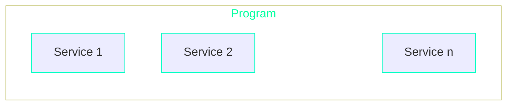

# Introduction

The Sails framework is based on the concept of **services** and **programs**. A program serves as a container for one or more services.
This is reflected in the code as follows:

- **Services**: A service is a Rust `struct` whose `impl` block is marked with the `#[service]` attribute. It is responsible for handling the business logic of the application.
It exposes public methods as remote calls, with commands that modify state and queries that return data without making state changes.
- **Programs**: A program is Rust `struct` whose `impl` block is marked with the `#[program]` attribute. It hosts one or more services and manages the application lifecycle. It defines how the program and its services are initialized and interact with external consumers through constructors and public methods. *Only one program is allowed per application.*

Additionally, Sails provides a mechanism to emit **events** from your service while processing commands, as well as the option for customized **message routing**, which involves defining rules for directing incoming request messages to specific service methods based on service and method names. It also offers advanced features like the ability to extend (or **mix in**) existing services.



## Service

The service's main responsibility is to implement specific aspects of the application's business logic. The set of its **public** methods defined in the `impl` block essentially represents a collection of remote calls that the service exposes to external consumers. In Sails, there are two types of calls available:

- **Commands**: A method working over `&mut self` is treated as
a command. It is a call that is *changing some state* of the program.
- **Query**: A method working over a `&self` is treated as a query *keeping everything unchanged and only returning some data*. 

Both types of methods can accept some parameters passed by a client and can be synchronous
or asynchronous. All the other service's methods and associated functions are treated
as implementation details and ignored. The code generated behind the service by the
`#[service]` attribute decodes an incoming request message and dispatches it to the
appropriate method based on the method's name. On the method's completion, its result
is encoded and returned as a response to a caller.

```rust
#[service]
impl MyService {
    // This is a command
    #[export]
    pub fn do_something(&mut self, p1: u32, p2: String) -> &'static [u8] {
        ...
    }

    // This is a query
    #[export]
    pub fn some_value(&self, p1: Option<bool>) -> String {
        ...
    }
}
```

## Program

The program's main responsibility is to host one or more services and expose them to external consumers. The structure of a program is somewhat simpler compared to that of services. As with services, there are two possible variants for its **public** methods:

- **Application Constructors**: Methods returning `Self` are treated as application constructors. These functions can accept some parameters
passed by a client and can be synchronous or asynchronous. One of them will be called
once at the very beginning of the application lifetime, i.e. when the application is
loaded onto the network. The returned program instance will live until the application
stays on the network.
- **Exposed Service Constructors**: Methods working over `&self` and having no other parameters are treated as *exposed service constructors* and are called
each time when an incoming request message needs be dispatched to a selected service.

All the other methods and associated functions are treated as implementation details
and ignored. The code generated behind the program by the `#[program]` attribute
receives an incoming request message from the network, decodes it and dispatches it to
a matching service for actual processing. After that, the result is encoded and returned
as a response to a caller. Only one program is allowed per application.

```rust
#[program]
impl MyProgram {
    // Application constructor
    pub fn new() -> Self {
        ...
    }

    // Yet another application constructor
    pub fn from_u32(p1: u32) -> Self {
        ...
    }

    // Service constructor
    pub fn ping_svc(&self) -> MyPing {
        ...
    }
}
```
