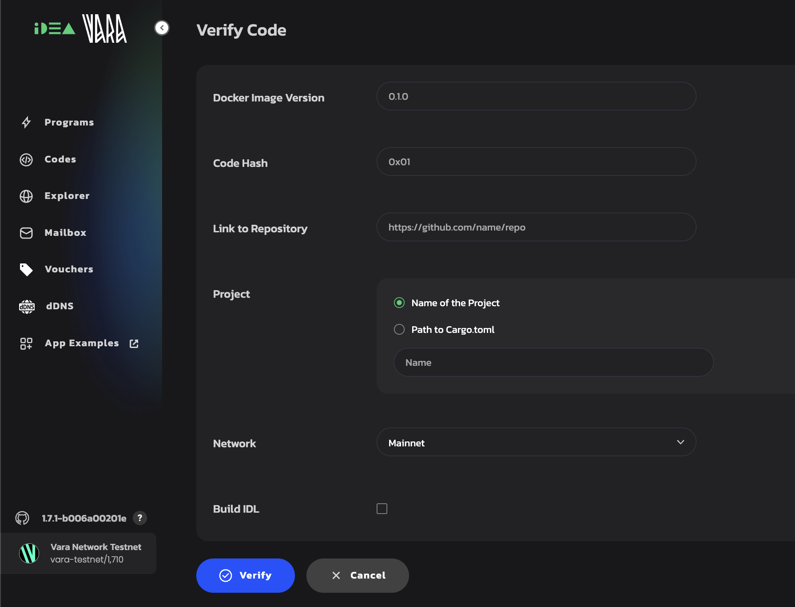

# Sails Verifier

`Sails Verifier` is a tool that checks whether a compiled program was built from the claimed source code using a trusted, reproducible environment.
It also ensures compatibility with the Vara network by verifying that the binary matches the required versions of `Sails`, `Rust`, and system dependencies — guaranteeing predictable behavior and provable code integrity.

Sails Verifier helps to:

	- ✅ Ensure your program was built in the correct environment
	- ✅ Guarantee determinism: same code = same binary = same behavior
	- ✅ Speed up audits and integration with other tools

Whether you’re a <u>developer</u>, <u>auditor</u>, or <u>simple user</u> — you can trust that the program behaves exactly as the source code says it will.

## How to use it

If you’re building on `Sails` — Sails Verifier should be part of your standard workflow. It helps you build safer, more reliable applications that everyone can trust.

First, compile your program using the official Docker image:

```bash
docker run -v $(pwd):/app --entrypoint /bin/bash ghcr.io/gear-tech/sails-program-builder:<version> -c 'cargo build --release'
```

```info
**Important:** Make sure to choose the Docker image version that matches the Sails version used in your project.
```

👉 Browse available Docker image versions here:
[gear-tech/sails-program-builder](https://github.com/gear-tech/sails-program-builder/pkgs/container/sails-program-builder)

Then, upload your binary and source code for verification using:



- Web interface: [gear-tech.io/verify](https.gear-tech.io/verify)
- Technical README & API: [Github](https://github.com/gear-tech/sails-program-verifier)