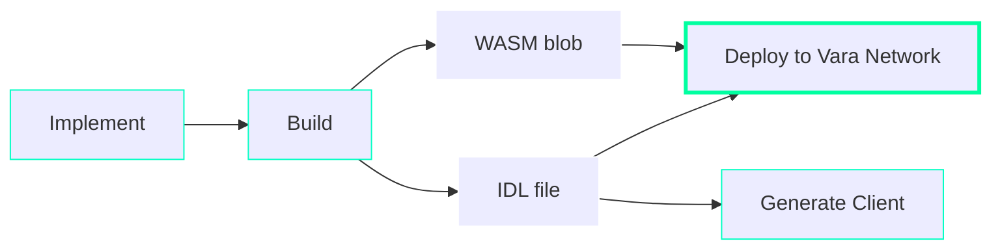

# Sails Library

## Introduction

Sails is a library designed to elevate the experience of developing applications with Gear Protocol,
placing a strong emphasis on simplicity and clarity. It removes the need to write low-level boilerplate code with `gstd`,
allowing developers to focus on business challenges. Additionally, Sails automatically generates a corresponding Interface Definition Language (IDL)
file for the application, which outlines data types, services, constructors, and events in a language-independent format.
This IDL file can then be used to automatically generate client code in Rust and TypeScript, facilitating seamless interaction with the application.

:::important
🔥 Try out our new interactive [Sails tutorial](https://sails-tutorials.vara.network/hello-world/hello-world).
:::

## Development Workflow

The typical development workflow with the Sails framework consists of the following steps:

- **Implement**: The program logic is implemented in Rust using the Sails framework.
- **Build**: The Rust program is compiled into an optimized WebAssembly (WASM) blob. The `sails_idl_gen` crate is then used to automatically generate a corresponding IDL file for interfacing with the program. Typically, all of these steps are executed automatically with a proper cargo configuration for Sails.
- **Deploy**: The optimized WASM blob and corresponding IDL file are uploaded to the Vara Network (mainnet or testnet) via the [Gear IDEA portal](https://idea.gear-tech.io/).
- **Interact**: Interaction with the deployed dApp is carried out either directly through the Gear IDEA portal or by using a Rust/TypeScript client generated from the IDL file.



To install the latest version of the Sails library, use:
```bash
cargo install sails-cli
```