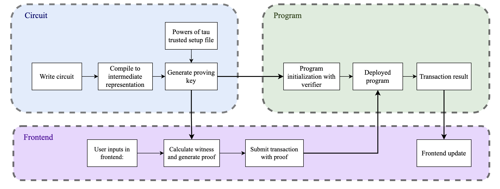

<!-- ---
sidebar_label: ZK-Battleship Game
sidebar_position: 2
---

# ZK-Battleship Game

## Introduction

[The previous paper](./battleship.md)  explored the implementation of a Battleship game, where all data, including the positions of players' ships, were openly stored on a blockchain. While this approach demonstrated the potential of decentralized gaming, it had a significant drawback: the ship positions were publicly accessible, undermining the strategic nature of the game.

To address this issue and preserve the confidentiality of players' data, the new version of the game integrates **Zero-Knowledge Proofs (zk-SNARKs)**. With this technology, players' boards are stored locally, and no information about ship positions is transmitted to the network, ensuring both fairness and security in gameplay.

### What Are Zero-Knowledge Proofs?

**Zero-Knowledge Proofs (zk-SNARKs)** are a cryptographic technology that allows one party to prove to another that a certain statement is true without revealing any additional information.

In simple terms, zk-proofs enable a player to prove that they possess certain information (such as the correct arrangement of ships on their board) and are performing the required actions (like responding to an opponent’s move) without disclosing the information itself. This ensures the privacy and security of the game while maintaining its functionality and fairness.


## Implementation details

The source code is available on [GitHub](https://github.com/gear-foundation/dapps/tree/master/contracts/zk-battleship). This article describes the program interface, data structure, basic functions and explains their purpose. It can be used as is or modified to suit your own scenarios.

### Problem Statement

The game of Battleship inherently relies on the mutual trust between players to accurately place their ships on the board and honestly record hits on their ships. The necessary guarantees for a fair game are as follows:

1. **Valid Board Configuration**: Each player's board must be valid, meaning the ships are correctly placed according to the game's rules.
2. **Board Integrity**: The board configuration of each player must remain unchanged throughout the entire game.
3. **Opponent's Board Privacy**: A player must not be able to see their opponent's board at any point in the game.
4. **Honest Reporting**: A player should not be able to lie about whether an opponent's guess was a hit or a miss.

These guarantees ensure a fair and strategic gameplay experience while maintaining the confidentiality of each player’s board. 

### Circom and Zero-Knowledge Proofs

To implement these guarantees, let 's turn to [Circom](https://iden3.github.io/circom/), a domain-specific language for creating Zero-Knowledge circuits. Circom allows us to generate zk-SNARKs, enabling us to create proofs that verify the above conditions without revealing any information about the board's configuration or the game state.

Using Circom, it is possible to create a system in which:
- Each player's board is verified to be valid at the start of the game.
- The integrity of the board is maintained, ensuring no alterations are made during gameplay.
- Players can prove the result of each opponent’s guess without revealing the underlying board configuration.
- These proofs can be verified by the opponent or a neutral party without compromising the privacy of the game.

The next section will discuss, the implementation of the necessary schemes in the Circom language to create the required zk-proofs to ensure a fair and secure Battleship game.

### Battleship Placement Proof in Circom

The provided Circom code implements a Zero-Knowledge proof to validate the placement of ships in a Battleship game. The goal is to ensure that the ships are correctly placed according to the game rules, without revealing the actual positions of the ships.

#### Inputs

```circom
template BattleshipPlacement(N1, N2, N3, N4) {
    signal input ship_1[N1];
    signal input ship_2[N2];
    signal input ship_3[N3];
    signal input ship_4[N4];
    signal input hash;
```

- **Ship Coordinates**: `ship_1`, `ship_2`, `ship_3`, and `ship_4` represent the coordinates of the ships on the board.
- **Hash**: is a cryptographic hash of all the ship coordinates combined.

Example input: 

```json
{
    "ship_1": ["4"],
    "ship_2": ["15", "20"],
    "ship_3": ["5", "6"],
    "ship_4": ["13", "18", "23"],
    "hash": "52217276415269335215074497398359620454856162108003890482549690012292772807126"
}
```

#### Key Components and Logic

1. **Uniqueness of Coordinates:**
   The code uses the `IsUniqueArray` template to ensure that each ship’s coordinates are unique, preventing overlapping or duplicate placements.

   ```circom
   template IsUniqueArray(N) {
       signal input arr[N];

       for (var i = 0; i < N; i++) {
           for (var j = i + 1; j < N; j++) {
               assert(arr[i] != arr[j]);
           }
       }
   }
   ```

2. **Edge Constraints:**
    The templates `NotRightEdge`, `NotLeftEdge`, and `NotHalfEdge` are utilized as utility components to assist in validating board conditions within the game. These templates do not directly prevent the placement of ships at the board's edges; rather, they help ensure that subsequent checks and operations involving coordinates are correctly applied based on the board's structure.

    - NotRightEdge:
    This template checks if a given coordinate is not on the right edge of the board. It does so by comparing the coordinate against specific values corresponding to the rightmost cells in each row. If the coordinate is not at the right edge, the output is 1, otherwise it's 0.

    - NotLeftEdge:
    Similarly, this template checks if a coordinate is not on the left edge of the board by comparing against the leftmost cells in each row. If the coordinate is not on the left edge, the output is 1, otherwise it's 0.

    - NotHalfEdge:
    This template is used to check if a coordinate is not near a boundary that would cause wrapping when calculating neighboring cells. It compares the coordinate against specific values that are susceptible to such wrapping issues. If the coordinate is not near such an edge, the output is 1.

    `NotRightEdge()` template example: 
    ```circom
    template NotRightEdge() {
        signal input coord;
        signal output out;

        component is_equal_4 = IsEqual();
        is_equal_4.in[0] <== coord;
        is_equal_4.in[1] <== 4;

        // Additional edge checks...

        out <== (1 - is_equal_4.out - ...);
    }
    ```
   These templates are then incorporated into more complex validation logic, such as:

    - `CheckDistance`:
    This function uses the `NotRightEdge` and `NotLeftEdge` templates to adjust the calculation of surrounding cell coordinates based on the position of the cell on the board. This ensures that the calculation correctly respects the board's boundaries and prevents erroneous checks across the edges.

    - `IntegrityEdgeSize2` and `IntegrityEdgeSize3`:
    These functions verify that a ship of size 2 or 3 is placed correctly on the board, without wrapping around edges. The `NotRightEdge` and `NotHalfEdge` templates are used to ensure that the coordinates of the ship's cells are aligned either horizontally or vertically within the bounds of the board.

3. **Distance Check Between Ships:**
   The `CheckDistance` template is used to ensure that ships are not placed too close to each other. This is done by checking the surrounding cells of each coordinate to ensure no other ship occupies these cells.

   ```circom
   template CheckDistance(N) {
       signal input coord;
       signal input arr[N];
       signal cells[9];

       component not_left_edge = NotLeftEdge();
       not_left_edge.coord <== coord;

       // Additional distance checks...

       for (var i = 0; i < 8; i++) {
           for (var j = 0; j < N; j++) {
               assert(cells[i] != arr[j]);
           }
       }
   }
   ```

4. **Ship Integrity:**
   The `IntegrityEdgeSize2`, `IntegrityEdgeSize3`, and `Integrity` templates ensure that each ship is placed in a continuous line either horizontally or vertically and does not "break up" due to edge constraints.

   ```circom
   template IntegrityEdgeSize2() {
       signal input arr[2];

       component not_edge = NotRightEdge();
       not_edge.coord <== arr[0];

       var horizontal = (arr[1] == arr[0] + 1) * not_edge.out;
       var vertical = (arr[1] == arr[0] + 5);
       assert((horizontal+vertical) == 1);
   }
   ```

5. **Poseidon Hash for Commitment:**
   The use of the `Poseidon` hash function allows the players to commit to their board configuration in a way that can later be verified without revealing the actual configuration.

   ```circom
   component poseidon = Poseidon(N1 + N2 + N3 + N4);
   for (var i = 0; i < N1 + N2 + N3 + N4; i++) {
       poseidon.inputs[i] <== combinedShips[i];
   }
   hash === poseidon.out;
   ```

6. **Main Circuit:**
   The `BattleshipPlacement` template brings all these components together, taking in the coordinates of the ships and producing a hash as the public output. It checks for valid ship placement, non-overlapping ships, and compliance with the game rules.

   ```circom
   component main {public [hash]} = BattleshipPlacement(1, 2, 2, 3);
   ```

This code provides a comprehensive circuit for verifying Battleship game board setups using zk-SNARKs. It ensures that ship placements are valid, the board configuration is committed to with a Poseidon hash, and that the integrity and distance rules of the game are upheld. This approach allows third parties or opponents to verify the board without revealing the actual positions of the ships, preserving the secrecy and fairness of the game.  
The full code discussed above can be found on [GitHub](https://github.com/gear-foundation/dapps/tree/master/contracts/zk-battleship/circom/placement.circom).

### Battleship Hit Proof in Circom

The `BattleshipHit` circuit is designed to verify if a shot fired in a game of Battleship hits a ship, misses entirely, or sinks the ship. It accepts the coordinates of multiple ships, previous hit coordinates, and a new shot coordinate, and outputs a result indicating whether the shot was a miss, a hit, or a sinking blow.

#### Inputs and Outputs

```circom
template BattleshipHit(N1, N2, N3, N4, MAX_HITS) {
    signal input ship_1[N1];
    signal input ship_2[N2];
    signal input ship_3[N3];
    signal input ship_4[N4];
    signal input hits[MAX_HITS];  // Previous hits
    signal input hit;             // Current shot coordinate
    signal input hash;            // Hash on each element of coordinates
    signal output is_hit;         // 0 = miss, 1 = hit, 2 = sunk
```

- **Ship Coordinates**: `ship_1`, `ship_2`, `ship_3`, and `ship_4` represent the coordinates of the ships on the board.
- **Hit Coordinates**: `hits` stores the coordinates of previous shots, and `hit` is the current shot coordinate.
- **Hash**: is a cryptographic hash of all the ship coordinates combined.
- **Output (`is_hit`)**: The circuit outputs `0` for a miss, `1` for a hit, and `2` for a sunk ship.

Example input: 

```json
{
    "ship_1": ["4"],
    "ship_2": ["15", "20"],
    "ship_3": ["5", "6"],
    "ship_4": ["13", "18", "23"],
    "hits": ["18", "23", "15", "5", "-1", "-1", "-1", "-1", "-1", "-1", "-1", "-1", "-1", "-1", "-1", "-1", "-1", "-1", "-1", "-1", "-1", "-1", "-1", "-1", "-1"],
    "hit": "6",
    "hash": "52217276415269335215074497398359620454856162108003890482549690012292772807126"
}

```

#### Key Components and Logic

1. **Hash Verification**

The combined ship coordinates are hashed using the Poseidon hash function, and the result is compared with the provided hash to verify the validity of the ship positions.

```circom
    component poseidon = Poseidon(N1 + N2 + N3 + N4);
    for (var i = 0; i < N1 + N2 + N3 + N4; i++) {
        poseidon.inputs[i] <== combinedShips[i];
    }
    hash === poseidon.out;
```

2. **Hit Detection**

For each ship, the circuit checks whether the current shot matches any of the ship's coordinates and counts the number of hits. It also tracks previous hits on each ship.

```circom
    // Check hits on ship 1
    var hits_on_ship1 = 0;
    component is_equal_ship1[N1];
    for (var j = 0; j < N1; j++) {
        is_equal_ship1[j] = IsEqual();
        is_equal_ship1[j].in[0] <== hit;
        is_equal_ship1[j].in[1] <== ship_1[j];
        hits_on_ship1 += is_equal_ship1[j].out;
    }
    signal hit_ship1 <== hits_on_ship1;
    // ... (similarly for ship_2, ship_3, and ship_4)
```

3. **Sinking Verification**

The circuit calculates the total hits on each ship by summing previous hits with the current hit and then checks if this total equals the ship's length, indicating the ship is sunk.

```circom
    component ge_total_hits1 = GreaterEqThan(N1);
    ge_total_hits1.in[0] <== total_hits_on_ship1;
    ge_total_hits1.in[1] <== N1;
    signal sunk_ship1 <== ge_total_hits1.out;
    // ... (similarly for ship_2, ship_3, and ship_4)
```

4. **Determining the Final Result**

The circuit uses a series of `Mux1` components to determine the final output (`is_hit`). It checks whether each ship was hit or sunk and sets the output accordingly.

```circom
    component mux_main4 = Mux1();
    mux_main4.c[0] <== mux_main3.out;
    mux_main4.c[1] <== mux_hit4.out;
    mux_main4.s <== hit_ship4;
    is_hit <== mux_main4.out;
```

This circuit verifies if a shot in Battleship hits a ship and whether that ship is sunk. It uses a series of equality checks and logic gates to aggregate hits, compare them against ship coordinates, and output the correct result.  
The full code discussed above can be found on [GitHub](https://github.com/gear-foundation/dapps/tree/master/contracts/zk-battleship/circom/hit.circom).


### Proof Generation and Verification Key Details

In zk-SNARKs the proof generation and verification process is essential for maintaining privacy and integrity in decentralized systems.

#### **Proof Generation**
The process of generating a zk-SNARK proof involves compiling a circuit, calculating a witness, and then using a proving key to create the proof. For a detailed explanation of witness generation, you can refer to the steps [here](https://docs.circom.io/getting-started/computing-the-witness/#what-is-a-witness), and for the proof generation process, see this [link](https://docs.circom.io/getting-started/proving-circuits/).

#### **Verification Key Generation**
A verification key is generated during the setup phase, which corresponds to the specific circuit and proving key. This verification key is then provided to the program during its initialization, enabling the program to verify zk-SNARK proofs submitted by users.

#### **Verification Process in Programs**
When proving circuits with ZK, two key outputs are generated: proof and public.

- Proof: This is the zk-SNARK proof, a cryptographic proof that verifies the correctness of the computation.

- Public: This contains the public inputs or outputs of the circuit. These are open data that the program uses for verification. For instance, this could include information about a hit or miss in a game, or a hash representing the ship placement. The program uses this data to validate the proof and ensure consistency, such as checking that the ship placement hash remains unchanged throughout the game.

These outputs are then passed to the program, which securely verifies the computations without revealing private data, ensuring transparent and fair interactions.


### Program Workflow Explanation

The program's primary responsibility in the Battleship game is to verify zero-knowledge proofs (ZKPs) that ensure the game's integrity while maintaining player privacy. The program is initialized with verification keys that are essential for validating these proofs during gameplay.

#### Program Initialization

During the program's initialization, the following parameters are passed:

```rust
constructor {
    New : (
        verification_key_for_start: VerifyingKeyBytes,
        verification_key_for_move: VerifyingKeyBytes,
        // other initialization fields 
    );
};
```
- **verification_key_for_start**: This key is used to verify the proof of the initial ship placement.
- **verification_key_for_move**: This key is used to verify the proof for each move or shot taken during the game.

#### Data Structures for Verification

The program uses several data structures to handle verification processes:

```rust
pub struct VerifyingKeyBytes {
    pub alpha_g1_beta_g2: Vec<u8>,
    pub gamma_g2_neg_pc: Vec<u8>,
    pub delta_g2_neg_pc: Vec<u8>,
    pub ic: Vec<Vec<u8>>,
}
```

This structure represents the verification keys, which are necessary to validate proofs.

#### Ship Placement Verification

When verifying the placement of ships, the program receives:

```rust
proof: services::verify::ProofBytes,
public_input: services::verify::PublicStartInput,
```

**ProofBytes**: Contains the proof generated by the player.
    ```rust
    pub struct ProofBytes {
        pub a: Vec<u8>,
        pub b: Vec<u8>,
        pub c: Vec<u8>,
    }
    ```
    - `a`, `b`, and `c`: These fields represent the proof components in the elliptic curve pairing used in ZKPs.

**PublicStartInput**: Contains the public input required for verification.
    ```rust
    pub struct PublicStartInput {
        pub hash: Vec<u8>,
    }
    ```
    - `hash`: This is the hash of the ship placement, ensuring that the layout remains confidential while allowing the program to verify its correctness.

#### Move Verification

For each move the program processes the following:

    ```rust
    pub struct PublicMoveInput {
        pub out: u8,
        pub hit: u8,
        pub hash: Vec<u8>,
    }
    ```
    - `out`: Represents the outcome of the shot, where 0 indicates a miss, 1 indicates a hit, and 2 indicates a sunk ship.
    - `hit`: The coordinate of the attempted shot.
    - `hash`: The hash of the ship placement, which ensures that the integrity of the board state is maintained throughout the game.

#### Verification Process

The verification process is central to the program's function. When a player submits a move or sets up their ships, the program checks the provided proof against the public inputs using the stored verification keys. If the proof is valid, the program acknowledges the action as legitimate; otherwise, it rejects the action.

:::note
This process allows the game to maintain fairness and privacy, ensuring that players cannot cheat by altering ship placements or falsifying shot outcomes.
:::

### Use of BLS12-381 in the Program

The program leverages the BLS12-381 elliptic curve for verifying zero-knowledge proofs, which is a computationally intensive process. BLS cryptography is known for its ability to efficiently handle signature aggregation and verification at scale using Elliptic Curve cryptography.

In the context of this program, performing BLS computations directly on-chain would significantly increase gas costs and processing time, potentially requiring over 30 blocks on the Vara network to complete. To address this, the program utilizes the [BLS12-381 Built-in Actor](docs/build/builtinactors/bia-bls.md), a specialized module integrated into the Vara runtime.

This module allows the program to offload BLS cryptographic operations to be executed in native mode off-chain by the validators. By sending a message with the necessary arguments to the BLS12-381 actor's address, the program ensures that these intensive computations are processed efficiently and within the single block time of the Vara network (which is 3 seconds). Once the computation is complete, the result is returned to the program, minimizing on-chain resource usage and reducing gas costs. 

#### Code Explanation

The following Rust code snippet illustrates the process:

```rust
// Verifies the proof by comparing the result of the exponentiation with the expected value.
let miller_out = calculate_multi_miller_loop(a.encode(), b.encode(), builtin_bls381_address).await;

let exp = calculate_exponentiation(miller_out, builtin_bls381_address).await;

if exp != alpha_g1_beta_g2 {
    ext::panic("Verification failed");
}
```

1. **Multi-Miller Loop Calculation:**
   The first step involves calculating the multi-Miller loop using the G1 and G2 points (`a` and `b`) of the proof. This operation is offloaded to the BLS12-381 Built-in Actor for efficient execution.

   ```rust
   async fn calculate_multi_miller_loop(
       g1: Vec<u8>,
       g2: Vec<u8>,
       builtin_bls381_address: ActorId,
   ) -> Vec<u8> {
       let request = Request::MultiMillerLoop { a: g1, b: g2 }.encode();
       let reply = msg::send_bytes_for_reply(builtin_bls381_address, &request, 0, 0)
           .expect("Failed to send message")
           .await
           .expect("Received error reply");
       let response = Response::decode(&mut reply.as_slice()).expect("Error: decode response");
       match response {
           Response::MultiMillerLoop(v) => v,
           _ => unreachable!(),
       }
   }
   ```

   - A request is encoded and sent to the BLS12-381 Built-in Actor.
   - The response is awaited and decoded to retrieve the output of the Miller loop.

2. **Final Exponentiation:**
   After obtaining the result from the Miller loop, the next step is to perform the final exponentiation, which transforms the pairing result into a form that can be compared to the expected value.

   ```rust
   async fn calculate_exponentiation(
       f: Vec<u8>,
       builtin_bls381_address: ActorId,
   ) -> ArkScale<<Bls12_381 as Pairing>::TargetField> {
       let request = Request::FinalExponentiation { f }.encode();
       let reply = msg::send_bytes_for_reply(builtin_bls381_address, &request, 0, 0)
           .expect("Failed to send message")
           .await
           .expect("Received error reply");
       let response = Response::decode(&mut reply.as_slice()).expect("Error: decode response");
       let exp = match response {
           Response::FinalExponentiation(v) => {
               ArkScale::<<Bls12_381 as Pairing>::TargetField>::decode(&mut v.as_slice())
                   .expect("Error: decode ArkScale")
           }
           _ => unreachable!(),
       };
       exp
   }
   ```

   - Similar to the Miller loop, a request is sent to the BLS12-381 Built-in Actor to perform the exponentiation.
   - The result is decoded and compared with the expected `alpha_g1_beta_g2` value. If the result does not match, the verification fails.
   
:::note
This implementation highlights the use of off-chain computation via the BLS12-381 Built-in Actor to handle complex cryptographic operations, thus optimizing both performance and cost.
:::

### Overview of Application Workflow

This diagram represents the overall workflow of an application that integrates zero-knowledge proofs (ZKPs) into a decentralized environment. The workflow is divided into three main sections: **Circuit**, **Program**, and **Frontend**, each of which plays a crucial role in the end-to-end process of generating, verifying, and utilizing ZKPs within the application.



#### 1. Circuit

- Write Circuit:  
  The workflow starts with defining the circuit, which sets the logical constraints and conditions necessary for the zero-knowledge proof. This circuit acts as the mathematical foundation of the proof system.

- Compile to Intermediate Representation:  
  After the circuit is written, it is compiled into an intermediate format. This representation acts as a transitional phase between the abstract design of the circuit and its practical application in key generation.

- Powers of Tau Trusted Setup:  
  A trusted setup, commonly known as "Powers of Tau," is conducted to produce a setup file. This step is essential for establishing the security and integrity of the zero-knowledge proof system.

- Generate Proving Key:  
  Using the intermediate representation and the trusted setup file, a proving key is generated. This key is essential for producing proofs that the program can subsequently verify.

#### 2. Program

- Program initialization with verifier:
  The program is initialized with a verifier that can check the validity of the proofs generated by the circuit. This verifier is crucial for integrating the proof system into the program.

- Deployed program:
  The program, along with the verifier, is then deployed. This makes the verification process available for real-time interactions.

- Transaction result:
  When the proof is sent, the program processes the transaction and produces a result. This step not only verifies the proof, but also updates the state of the game or application based on the verified proof.

#### 3. Frontend

- User inputs in frontend:
  Users interact with the application through the frontend, providing the necessary inputs that will be used to generate the proof.

- Calculate witness and generate proof:
  Based on the user inputs, the frontend calculates the witness (the private inputs) and generates a proof. This proof encapsulates the information required for the verifier to confirm the validity of the transaction.

- Submit transaction with proof:
  - The generated proof is submitted to the deployed program as a transaction. The program then verifies this proof using the verifier.

- Frontend update:
  Based on the result of the transaction, the frontend is updated to reflect the outcome, providing feedback to the user.

This structured workflow ensures that the application can securely and efficiently handle zero-knowledge proofs, from circuit creation to proof verification and user interaction.


## Conclusion

Overall, this application demonstrates how advanced cryptographic techniques like ZKPs can be effectively incorporated into interactive applications, ensuring high security and data integrity without revealing sensitive information.

For more details, refer to the [GitHub](https://github.com/gear-foundation/dapps/tree/master/contracts/zk-battleship) repository. -->
