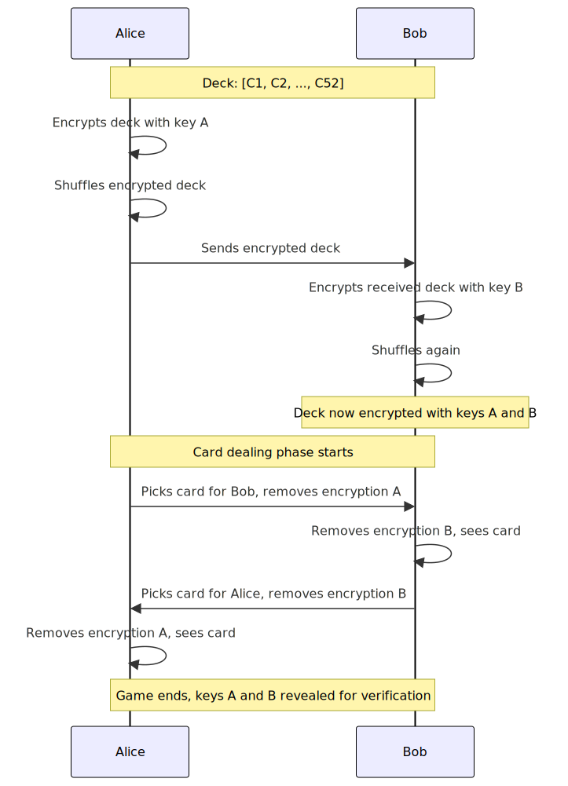

# Mental Poker on Vara Network

:::note
**Who this article is for**: This article targets blockchain developers, cryptographers, and poker enthusiasts interested in how cryptography and blockchain enable secure and decentralized online poker.
:::

Mental poker is a unique cryptographic concept first introduced in the landmark 1979 paper ["Mental Poker"](https://people.csail.mit.edu/rivest/pubs/SRA81.pdf) by Ron Rivest, Adi Shamir, and Leonard Adleman (the creators of RSA). It enables players to play poker remotely without trusting each other or relying on intermediaries such as dealers or arbiters. Imagine playing poker online with a friend, but neither party trusts the platform or each other. Mental poker solves this trust issue by leveraging mathematics and cryptography to ensure cards are dealt fairly, remain hidden from other players, and enforce game rules purely through code. In an era where decentralization and secure remote interactions have become essential, mental poker addresses the critical need for trustless, secure, and fair online gaming.

The original RSA paper proposed a mental poker protocol based on commutative encryption—a cryptographic method where encryption and decryption can occur in any order. This ensures that the deck of cards is shuffled and dealt fairly without revealing card identities prematurely. To illustrate this intuitively, imagine a box locked by multiple padlocks, each belonging to a different player. The box can only open once all padlocks are removed, but the order in which they're unlocked doesn't matter.

Today, thanks to advancements in zero-knowledge proofs (ZKPs), elliptic curve cryptography, and blockchain technology, the vision outlined in the original Mental Poker paper is more achievable and practical than ever before. In this article, modern cryptographic tools combined with innovative blockchain architectures, such as Vara Network, will be explored. Importantly, these techniques are applicable not only to poker but can also be generalized to create secure, decentralized versions of many other games and trustless multi-party interactions.

## How Does the Original Protocol Work?



A deck of 52 cards is represented by unique identifiers that are encrypted and shuffled by multiple players.

**Example scenario**: `Alice` and `Bob` playing poker remotely:

**Alice encrypts** each card with her secret key $A$:
   
$$
A(C_1), A(C_2), \dots, A(C_{52})
$$
   
- Then Alice randomly shuffles the deck.

**Bob receives the encrypted deck**, encrypts it again with his key $B$:
   
$$
B(A(C_1)), B(A(C_2)), \dots, B(A(C_{52}))
$$
   
- Bob then randomly shuffles this doubly-encrypted deck.

**Card dealing**:
   
**Alice selects a card for Bob**, removes her encryption layer:
$$
B(A(C_i)) \rightarrow B(C_i)
$$
sends it to Bob. Bob removes his encryption layer:
$$
B(C_i) \rightarrow C_i
$$

**Bob selects a card for Alice**, removes his encryption layer:
$$
A(B(C_j)) \rightarrow A(C_j)
$$
sends it to Alice. Alice removes her encryption layer:
$$
A(C_j) \rightarrow C_j
$$

**Verification at the end**: Players reveal keys $A$ and $B$ publicly to verify fairness of the game.

Multiple encryption and shuffling layers ensure no player knows card positions until fully decrypted.

### Pseudocode for Encryption and Card Dealing

```python
# Deck of 52 cards
deck = [C1, C2, ..., C52]

alice_key = generate_secret_key()  # Alice's secret key
bob_key = generate_secret_key()    # Bob's secret key

# Alice encrypts and shuffles the deck
alice_encrypted_deck = [encrypt(card, alice_key) for card in deck]
shuffle(alice_encrypted_deck)  # Shuffling (verified via ZK later)

# Bob encrypts and shuffles again
bob_encrypted_deck = [encrypt(card, bob_key) for card in alice_encrypted_deck]
shuffle(bob_encrypted_deck)  # Shuffling (verified via ZK later)

# Dealing a card to Alice
alice_card = select_card(bob_encrypted_deck)  # Bob selects for Alice
alice_card = decrypt(alice_card, bob_key)     # Bob removes his layer
alice_card = decrypt(alice_card, alice_key)   # Alice removes her layer
print(f"Alice receives card: {alice_card}")

# Dealing a card to Bob
bob_card = select_card(bob_encrypted_deck)    # Alice selects for Bob
bob_card = decrypt(bob_card, alice_key)       # Alice removes her layer
bob_card = decrypt(bob_card, bob_key)         # Bob removes his layer
print(f"Bob receives card: {bob_card}")

# Fairness verification (via ZK-circuits, explained later)
verify_shuffle(alice_encrypted_deck, bob_encrypted_deck)
```
:::note
The pseudocode is simplified. Real implementations use cryptographic libraries and ZK-proofs, which will be explored later.
:::
