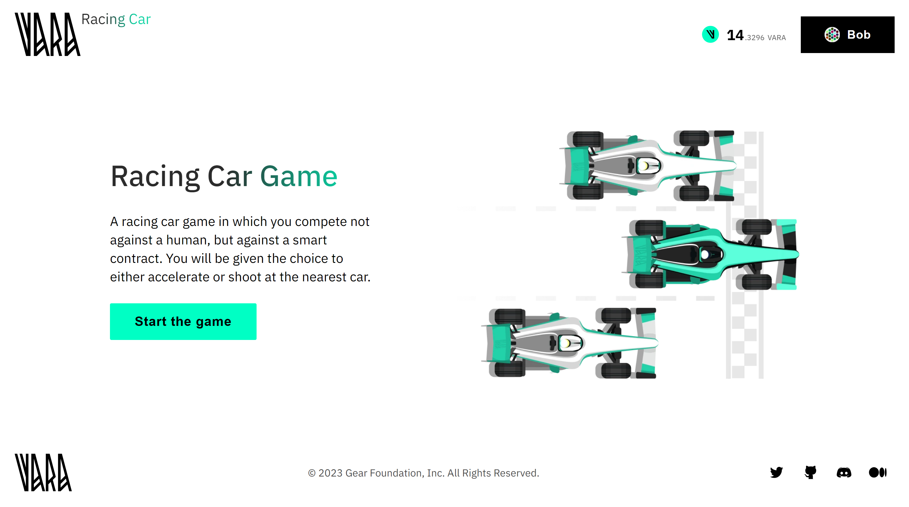

# Racing Cars - Algorithmic Game

The Racing Cars game revolves around a competition of program algorithms. In essence, participants upload their personalized program strategies, all managed by a central Master program. These strategies are open to optimization and can be re-uploaded.



In a well-known Ethereum-based [0xMonaco](https://mirror.xyz/matchboxdao.eth/-xVvvo36y-LHvrW99heb4VJ-xAOWQ-BQAx6MCwHLWnk) game, participants upload their personalized program strategies, all managed by a central Master contract. Central components were necessary to enable multi-block gameplay.

However, in the case of Vara, the game operates **fully on-chain**, thanks to the asynchronous messaging paradigm. Various actors (programs) communicate with each other, and if a game round can't be accommodated within a single block, it carries over into subsequent ones.

For this version of the game, improvements were made to increase its appeal. The game features a competition where a player races against two pre-loaded programs on the blockchain. Participants have three cars: the player's car is green, while the competitors' cars are white. Both the player and the program algorithms can choose to either accelerate, moving the car forward, or shoot at the nearest car to slow it down. The objective is to cross the finish line first to win the race.

The game example uses the [**EZ-Transactions package**](/docs/api/tooling/gasless-txs.md) that simplifies blockchain interactions by enabling gasless and signless transactions. Anyone can use it to integrate into their dApp projects. For more details, visit the [GitHub page](https://github.com/gear-foundation/dapps/tree/vt-update-ez-transactions/frontend/packages/ez-transactions).

The source code for the game program and algorithm examples are available on [GitHub](https://github.com/gear-foundation/dapps/tree/master/contracts/car-races).
The [frontend application](https://github.com/gear-foundation/dapps/tree/master/frontend/apps/racing-car-game) facilitates gameplay and interacts with the programs.
This article describes the program interface, data structure, basic functions and explains their purpose. It can be used as is or modified to suit your own scenarios.

Everyone can play the game via this link - [Play Racing Cars](https://racing.vara.network/) (VARA tokens are requred for gas fees).

## How to run

1. Build a program
> Additional details regarding this matter can be located within the [README](https://github.com/gear-foundation/dapps/tree/master/contracts/car-races/README.md) directory of the program.

2. Upload the program to the [Vara Network Testnet](https://idea.gear-tech.io/programs?node=wss%3A%2F%2Ftestnet.vara.network)
> Initiate the process by uploading the bot program, followed by the subsequent upload of the main program. Further details regarding the process of program uploading can be located within the [Getting Started](/docs/getting-started-in-5-minutes#deploy-your-program-to-the-testnet) section.

3. Build and run user interface
> More information about this can be found in the [README](https://github.com/gear-foundation/dapps/blob/master/frontend/apps/racing-car-game/README.md) directory of the frontend.

## Implementation details
To implement this game, the [CarRacesService](https://github.com/gear-foundation/dapps/tree/master/contracts/car-races/app/src/services/mod.rs) was developed, which contains all the core game functionality. 
### Program description

The program contains the following information

```rust title="car-races/app/src/services/mod.rs"
pub struct ContractData {
    admins: Vec<ActorId>,
    strategy_ids: Vec<ActorId>,
    games: HashMap<ActorId, Game>,
    messages_allowed: bool,
    dns_info: Option<(ActorId, String)>,
}
```

* `admins` - game admins
* `strategy_ids` - program strategy ids
* `games` - game information for each player
* `messages_allowed` - access to playability
* `dns_info` -  optional field that stores the [dDNS](../Infra/dein.md) address and the program name. 


Where `Game` is defined as follows:

```rust title="car-races/app/src/services/game.rs"
pub struct Game {
    pub cars: BTreeMap<ActorId, Car>,
    pub car_ids: Vec<ActorId>,
    pub current_turn: u8,
    pub state: GameState,
    pub result: Option<GameResult>,
    pub current_round: u32,
    pub last_time_step: u64,
}
```
```rust title="car-races/app/src/services/game.rs"
pub struct Car {
    pub position: u32,
    pub speed: u32,
    pub car_actions: Vec<RoundAction>,
    pub round_result: Option<RoundAction>,
}
```

### Initialization

To initialize the game program, the game configuration and the optional DNS address and name must be provided.

```rust title="car-races/src/app/services/mod.rs"
pub async fn init(
        config: InitConfig,
        dns_id_and_name: Option<(ActorId, String)>,
    ) {
        unsafe {
            DATA = Some(ContractData {
                admins: vec![exec_context.actor_id()],
                games: HashMap::with_capacity(20_000),
                dns_info: dns_id_and_name.clone(),
                ..Default::default()
            });
            CONFIG = Some(config.config);
        }
        if let Some((id, name)) = dns_id_and_name {
            let request = [
                "Dns".encode(),
                "AddNewProgram".to_string().encode(),
                (name, exec::program_id()).encode(),
            ]
            .concat();

            msg::send_bytes_with_gas_for_reply(id, request, 5_000_000_000, 0, 0)
                .expect("Error in sending message")
                .await
                .expect("Error in `AddNewProgram`");
        }
    }
```

### Service functions

```
service CarRacesService {
  
  // Admin actions
  //----------------------------------

  // Adds a new admin by specifying their actor ID.
  AddAdmin : (admin: actor_id) -> null;

  // Removes an admin by specifying their actor ID.
  RemoveAdmin : (admin: actor_id) -> null;

  // Updates the configuration settings of the game, such as gas limits, speed limits, etc.
  UpdateConfig : (config: ServicesConfig) -> null;

  // Enables or disables the processing of game-related messages.
  AllowMessages : (messages_allowed: bool) -> null;

  // Terminates the program and transfers control to the specified inheritor.
  Kill : (inheritor: actor_id) -> null;

  // Adds two strategy contracts (AI cars) to the game.
  AddStrategyIds : (car_ids: vec actor_id) -> null;

  // Removes a specific player's game instance. Only applicable if the game has finished.
  RemoveGameInstance : (account: actor_id) -> null;

  // Removes game instances for specific players or all instances that have exceeded the storage time.
  RemoveInstances : (player_ids: opt vec actor_id) -> null;

  // Player (game-related) actions
  //----------------------------------

  // Starts a new game for the player, supporting signless/gasless sessions with an optional session account.
  StartGame : (session_for_account: opt actor_id) -> null;

  // Processes a player's move. The `strategy_move` determines the player's action,
  // and an optional session account can be specified for signless/gasless interaction.
  PlayerMove : (strategy_move: StrategyAction, session_for_account: opt actor_id) -> null;

  // Queries (read-only operations)
  //----------------------------------

  // Queries the list of all admins currently registered in the service.
  query Admins : () -> vec actor_id;

  // Returns the list of all active games, including player IDs and game states.
  query AllGames : () -> vec struct { actor_id, Game };

  // Retrieves the current configuration settings of the service.
  query ConfigState : () -> ServicesConfig;

  // Provides DNS information if the service is registered with DNS, including the actor ID and name.
  query DnsInfo : () -> opt struct { actor_id, str };

  // Fetches the game state for a specific player, given their actor ID.
  query Game : (account_id: actor_id) -> opt Game;

  // Checks if message processing is currently enabled or disabled for the game.
  query MessagesAllowed : () -> bool;

  // Retrieves the IDs of the strategy (AI) cars that are part of the current game.
  query StrategyIds : () -> vec actor_id;

  // Events
  //----------------------------------

  events {
    // Fired when a new round of the game is completed, containing round information.
    RoundInfo: RoundInfo;

    // Triggered when the service is killed, transferring control to the inheritor.
    Killed: struct { inheritor: actor_id };
  }
};
```

### Logic
Before starting the game, the admin must first send a message to enable or disable message processing for the game:
```rust title="car-races/app/src/services/mod.rs"
pub fn allow_messages(&mut self, messages_allowed: bool) {
    let msg_src = msg::source();
    assert!(self.data().admins.contains(&msg_src), "Not admin");
    self.data_mut().messages_allowed = messages_allowed;
}
```
After that, the admin needs to add two strategy contracts that will play against the user:

```rust title="car-races/app/src/services/mod.rs"
pub fn add_strategy_ids(&mut self, car_ids: Vec<ActorId>) {
    let msg_src = msg::source();
    assert!(self.data().messages_allowed, "Message processing suspended");
    assert!(self.data().admins.contains(&msg_src), "Not admin");
    assert_eq!(car_ids.len(), 2, "Must be two strategies");
    self.data_mut().strategy_ids = car_ids;
}

```
This function, `start_game`, initializes a new game session for a player, supporting signless/gasless [sessions](https://github.com/gear-foundation/signless-gasless-session-service), which allows players to participate in games without requiring them to sign each action or pay gas fees. You can read more about signless/gasless sessions [here](/docs/about/features/gassignless.md).

```rust title="car-races/app/src/services/mod.rs"
pub fn start_game(&mut self, session_for_account: Option<ActorId>) {
    // Ensure that message processing is allowed before starting the game.
    assert!(self.data().messages_allowed, "Message processing suspended");

    let msg_src = msg::source();
    let sessions = SessionStorage::get_session_map();

    // Determine the player, either from the session or the message source.
    let player = get_player(
        sessions,
        &msg_src,
        &session_for_account,
        ActionsForSession::StartGame,
    );

    let last_time_step = exec::block_timestamp();
    let strategy_ids = self.data().strategy_ids.clone();

    // Check if the player already has a game; if finished, reset it, otherwise create a new one.
    let game = if let Some(game) = self.data_mut().games.get_mut(&player) {
        assert!(game.state == GameState::Finished, "Game already started");
        game.current_round = 0;
        game.result = None;
        game.last_time_step = last_time_step;
        game
    } else {
        self.data_mut().games.entry(player).or_insert_with(|| Game {
            last_time_step,
            ..Default::default()
        })
    };

    // Initialize the cars with the player and two strategy contracts.
    game.car_ids = vec![player, strategy_ids[0], strategy_ids[1]];
    let initial_state = Car {
        position: 0,
        speed: config().initial_speed,
        car_actions: Vec::new(),
        round_result: None,
    };

    game.cars.insert(player, initial_state.clone());
    game.cars.insert(strategy_ids[0], initial_state.clone());
    game.cars.insert(strategy_ids[1], initial_state);

    // Set the game state to allow player actions.
    game.state = GameState::PlayerAction;
}
```
The function `player_move` handles the player's move in the game and ensures proper state transitions and actions based on the player's input. It also supports signless/gasless sessions to enhance player interaction without requiring manual signing or gas fees.


```rust title="car-races/app/src/services/mod.rs"
pub async fn player_move(
    &mut self,
    strategy_move: StrategyAction,
    session_for_account: Option<ActorId>,
) {
    // Ensure that message processing is allowed before processing the move.
    assert!(self.data().messages_allowed, "Message processing suspended");

    let msg_src = msg::source();
    let sessions = SessionStorage::get_session_map();

    // Determine the player based on the message source or session.
    let player = get_player(
        sessions,
        &msg_src,
        &session_for_account,
        ActionsForSession::Move,
    );

    // Retrieve the current game for the player.
    let game = self.get_game(&player);

    // Handle the player's move within an asynchronous event handler.
    event_or_panic_async!(self, || async move {
        // Validate the current game state.
        game.verify_game_state()?;

        // Apply the player's strategy move.
        game.apply_strategy_move(strategy_move);

        // Transition the game state to the race phase and update the timestamp.
        game.state = GameState::Race;
        game.last_time_step = exec::block_timestamp();

        let num_of_cars = game.car_ids.len() as u8;

        // Update the turn to the next car.
        game.current_turn = (game.current_turn + 1) % num_of_cars;

        let mut round_info: Option<RoundInfo> = None;

        // Continue processing car turns until the player can act or the game finishes.
        while !game.is_player_action_or_finished() {
            game.process_car_turn().await?;
            
            // After all cars have acted, the game returns to the player.
            if game.current_turn == 0 {
                game.state = GameState::PlayerAction;
                game.current_round = game.current_round.saturating_add(1);

                // Update the positions of the cars after the round.
                game.update_positions();

                // Create round info to track the current state of the game.
                round_info = Some(create_round_info(game));

                // If the game is finished, a delayed message is sent to remove the game instance.
                if game.state == GameState::Finished {
                    send_msg_to_remove_game_instance(player);
                }
            }
        }

        // Return the round info as an event or handle an unexpected state.
        match round_info {
            Some(info) => Ok(Event::RoundInfo(info)),
            None => Err(Error::UnexpectedState),
        }
    })
}
```

## Source code

The source code of this example of Racing Cars Game program and the example of an implementation of its testing is available on [gear-foundation/dapp/contracts/car-races](https://github.com/gear-foundation/dapps/tree/master/contracts/car-races).

See also an example of the program testing implementation based on `gtest`: [gear-foundation/dapps/car-races/tests](https://github.com/gear-foundation/dapps/tree/master/contracts/car-races/app/tests).

For more details about testing programs written on Vara, refer to the [Program Testing](/docs/build/testing) article.
