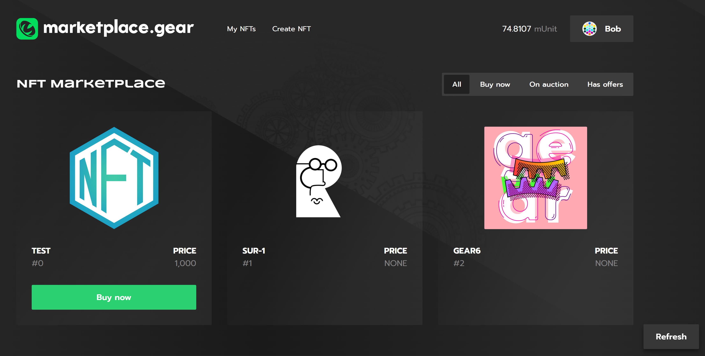

# NFT Marketplace



NFT marketplace is a program where anyone can buy and sell non-fungible tokens for fungible tokens. The program also supports holding the NFT auctions and making/accepting purchase offers on NFTs.

The following are program examples available on GitHub: 

- [Vara Non-Fungible Token](https://github.com/gear-foundation/standards/tree/master/extended-vnft).
- [Vara Fungible Token](https://github.com/gear-foundation/standards/tree/master/extended-vft).
- [NFT marketplace](https://github.com/gear-foundation/dapps/tree/master/contracts/nft-marketplace).
- Marketplace UI available on [Github](https://github.com/gear-foundation/dapps/tree/master/frontend/apps/nft-marketplace)

Anyone can easily create their own NFT marketplace application and run it on Vara Network. 

:::tip
The project code is developed using the [Sails](../../../build/sails/sails.mdx) framework.
::: 

## How to run

### ⚒️ Build programs

- Build [NFT contract](https://github.com/gear-foundation/standards/tree/master/extended-vnft) as described in `README.md`
- Build [Marketplace program](https://github.com/gear-foundation/dapps/tree/a357635b61e27c52f46908885fecb048dc8424e5/contracts/nft-marketplace) as described in `README.md`

### 🏗️ Upload programs

A program can be deployed to the network using [idea.gear-tech.io](https://idea.gear-tech.io/). In the network selector, choose `Vara Network Testnet` or `Development` (in this case, the application will connect to a locally running Vara node).

### 🖥️ Run UI

1. Install packages

```sh
yarn install
```

2. Configure .evn file. Specify network address and program ID like in the example below:

For proper application functioning, one needs to adjust an environment variable parameters. An example is available [here](https://github.com/gear-foundation/dapps/blob/master/frontend/apps/nft-marketplace/.env.example).

```sh
REACT_APP_NODE_ADDRESS=wss://testnet.vara.network:443
REACT_APP_IPFS_ADDRESS=https://stg-pinata-proxy.vara.network/files/upload
REACT_APP_IPFS_GATEWAY_ADDRESS=https://gear.mypinata.cloud/ipfs
REACT_APP_MARKETPLACE_CONTRACT_ADDRESS=0xe33f5124f1200f6cd728acc14f7dfcd6e59d584271415f15dbe9106af7e2d1e6
REACT_APP_NFT_CONTRACT_ADDRESS=0x3d3d0b5c597d6d767294cc93e0a3489d848ae32cbf851fa40756800d28e4cd37
```

- `REACT_APP_NODE_ADDRESS` is Vara Network address (for testnet it is - `wss://testnet.vara.network`)
- `REACT_APP_IPFS_ADDRESS` is address of IPFS to store NFT assets (https://stg-pinata-proxy.vara.network/files/upload that was used for this implementation)
- `REACT_APP_IPFS_GATEWAY_ADDRESS` is IPFS Gateway address (https://gear.mypinata.cloud/ipfs)
- `REACT_APP_MARKETPLACE_CONTRACT_ADDRESS` is NFT Marketplace program address in Vara Network
- `REACT_APP_NFT_CONTRACT_ADDRESS` is Vara Non-Fungible Token contract address in Vara Network

3. Run app

```sh
yarn start
```

## Marketplace program logic

This article explains the programming interface, data structure, basic functions and explains their purpose. It can be used as is or modified to suit your own scenarios.

## Logic
The program state:
```rust title="nft-marketplace/app/src/utils.rs"
pub struct Market {
    pub admin_id: ActorId,
    pub items: HashMap<(ContractId, TokenId), Item>,
    pub approved_nft_contracts: HashSet<ActorId>,
    pub approved_ft_contracts: HashSet<ActorId>,
}
```
- `admin_id` - an account who has the right to approve non-fungible-token and fungible-tokens contracts that can be used in the marketplace program;
- `items` - listed NFTs;
- `approved_nft_contracts` - NFT contracts accounts that can be listed on the marketplace;
- `approved_ft_contracts` - fungible token accounts for which it is possible to buy marketplace items;

The marketplace item has the following struct:
```rust title="nft-marketplace/app/src/utils.rs"
pub struct Item {
    pub frozen: bool,
    pub token_id: TokenId,
    pub owner: ActorId,
    pub ft_contract_id: Option<ContractId>,
    pub price: Option<Price>,
    pub auction: Option<Auction>,
    pub offers: HashMap<(Option<ContractId>, Price), ActorId>,
}
```
- `frozen` is freeze indicator (required for asynchronous messages)
- `token_id` is the ID of the NFT within its contract
- `owner` - an NFT item owner
- `ft_contract_id` - a contract of fungible tokens for which that item can be bought. If that field is `None` then the item can be sold for native Vara tokens
- `price` - the item price. `None` field means that the item is not on the sale
- `auction` - a field containing information on the current auction. `None` field means that there is no current auction on the item
- `offers` - purchase offers made on that item

### Listing NFTs, changing the price or stopping the sale.

To list NFTs on the marketplace or modify the terms of sale, invoke the following function:

```rust title="nft-marketplace/app/src/lib.rs"
    /// Adds data on market item.
    /// If the item of that NFT does not exist on the marketplace then it will be listed.
    /// If the item exists then that action is used to change the price or suspend the sale.
    ///
    /// # Requirements
    /// * [`msg::source()`](gstd::msg::source) must be the NFT owner
    /// * `nft_contract_id` must be added to `approved_nft_contracts`
    /// * if item already exists, then it cannot be changed if there is an active auction
    ///
    /// On success triggers the event [`MarketEvent::MarketDataAdded`].
    pub async fn add_market_data(&mut self, nft_contract_id: ContractId, ft_contract_id: Option<ContractId>, token_id: TokenId, price: Option<Price>) {
        let market = self.get_mut();
        add_market_data(market, nft_contract_id, ft_contract_id, token_id, price).await;
        self.notify_on(MarketEvent::MarketDataAdded { nft_contract_id, token_id, price })
            .expect("Notification Error");
    }
```

### Withdrawal of an item from market

To withdraw an item from the marketplace and reclaim the associated token, invoke the following function:

```rust title="nft-marketplace/app/src/lib.rs"
    /// Removes data on market item.
    ///
    /// # Requirements
    /// * [`msg::source()`](gstd::msg::source) must be the  item.owner
    /// * There must be no open auction on the item.
    ///
    /// On success triggers the event [`MarketEvent::MarketDataRemoved`].
    pub async fn remove_market_data(&mut self, nft_contract_id: ContractId, token_id: TokenId) {
        let market = self.get_mut();
        let msg_src = msg::source();
        remove_market_data(market, &nft_contract_id, token_id, msg_src).await;
        self.notify_on(MarketEvent::MarketDataRemoved {
            owner: msg_src,
            nft_contract_id,
            token_id,
        })
        .expect("Notification Error");
    }
```

### NFT purchase.

To buy NFTs, invoke the following function:

```rust title="nft-marketplace/app/src/lib.rs"
    /// Sells the NFT.
    ///
    /// # Requirements:
    /// * The NFT item must exist and be on sale.
    /// * If the NFT is sold for a native Vara token, then a buyer must attach a value equal to the price.
    /// * If the NFT is sold for fungible tokens then a buyer must have enough tokens in the fungible token contract.
    /// * There must be no open auction on the item.
    ///
    /// On success triggers the event [`MarketEvent::ItemSold`].
    pub async fn buy_item(&mut self, nft_contract_id: ContractId, token_id: TokenId) {
        let market = self.get_mut();
        let msg_src = msg::source();
        buy_item(market, &nft_contract_id, token_id, msg_src).await;
        self.notify_on(MarketEvent::ItemSold { owner: msg_src, nft_contract_id, token_id })
            .expect("Notification Error");
    }
```

### NFT auction.

The marketplace program includes the *English auction*. *English auction* is an open auction at an increasing price, where participants openly bid against each other, with each subsequent bid being greater than the previous one.

The auction has the following struct:
```rust title="nft-marketplace/app/src/utils.rs"
pub struct Auction {
    pub started_at: u64,
    pub ended_at: u64,
    pub current_price: Price,
    pub current_winner: ActorId,
}
```
- `started_at` - auction start time;
- `ended_at` - auction end time;
- `current_price` - the current offered price for the NFT;
- `current_winner` - the current auction winner

The auction is started with the following function:

```rust title="nft-marketplace/app/src/lib.rs"
    /// Creates an auction for selected item.
    /// If the NFT item doesn't exist on the marketplace then it will be listed
    ///
    /// Requirements:
    /// * Only the item owner can start the auction.
    /// * `nft_contract_id` must be in the list of `approved_nft_contracts`
    /// *  There must be no active auction
    ///
    /// On success triggers the event [`MarketEvent::AuctionCreated`].
    pub async fn create_auction(&mut self, nft_contract_id: ContractId, ft_contract_id: Option<ContractId>, token_id: TokenId, min_price: u128, duration: u64) {
        let market = self.get_mut();
        create_auction(market, &nft_contract_id, ft_contract_id, token_id, min_price, duration).await;
        self.notify_on(MarketEvent::AuctionCreated {
            nft_contract_id,
            token_id,
            price: min_price,
        }).expect("Notification Error");
    }
```

Use the following function to add a bid to the currency auction:
```rust title="nft-marketplace/app/src/lib.rs"
    /// Adds a bid to an ongoing auction.
    ///
    /// # Requirements:
    /// * The item must exist.
    /// * The auction must exist on the item.
    /// * If the NFT is sold for a native Vara token, then a buyer must attach a value equal to the price indicated in the arguments.
    /// * If the NFT is sold for fungible tokens then a buyer must have   enough tokens in the fungible token contract.
    /// * `price` must be greater than the current offered price for that item.
    ///
     /// On success triggers the event [`MarketEvent::BidAdded`].
    pub async fn add_bid(&mut self, nft_contract_id: ContractId, token_id: TokenId, price: u128) {
        let market = self.get_mut();
        add_bid(market, &nft_contract_id, token_id, price).await;
        self.notify_on(MarketEvent::BidAdded {
            nft_contract_id,
            token_id,
            price,
        }).expect("Notification Error");
    }
```

If the auction period is over, anyone can send the message `SettleAuction` that will send the NFT to the winner and pay the owner:

```rust title="nft-marketplace/app/src/lib.rs"
    /// Settles the auction.
    ///
    /// Requirements:
    /// * The auction must be over.
    ///
    /// On successful auction triggers the event [`MarketEvent::AuctionSettled`].
    /// If no bids were made triggers the event [`MarketEvent::AuctionCancelled`].
    pub async fn settle_auction(&mut self, nft_contract_id: ContractId, token_id: TokenId) {
        let market = self.get_mut();
        let event = settle_auction(market, &nft_contract_id, token_id).await;
        self.notify_on(event).expect("Notification Error");
    }
```

### Offers.

Use the following function to make an offer on the marketplace item:

```rust title="nft-marketplace/app/src/lib.rs"
    /// Adds a price offer to the item.
    ///
    /// Requirements:
    /// * NFT items must exist and be listed on the marketplace.
    /// * There must be no ongoing auction on the item.
    /// * If a user makes an offer in native Vara token, then he must attach a value equal to the price indicated in the arguments.
    /// * If a user makes an offer in fungible tokens then he must have  enough tokens in the fungible token contract.
    /// * The price can not be equal to 0.
    /// * There must be no identical offers on the item.
    ///
    /// On success triggers the event [`MarketEvent::OfferAdded`].
    pub async fn add_offer(&mut self, nft_contract_id: ContractId, ft_contract_id: Option<ContractId>, token_id: TokenId, price: u128) {
        let market = self.get_mut();
        add_offer(market, &nft_contract_id, ft_contract_id, token_id, price).await;
        self.notify_on(MarketEvent::OfferAdded {
            nft_contract_id,
            ft_contract_id,
            token_id,
            price,
        }).expect("Notification Error");
    }
```

The item owner can accept the offer:

```rust title="nft-marketplace/app/src/lib.rs"
    /// Accepts an offer.
    ///
    /// Requirements:
    /// * NFT items must exist and be listed on the marketplace.
    /// * Only the owner can accept the offer.
    /// * There must be no ongoing auction.
    /// * The offer with indicated hash must exist.
    ///
    /// On success triggers the event [`MarketEvent::OfferAccepted`].
    pub async fn accept_offer(&mut self, nft_contract_id: ContractId, ft_contract_id: Option<ContractId>, token_id: TokenId, price: u128) {
        let market = self.get_mut();
        let new_owner = accept_offer(market, &nft_contract_id, ft_contract_id, token_id, price).await;
        self.notify_on(MarketEvent::OfferAccepted {
            nft_contract_id,
            token_id,
            new_owner,
            price,
        }).expect("Notification Error");
    }
```

The user who made the offer can also withdraw their tokens:

```rust title="nft-marketplace/app/src/lib.rs"
    /// Withdraws tokens.
    ///
    /// Requirements:
    /// * NFT items must exist and be listed on the marketplace.
    /// * Only the offer creator can withdraw his tokens.
    /// * The offer with indicated hash must exist.
    ///
    /// On success triggers the event [`MarketEvent::TokensWithdrawn`].
    pub async fn withdraw(&mut self, nft_contract_id: ContractId, ft_contract_id: Option<ContractId>, token_id: TokenId, price: u128) {
        let market = self.get_mut();
        withdraw(market, &nft_contract_id, ft_contract_id, token_id, price).await;
        self.notify_on(MarketEvent::Withdraw {
            nft_contract_id,
            token_id,
            price,
        }).expect("Notification Error");
    }
```
## Consistency of program states

The `market` program interfaces with both `fungible` and `non-fungible` token contracts. Each transaction that alters the states of multiple programs is temporarily stored until its completion. Whenever a user engages with an item, the marketplace program verifies any pending transactions. If there is one, it prompts the user to finalize it, preventing the initiation of a new transaction. The idempotency inherent in the token contracts enables the restarting of a transaction without redundant changes, ensuring the consistent state of all three programs.

## Query

```rust title="nft-marketplace/app/src/lib.rs"
    pub fn get_market(&self) -> MarketState {
        self.get().clone().into()
    }
```

```rust title="nft-marketplace/app/src/utils.rs"
    pub struct MarketState {
        pub admin_id: ActorId,
        pub items: Vec<((ContractId, TokenId), ItemState)>,
        pub approved_nft_contracts: Vec<ActorId>,
        pub approved_ft_contracts: Vec<ActorId>,
    }
```

## Source code

The source code of this example of VaraMan Game program and the example of an implementation of its testing is available on [gear-foundation/dapp/contracts/nft-marketplace](https://github.com/gear-foundation/dapps/tree/master/contracts/nft-marketplace).

See also an example of the smart contract testing implementation based on `gtest`: [gear-foundation/dapps/vara-man/tests](https://github.com/gear-foundation/dapps/tree/master/contracts/nft-marketplace/tests).

For more details about testing programs written on Gear, refer to the [Program Testing](/docs/build/testing) article.
