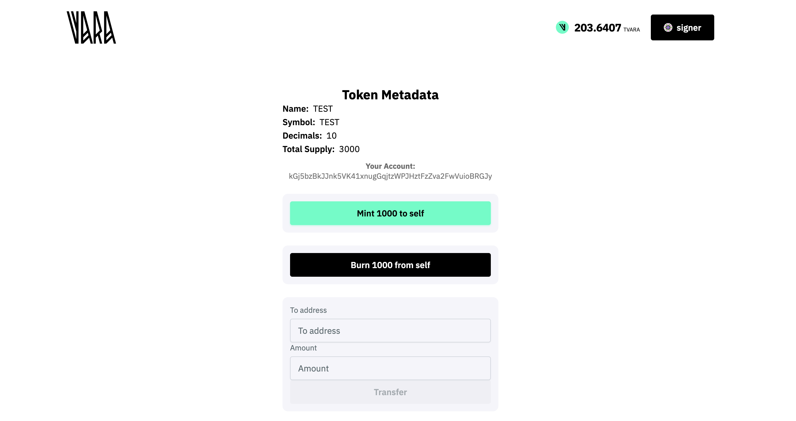

# VFT Extended DApp Frontend Integration Guide



This guide explains how to build a frontend application in React that interacts with the VFT Extended (Vara Fungible Token) contract, using sails-js React hooks. The document provides a step-by-step approach, code samples, and configuration tips for quickly integrating contract calls, queries, and event listeners.

**Who is this for?**
- React developers integrating smart contract features into a DApp on the Vara blockchain.
- Anyone needing a working example and best practices for `sails-js hooks` with VFT contracts.

**You will learn:**
- How to set up a project from a template
- How to generate a contract TypeScript client interface
- How to implement and use hooks for transactions, queries, and events
- How to build UI components for interacting with the VFT contract

[See VFT Standard description](https://wiki.vara.network/docs/examples/Standards/vft)

## Prerequisites

Before starting, make sure your environment is ready:

- **Node.js** (version 18+ recommended)
- **Yarn** or **npm**
- **Git**  
- [**Gear IDEA**](https://idea.gear-tech.io) (for contract deployment, not needed for frontend only)
- Access to **Vara network** (e.g., testnet node, test tokens to make transactions)
- Installed browser wallet (e.g., [Polkadot.js extension](https://polkadot.js.org/extension/) or compatible with Substrate network)
- **Basic knowledge** of React, TypeScript, and smart contract architecture

:::note
You need your contract uploaded to the Vara network and its address (ID) available before starting the frontend part.
:::

## Project Setup

### Create Frontend App from Template

Use the official Vara React app [template](/docs/api/tooling/create-gear-app.md).  
Run in your terminal:

```bash
npx degit gear-foundation/dapps/frontend/templates/create-vara-app dApp
cd dApp
yarn install # or npm install
yarn start   # or npm start
```

:::tip
The template includes wallet connection, node provider setup, alert system, and is ready for smart contract integration.
:::

### Project Structure Overview

After setup, important files and folders are:

```
.env             # Environment variables (node, contract addresses)
src/consts.ts    # App-level constants from env
src/hooks/       # Your custom and generated React hooks
src/components/  # UI components
src/App.tsx      # Main app entry
```

## Generating TypeScript Client (lib.ts) for Your Contract

### Deploy Your Contract

Make sure your VFT contract is already deployed on Vara testnet or mainnet (via [Gear IDEA](https://idea.gear-tech.io)) and you have its address (ProgramId).

### Generate Client Library

Follow the client generation instructions: [Client Generation Docs](https://wiki.vara.network/docs/sails-js/client-generation)

```bash
npx @gear-js/sails codegen --program <YOUR_PROGRAM_ID> --output src/hooks/lib.ts
```

- `--program` is your deployed contract ID (0x...).
- `--output` is the path for generated TS client code.

### Add Library to Hooks

Import the generated client (ABI) in your hooks, e.g.:

```ts
import { SailsProgram } from './lib';
```

:::note
The generated file describes the contract API for type-safe frontend access.
:::


## Environment Configuration

Create a `.env` file in the project root:

```env
VITE_NODE_ADDRESS=wss://testnet.vara.network
VITE_CONTRACT=0x... # your deployed contract address
```

Add a config file (`consts.ts`) for environment variables:

```ts
export const ENV = {
  NODE: import.meta.env.VITE_NODE_ADDRESS as string,
  CONTRACT: import.meta.env.VITE_CONTRACT as `0x${string}`,
};
```

## Implementing React Hooks for Contract Interaction

:::info
For detailed documentation on sails-js React Hooks and up-to-date API examples, see:  
- [React Sails Hooks Documentation](https://wiki.vara.network/docs/sails-js/react-hooks)  
- [Full hooks/api.ts source on GitHub](https://github.com/gear-foundation/dapps/blob/master/frontend/apps/vft-extended/src/hooks/api.ts)
:::

Your hooks (e.g., `hooks/api.ts`) wrap all main contract actions, queries, and event subscriptions.

### Program Instance

```ts
import { useProgram } from '@gear-js/react-hooks';
import { SailsProgram } from './lib';
import { ENV } from '../consts';

export function useProgramInstance() {
  return useProgram({
    library: SailsProgram,
    id: ENV.CONTRACT,
  });
}
```

### Token Actions (Mint, Burn, Transfer)

```ts
import { useSendProgramTransaction } from '@gear-js/react-hooks';

export function useSendMintTransaction() {
  const { data: program } = useProgramInstance();
  return useSendProgramTransaction({
    program,
    serviceName: 'vft',
    functionName: 'mint',
  });
}

export function useSendBurnTransaction() {
  const { data: program } = useProgramInstance();
  return useSendProgramTransaction({
    program,
    serviceName: 'vft',
    functionName: 'burn',
  });
}

export function useSendTransferTransaction() {
  const { data: program } = useProgramInstance();
  return useSendProgramTransaction({
    program,
    serviceName: 'vft',
    functionName: 'transfer',
  });
}
```

### Token Queries

```ts
import { useProgramQuery } from '@gear-js/react-hooks';

export function useTokenQueries() {
  const { data: program } = useProgramInstance();

  const { data: name, isPending: isNamePending } = useProgramQuery({
    program, serviceName: 'vft', functionName: 'name', args: [],
  });
  // ... (symbol, decimals, totalSupply)
  return { name, /* ...other fields */ };
}
```

:::note
For a full list of query methods, see the [React Hooks API Reference](https://wiki.vara.network/docs/sails-js/react-hooks).
:::

### Query with Parameters

```ts
export function useBalanceOfQuery(address: `0x${string}`) {
  const { data: program } = useProgramInstance();

  return useProgramQuery({
    program,
    serviceName: 'vft',
    functionName: 'balanceOf',
    args: [address],
    watch: false,
  });
}
```

:::tip When to use `watch`
Use `watch: true` for dynamic data that changes frequently, like balances in dashboards, or when you expect user actions or contract events to affect the data.  
For static or rarely-changing data (e.g., token name, symbol, decimals), you can skip `watch` for better performance.
:::

### Listen to Events

```ts
import { useProgramEvent } from '@gear-js/react-hooks';

export function useTokenEvents(callbacks) {
  const { data: program } = useProgramInstance();

  useProgramEvent({
    program,
    serviceName: 'vft',
    functionName: 'subscribeToMintedEvent',
    onData: (data) => callbacks.onMinted?.(data),
  });
  // ... subscribe to burned, transferred, approval
}
```

> **See [hooks/api.ts](https://github.com/gear-foundation/dapps/blob/master/frontend/apps/vft-extended/src/hooks/api.ts) for full code**

## Making Transactions

```ts
const { sendTransactionAsync: sendMint, isPending: mintPending } = useSendMintTransaction();
const { sendTransactionAsync: sendBurn, isPending: burnPending } = useSendBurnTransaction();
const { sendTransactionAsync: sendTransfer, isPending: transferPending } = useSendTransferTransaction();

await sendMint({ args: [toAddress, amount] });
await sendBurn({ args: [fromAddress, amount] });
await sendTransfer({ args: [toAddress, amount] });
```

Handle UI loading states and errors:

```ts
if (mintPending) { /* show spinner */ }
try {
  await sendMint({ args: [account.decodedAddress, '1000'] });
  // show success
} catch (e) {
  // show error
}
```

## Making Queries

Use `useTokenQueries()` and `useBalanceOfQuery()` to read contract state:

```ts
const { name, symbol, decimals, totalSupply, isLoading } = useTokenQueries();

const balanceQuery = useBalanceOfQuery(someAddress);

if (balanceQuery.isPending) { /* loading */ }
else { /* show balanceQuery.data */ }
```

## Listening to Contract Events

Another way to keep your frontend application in sync with the blockchain is by **listening to contract events**.  
When the contract emits events (e.g., on mint, burn, transfer), you can subscribe to them in your React code and automatically react to changes — for example, to refresh balances or update state.

Unlike the `watch` option in queries (which polls data on every block), **event listeners** let your app respond immediately when something of interest happens in the contract, without unnecessary polling.

Subscribe to contract events and trigger UI updates:

```ts
useTokenEvents({
  onMinted: () => refetchTotalSupply?.(),
  onBurned: () => refetchTotalSupply?.(),
  // onTransfer, onApproval...
});
```

This ensures real-time UI updates after mint/burn operations.

## UI Example: Home Component

A minimal example of how to use the new transaction hooks and queries in a component:

```tsx
import { useAccount, useAlert } from '@gear-js/react-hooks';
import { useState } from 'react';
import {
  useSendMintTransaction,
  useSendBurnTransaction,
  useSendTransferTransaction,
  useTokenQueries,
  useTokenEvents,
  useBalanceOfQuery,
} from '../../hooks';

function Home() {
  const { account } = useAccount();
  const { name, symbol, decimals, totalSupply, isLoading, refetchTotalSupply } = useTokenQueries();
  const alert = useAlert();

  const [transferTo, setTransferTo] = useState('');
  const [transferValue, setTransferValue] = useState('');
  const [balanceAddr, setBalanceAddr] = useState('');

  const { sendTransactionAsync: sendMint, isPending: mintPending } = useSendMintTransaction();
  const { sendTransactionAsync: sendBurn, isPending: burnPending } = useSendBurnTransaction();
  const { sendTransactionAsync: sendTransfer, isPending: transferPending } = useSendTransferTransaction();

  useTokenEvents({
    onMinted: (data) => alert.info(`Mint event: ${JSON.stringify(data)}`),
    onBurned: (data) => alert.info(`Burn event: ${JSON.stringify(data)}`),
  });

  // ...handlers for mint, burn, transfer, balance

  // ...render UI with all actions, inputs, loading states, errors
}

export { Home };
```

For the full and up-to-date example, see [**Home.tsx on GitHub**](https://github.com/gear-foundation/dapps/blob/master/frontend/apps/vft-extended/src/pages/home/Home.tsx)

---

For Vara UI Kit component details and usage, see  
[vara-ui on GitHub](https://github.com/gear-tech/gear-js/tree/main/utils/vara-ui).

## Notes and Best Practices

:::note
- Handle async errors to improve UX.
- Use event subscriptions to keep UI state in sync with blockchain.
- For production: review security, error boundaries, and consider adding better wallet management and notifications.
:::

:::warning
Never hard-code private keys or sensitive data in the frontend.  
Always use environment variables for node and contract addresses.
:::