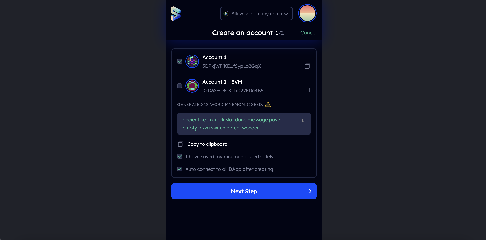
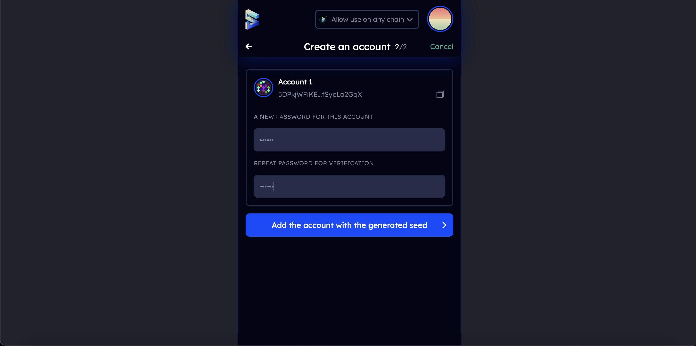

The Vara Network is substrate-based, which means that any keypair compatible with the standards of the `subkey` module will also work on Vara.

For most users, the use of popular and reliable wallets will be enough.
If you need to create a cold wallet for storing funds, then you should pay attention to Parity Signer (in the future we will also add Lager support)

:::info

### Storing your key safely

Your seed phrase is the key to your account. If you lose access to your account, by changing the device, forgetting the password, or losing the JSON file, you can restore your account by using the seed. This also means that someone else can have access to your account if they also have access to your seed.

We recommend that you store your seed in secure places like encrypted hard drives, non-digital devices or ideally, paper. We also recommend that you take other safety precautions to prevent this copy from physical damage, for example fire and water, and make multiple copies stored in different locations.

You should never store your seed on a device that is, or ever will be, connected to the internet.
:::

:::info

### Storing your accounts JSON file

Your account’s JSON file is encrypted with a password. This means that while you can import into any wallet, you will need to use the password to do so successfully. As there is this additional layer of security - a password - you don’t have to be as cautious about securing it. However, it’s worth using highly secure passwords that are not used for anything else. It would be best if you made a note of this password offline.
:::

## Via Talisman

`Talisman` is a popular and user-friendly wallet for creating and managing Substrate accounts. Being connected to web3 applications across various networks, Talisman browser extension allows to store, send and receive assets.

1. Install Talisman extension for your browser [here](https://talisman.xyz/)

2. Open the extension by clicking on the logo in the menu bar.

3. In the opened application, click "New wallet":


4. Enter a strong password:


And that's it. Your wallet has been created:


## Via Subwallet

Subwallet is another advanced wallet for managing Substrate as well as EVM accounts.

1. To install Subwallet follow this [link](https://subwallet.app/download.html)

2. Open Subwallet by clicking on its logo in the browser menu bar.

3. Click "Create new account":


4. Select the type of account you want to create (Subwallet allows you to create Substrate-like and Ethereum accounts at once). Copy your seed phrase and keep it in the same place:



5. Provide your password in the next step. And click "Add the account with the generated seed"



Congratulations, your wallet has been successfully created!

## Via Polkadot.js browser extension

The polkadot.js browser extension is the original application created by Parity Technologies for managing Substate accounts. This method involves installing the polkadot.js plugin and using it as a "virtual vault" that's separate from your browser to store your private keys and sign transactions.

1. You can install the extension via the following links.

Install on [Chromium](https://chrome.google.com/webstore/detail/polkadot%7Bjs%7D-extension/mopnmbcafieddcagagdcbnhejhlodfdd?hl=en)-based browser.

Install on [FireFox](https://addons.mozilla.org/en-US/firefox/addon/polkadot-js-extension).

2. Open the extension by clicking on the logo in the menu bar

3. Click the large plus button to create a new account. Alternatively, you can navigate to the smaller plus icon in the top right and select "Create New Account".


4. Save the `seed phrase` in a safe place using the security advices at the beginning of this article.


5.  Specify the name of your account and a strong password for making transactions. Click "Add the account with the generated seed".


:::note
The password that you choose here will be used to encrypt this account's information. You will need to re-enter it when attempting to process any kind of outgoing transaction, or when using it to cryptographically sign a message. This password is stored locally on the browser extension.
:::

You've now successfully created a new account using the polkadot.js browser extension.

### Via mobile app

If you need access to your accounts on a mobile device, then you can use the following mobile wallets for the Polkadot/Kusama ecosystem:

[](https://novawallet.io/)

[](https://subwallet.app/)

All supported wallets you can check [here](https://wiki.polkadot.network/docs/build-wallets).

### Via console

If you have `Gear` or `Vara` node installed, you can generate a new `seed phrase` using the command:

```sh
./gear key generate --network vara
```

And then `import` the generated seed phrase into any convenient wallet.

## Frequently Asked Questions

#### Is this account portable?

> Yes, you can access your account on a different device or wallet of your choice as long as you have the account's seed
> phrase or JSON file associated with the account.

#### Can I transact directly in the polkadot.js browser extension?

> There isn't functionality to make transactions directly in the polkadot.js browser extension.
> To make transactions, you need to launch [Gear Idea](https://idea.gear-tech.io) on your browser.
> Before you can make any transactions, you have to allow Gear Idea to access your account.
> The browser extension is what holds your account information. You choose which websites get to access this information.

#### Does vara support hard wallets?

> Yes! At the moment Vara supports Parity Signer. Also in the future we will support Leger.

#### How to get your address in the Vara Network format?

> The Vara address prefix is 137. To see your account in VARA format, just go to https://polkadot.js.org/apps/?rpc=wss%3A%2F%2Frpc.vara-network.io#/accounts
