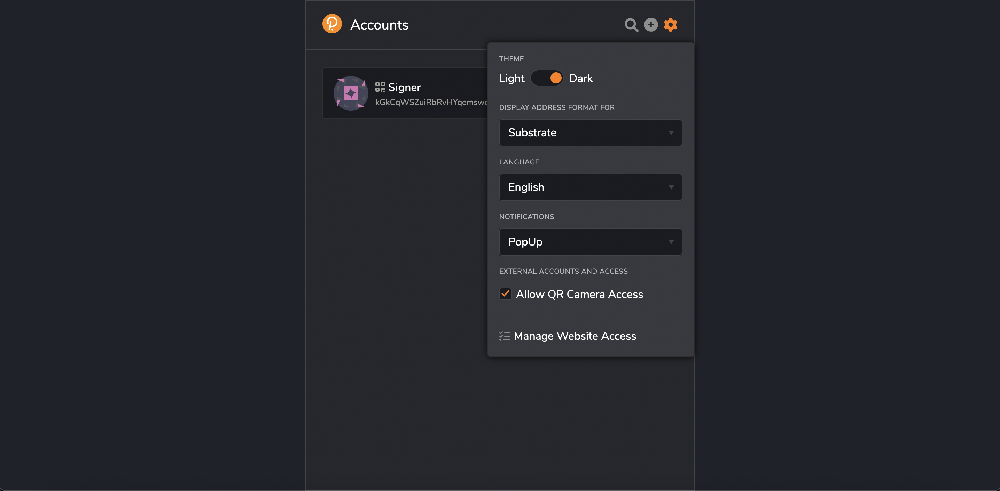

import googleURL from './img/google-play-badge.png';
import appleURL from './img/app-store-badge.png';

# Vara cold storage via Parity Signer

Parity Signer allows you to turn any mobile device based on Android or iOS into a real cold walllet. Your private keys are kept secure offline at all times and transactions are signed in an air-gapped way via QR-codes. A huge advantage is the completely open and transparent source code of [the product](https://github.com/paritytech/parity-signer)

Vara Network completely supports working with Parity Signer.

## Installation

There are several ways to get the Parity Signer

Download from the application store for your device:

  {' '}
  

Download directly from the github:

https://github.com/paritytech/parity-signer/releases

## Create your keys

:::info
Once Parity Signer is installed, your device should never go online. You must turn off or even physically remove the smartphone's Wifi, Mobile Network, and Bluetooth to ensure that the mobile phone containing these accounts will not be exposed to any online threat. Switching to airplane mode suffices in many cases.
:::

Go offline, generate and store your private keys. Backup your seed phrase on paper or try other reliable methods.

## Add Vara Network

To sign messages/transactions, and transfer funds to and from VARA account We need to add Vara Network to app.

1. Open your Signer and select tab `scan`

2. Go to [Metadata Portal](https://metadata.vara-network.io/#/vara)

3. Scan with your device `spec QR`

## Add network Metadata

Also, to sign and broadcast your transaction, we will need the metadata of the given network. Parity Signer can be easily updated with the latest blockchain metadata while staying offline.

To get the latest blockchain metadata:

1. Open your Signer and select tab `scan`

2. Again go to [Metadata Portal](https://metadata.vara-network.io/#/vara)

3. Scan with your device video QR with matadata frames

:::info
Scanning QR with metadata could take some time. Remember to update the Signer to the latest version of metadata, you will need to do the scan again. We generate new QR's with a each runtime upgrade of the network.
:::

When all metadata is uploaded, signer will be ready to work on the Vara Network.

## How to use

The signer allows you to sign transactions using an air-gapped way. You scan a QR code with details about your transaction, then generates a code already signed on your offline device and deliver it as confirmation. Many applications support this feature.

### Polkadot.{js}

To import your hard wallet account into Polkadot.js:

1. You should go to (account section)[https://polkadot.js.org/apps/#/accounts] and click `from QR` button.

2. Select in Signer your account and network.

3. Show your code to the camera.

Done! Now, when making transactions from this account, we will sign them with your Signer using QR codes.

### Polkadot extension

1. In your Polkadot extension allow QR camera access

2. Click + to import new accoutn and choose `Attach external QR-signer account` option:

3. Show your account QR-code to the camera.

Done!

### Nova Wallet

Nova Wallet also supports Parity Signer. More details https://docs.novawallet.io/nova-wallet-wiki/welcome-to-nova-wallet/hardware-wallets
