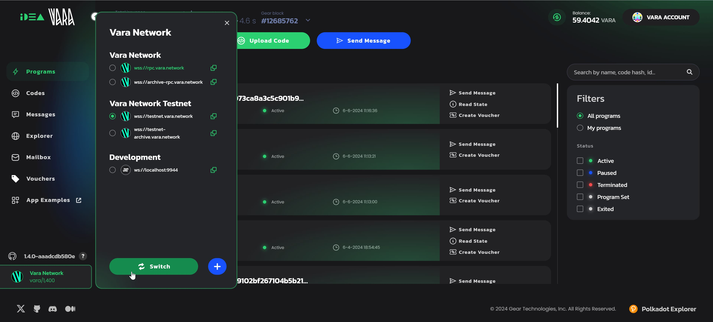
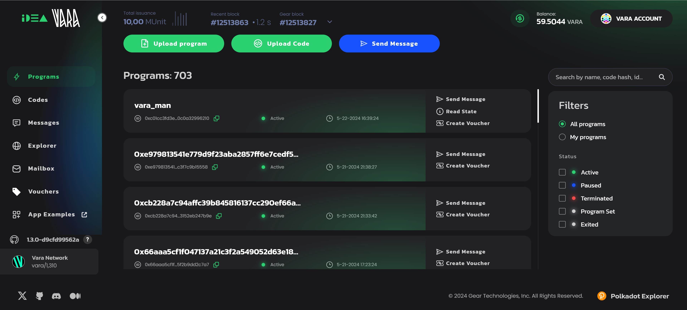
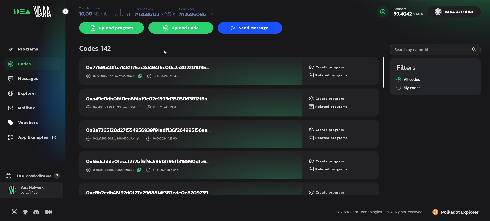
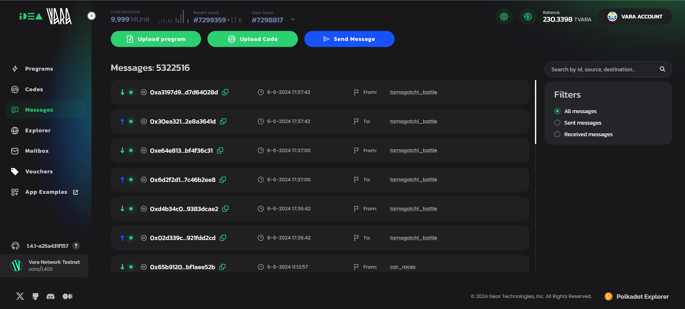
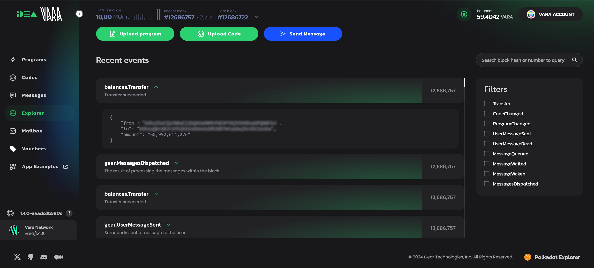
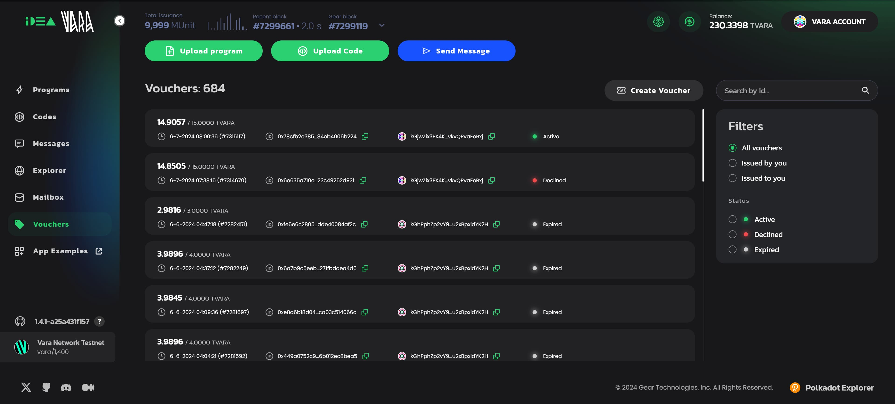

# UI Overview

## Network Switcher

Depending on whether you are developing and testing your program or interacting with programs in production, use the `Network Switcher` to select the Vara mainnet or the testnet (mainnet is selected by default). The portal can also connect to your locally launched developer node. 

## Programs

The `Programs` view is the default view of the Idea portal. The list of programs is displayed as tiles where you can instantly perform basic operations: send a message to a program, read its state, or issue a [voucher](../api/vouchers.md) for a specified account(s) to enable interaction with the program without worrying about gas fees.

Each program's tile contains its name, network address, status, and the date it was uploaded and initialized. Click on the program's name to access additional details.

### Upload Program

This option allows you to upload a program to the network.
Select program's .wasm and .meta files, click the `Calculate gas` and `Upload program` buttons. You will be prompted to sign the transaction of the program initialization.

Navigate to a program and click the `Read State` button to get accces to the program's storage data.

## Codes

The `Codes` view lists not yet initialized programs. These are WASM binaries you can upload on-chain without initialization, meaning you can create (initialize) a new active program from this code later as many times as needed.

The list is organized as code tiles where you can instantly create a new initialized program in the network and find all programs previously created from this code. Click on the code's name to access additional details.

### Upload Code

This option allows you to upload your program without program's initialization in the network.
It can be used to initialize one or several instances of an identical program later.

## Messages

All communications between actors in the Vara network can be found in the `Messages` view. It shows each message ID, date, and the direction of the message in relation to the program - `to` or `from` the particular program. Click on the message's name to access additional details about the message.

### Send Message

This option allows you to send a message to a program.

Copy destination program's address where to send a message and provide necessary details in the Payload section, click the “Calculate gas” and “Send message” buttons. You will be prompted to sign the transaction for the message sending. Navigate to necessary messages using search by program id, message id or applying filters.

### Explorer

The `Explorer` view allows you to get details about recent network events, search by block hash or block number, or apply filters by event types. Events are shown for the current user session only.

### Mailbox

[`Mailbox`](/docs/build/gstd/mailbox.md) contains messages sent from programs to the currently connected account.

### Vouchers

The list of issued vouchers and their properties is available in the `Vouchers` view. It shows the voucher status, amount of tokens available in the voucher, issue date, ID, and the account address to which the voucher was issued.

You can issue a new voucher via the `Create Voucher` button, search by voucher ID, or apply filters by voucher status or beneficiary.

