import Tabs from '@theme/Tabs';
import TabItem from '@theme/TabItem';
import CodeBlock from '@theme/CodeBlock';

Nominators are passive participants in any `Proof of Stake (PoS)` consensus mechanism. They indirectly contribute to maintaining the health and security of the network by delegating their tokens to the most reliable validators who actively confirm blocks. Nominators receive rewards for their delegation, which depend on the network's economy and the percentage that the validator takes for themselves.

Being a nominator does not require running your own node or worrying about online uptime.

## How to set up as a nominator

### Via Staking Dashboard

Vara offers a user-friendly staking dashboard, inspired by the Polkadot staking dashboard, that simplifies the process of staking and nominating validators.

1. To begin your VARA token staking journey, visit our staking dashboard at **[staking.vara-network.io](https://staking.vara-network.io/)**.
2. Once on the staking dashboard, connect your account and navigate to the "Nominate" section.
3. Click the `Start Nominating` button.

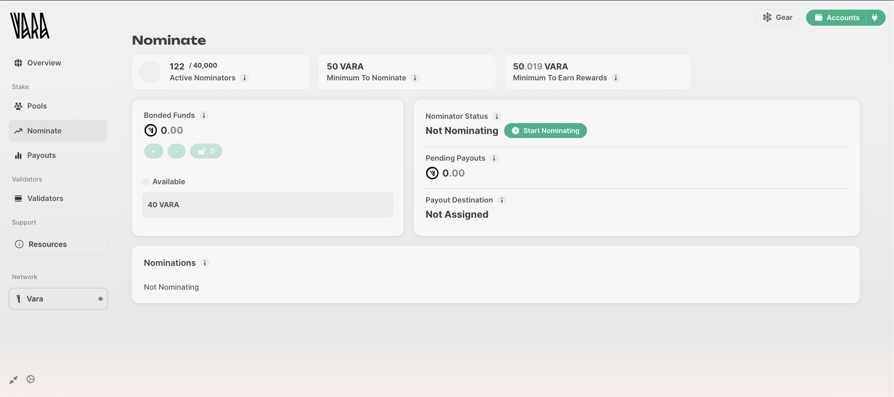

4. Payout Options

    Next, you'll be presented with payout options:

    - **Compound**: Rewards are automatically re-staked and bonded.
    - **To Your Account**: Rewards are deposited into your account.

    Select the option that suits your preferences and click "Continue" to proceed.

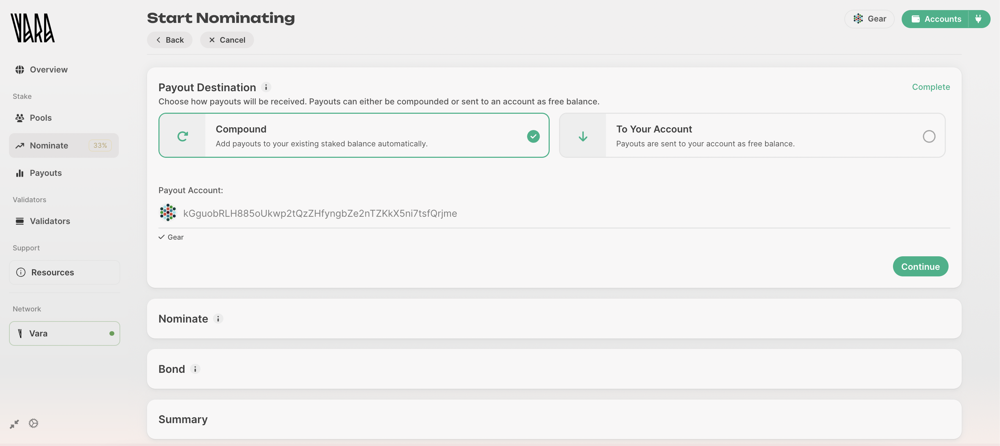

5. Nominating Validators

    Now, it's time to choose your nominations. The staking dashboard provides two methods:

    - **Automatic Optimal Selection**: This feature selects validators for you based on their performance and rewards. It's an excellent option if you're unsure about which validators to nominate.
    - **Manual Selection**: If you want more control over your nominations, opt for manual selection. Carefully choose the validators you wish to nominate. Nominating multiple validators can help diversify your risk.

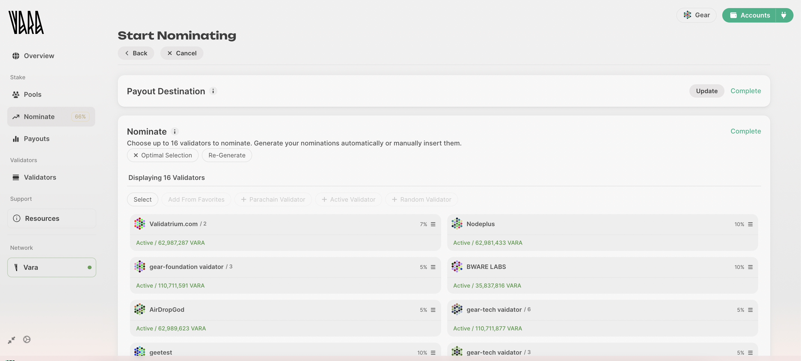

6. Define your Bond - specify amount of VARA to be staked, confirm and sign the transaction.

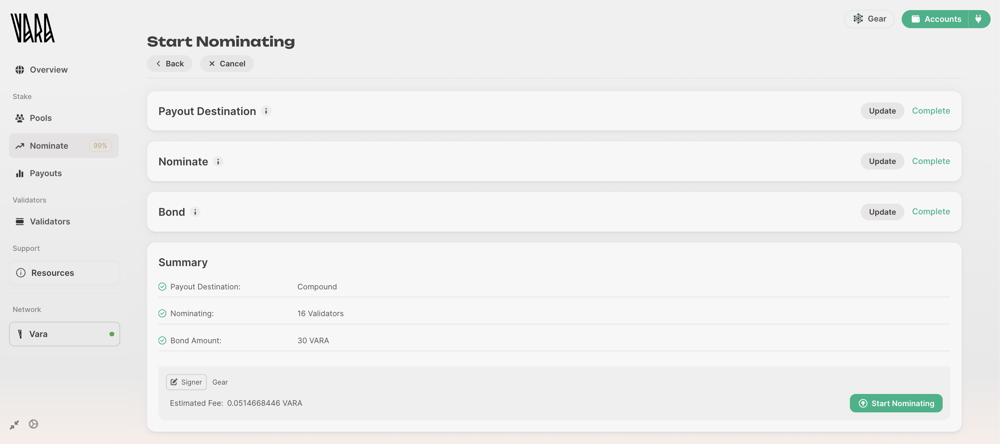

Congratulations! You are now an active nominator. You will now begin earning staking rewards starting from the next era.

### Via Polkadot.\{js\} app

Go to the Polkadot.\{js\} app, navigate to the Network → Staking → [Accounts](https://polkadot.js.org/apps/?rpc=wss%3A%2F%2Frpc.vara-network.io#/staking/actions) section, and click `+ Nominator`:

1. Select the stash and controller accounts, along with the amount of value you wish to bond. You can see in the screenshot what Stash and Controller accounts are. If you have not created your controller account, you can use the same one for both.

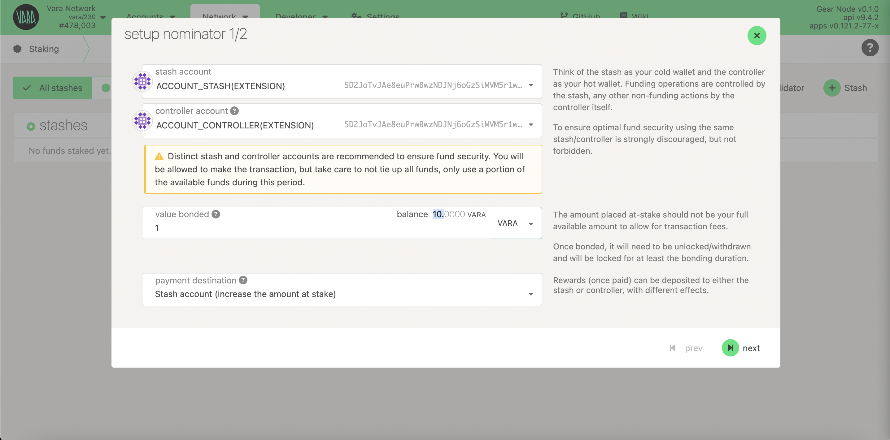

2. Choose a validator (or validators) you'd like to nominate. You can select up to 16 validators, and the algorithm will determine how to distribute your funds effectively for each Era. It's advisable to choose only reliable validators with a good reputation to ensure they won't be slashed.

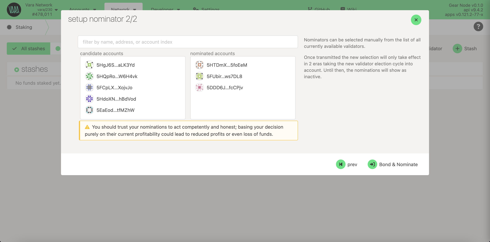

3. Click `Bond & Nominate` and sign the transaction. If everything is correct, your bonded VARA will appear in the Nominators list.

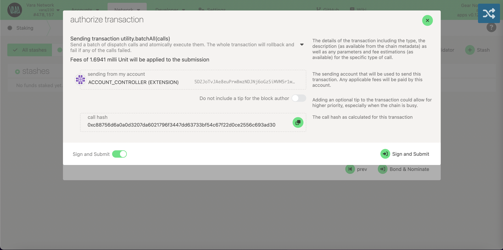

Your nominations will take effect in the next era.

## Nomination pools

Vara Staking Pools empower users to actively participate in the network's growth and receive rewards, regardless of their token holdings. With Staking Pools, even if a user has only 1 VARA token, they can start earning rewards by staking natively on Vara. Additionally, anyone who has 50 VARA tokens or more can create their own pool.

These pools enable users to join forces by pooling their VARA tokens together on-chain. Through this collaborative effort, participants can nominate validators and collectively stake their tokens, significantly enhancing the network's scalability and security.

:::note
Further instructions are also valid for using this app on Laptop/Desktop devices via **[this link](https://polkadot.js.org/apps/?rpc=wss://rpc.vara-network.io#/explorer)**.
:::

### Via Polkadot.js app using SubWallet browser as an example

1. If you have some VARA tokens in your account in the SubWallet mobile application, click **[this link](https://mobile.subwallet.app/browser?url=https%3A%2F%2Fslink.subwallet.app%2Fpolkadot-vara)** to open the Polkadot.js application directly in the wallet's browser.

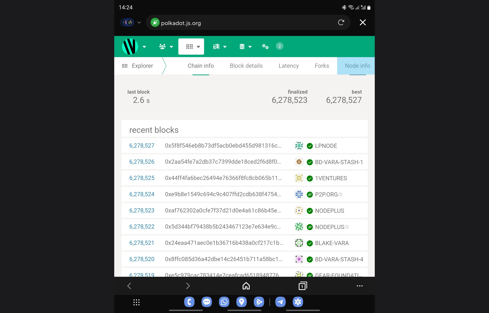

2. Select the `Network` drop-down, and then click `Staking`:

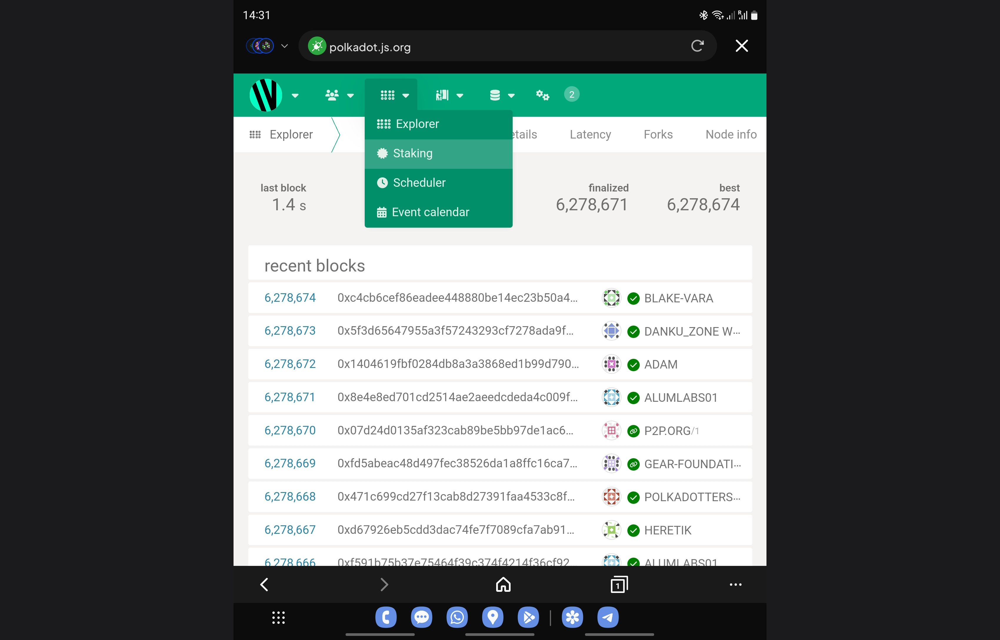

3. Choose `Pools`, navigate to `All pools`, select any desired pool, and click `Join`:

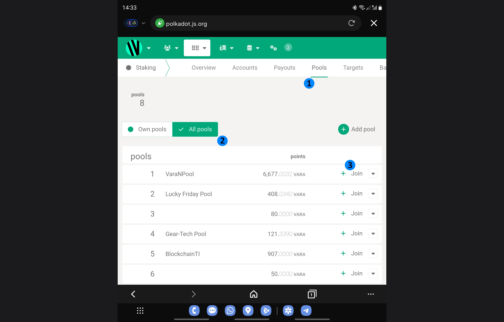

4. Specify your account and the amount of VARA you wish to stake:

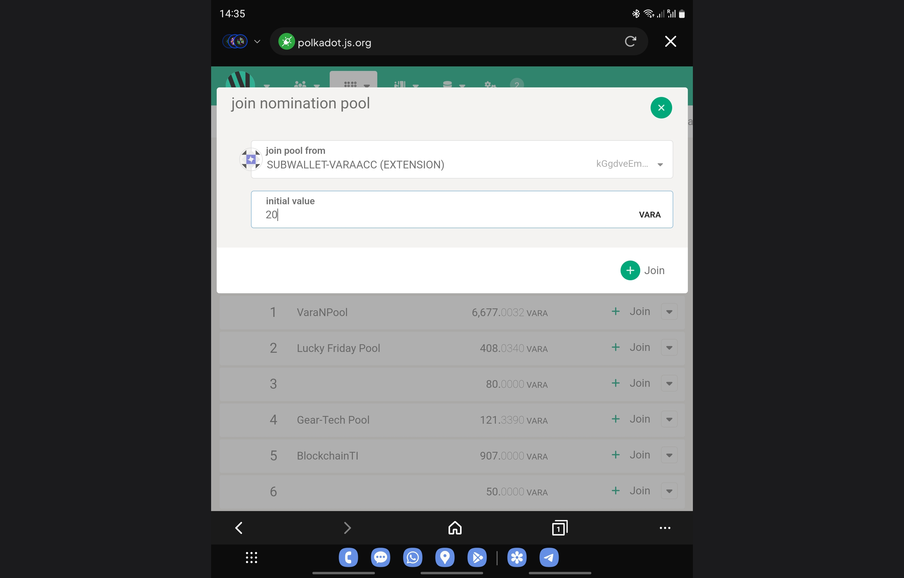

5. Review the transaction details and click `Sign and Submit`:

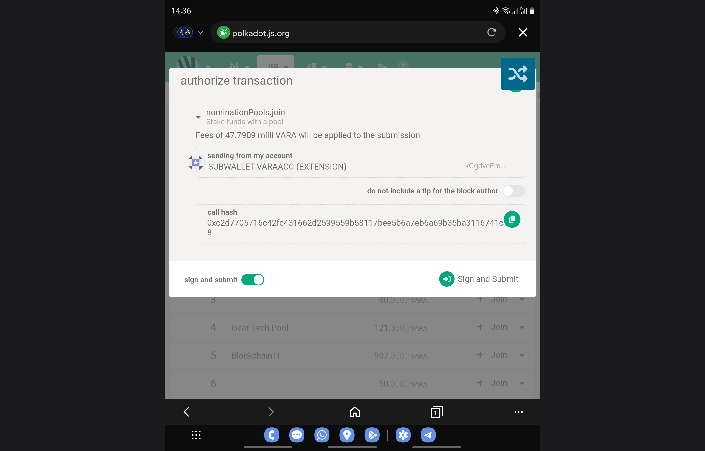

6. Approve the transaction by signing in to the Wallet application:

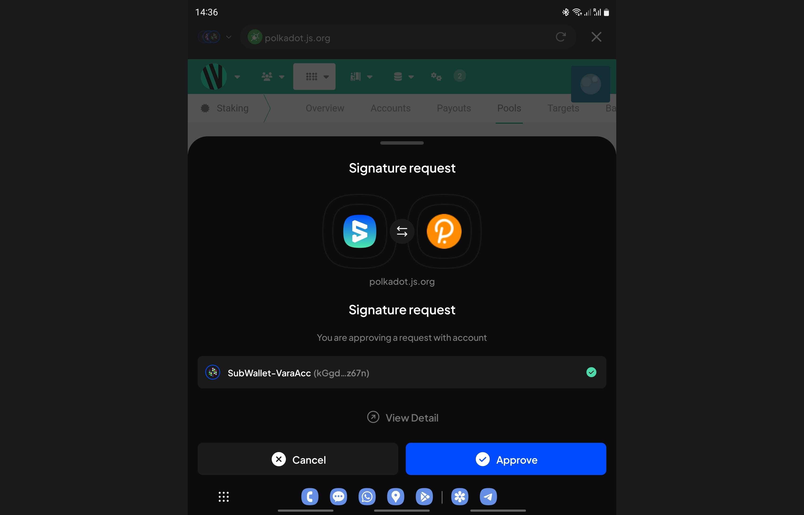

7. Congratulations! You have successfully staked VARA in the pool. You will begin earning staking rewards from the next era.

    You can check your stake at `Pools - Own pools` as well as `Accounts - Pooled`:

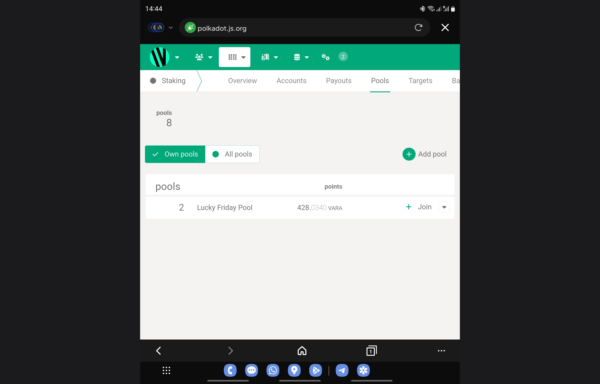
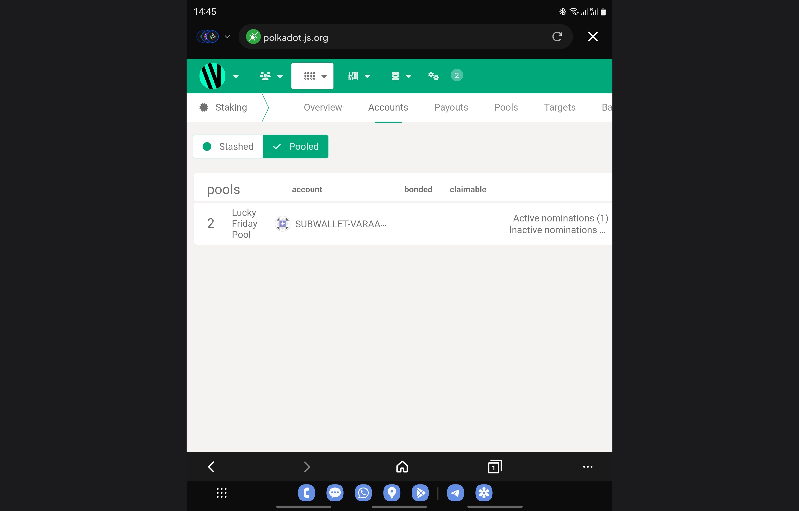

<!--
### How to Get Started

Participating in Vara Staking Pools is straightforward:

1. Visit our dedicated staking platform: https://staking.vara-network.io/#/pools.
2. Connect your wallet to the platform securely.
3. Browse the available pools and choose the one that aligns with your preferences and goals.
4. Join the pool, and your staked VARA tokens will start actively participating in network consensus and earning rewards.
-->
