import Tabs from '@theme/Tabs';
import TabItem from '@theme/TabItem';
import CodeBlock from '@theme/CodeBlock';

Nominators are passive participants in any `Proof of Stake (PoS)` consensus mechanism. They indirectly contribute to maintaining the health and security of the network by delegating their tokens to the most reliable validators who actively confirm blocks. Nominators receive rewards for their delegation, which depend on the network's economy and the percentage that the validator takes for themselves.

Being a nominator does not require running your own node or worrying about online uptime.

## Start Nominating

:::note
The minimum amount of VARA required to start nominating validators directly and earning rewards is 50 VARA. This is the minimum balance needed to qualify for rewards. If your balance is less than 50 VARA, consider joining [Nomnation Pools](#join-nomination-pools).
:::

### Via Vara Staking Dashboard

Vara offers a user-friendly staking **[application](https://staking.vara.network/)**, inspired by the Polkadot's staking app, that simplifies the process of staking and nominating validators.

1. To begin your VARA token staking journey, visit Vara staking at **[staking.vara.network](https://staking.vara.network/)**.
2. Connect your account and navigate to the "Nominate" section.
3. Click the `Start Nominating` button.

4. Payout Options

    Next, you'll be presented with payout options:

    - **Compound**: Rewards are automatically re-staked and bonded.
    - **To Your Account**: Rewards are deposited into your account.

    Select the option that suits your preferences and click "Continue" to proceed.

5. Nominating Validators

    Now, it's time to choose your nominations. The staking dashboard provides two methods:

    - **Automatic Optimal Selection**: This feature selects validators for you based on their performance and rewards. It's an excellent option if you're unsure about which validators to nominate.
    - **Manual Selection**: If you want more control over your nominations, opt for manual selection. Carefully choose the validators you wish to nominate. Nominating multiple validators can help diversify your risk.

6. Define your Bond - specify amount of VARA to be staked, confirm and sign the transaction.

Congratulations! You are now an active nominator. You will now begin earning staking rewards starting from the **next era**.

### Via SubWallet

SubWallet enables VARA staking in a few clicks. See how it's done with the example of a mobile app:

1. Navigate to the `Staking` section in the SubWallet application:

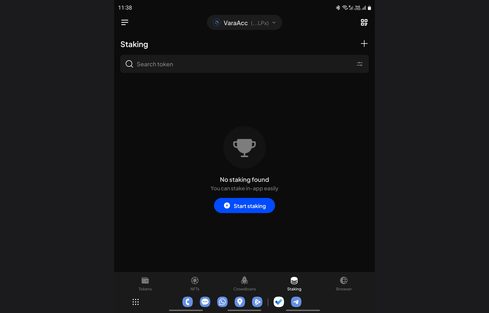

2. If you don't see Vara Network there, just use the search function—type 'Vara':

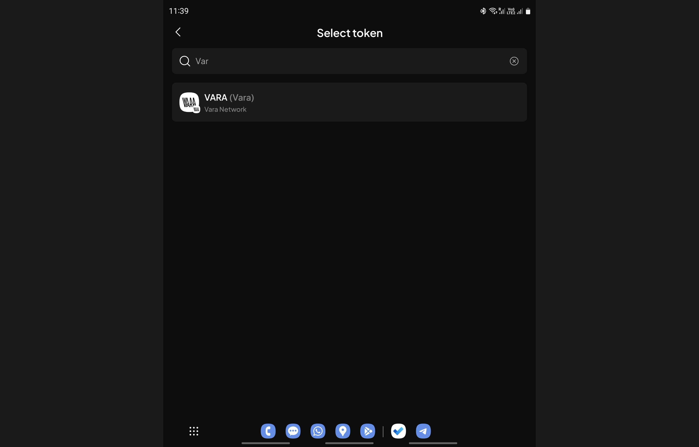

3. Specify the amount of VARA to stake and choose up to 16 validators to **Nominate**. Alternatively you can opt for **pool** staking, in this case make sure you have filtered out only **Active pools**:

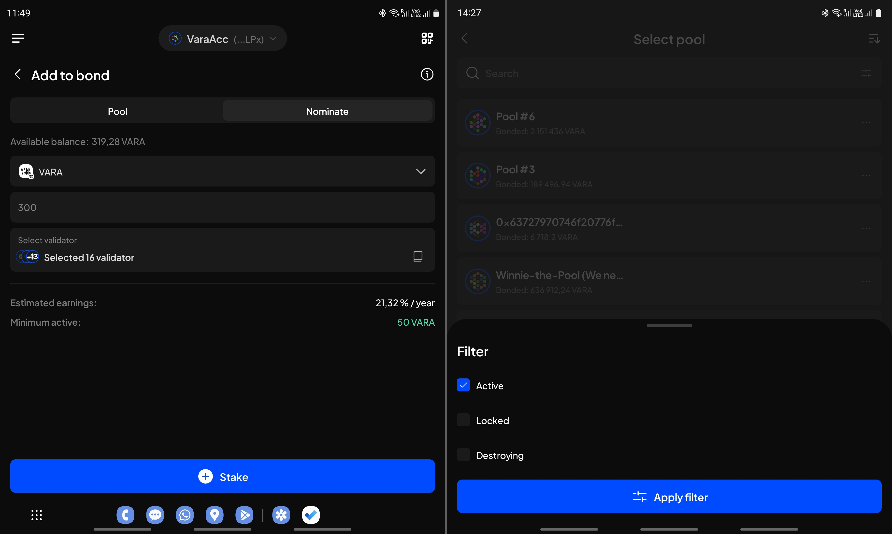

4. Review the specified data and click the `Approve` button:

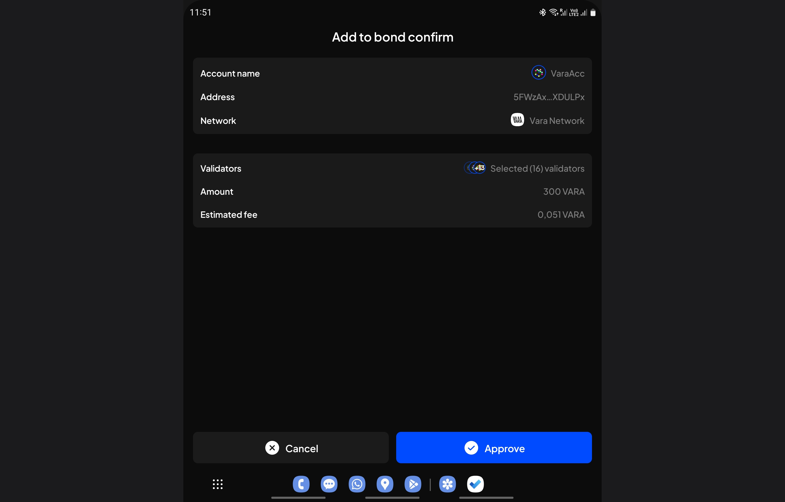

5. That's it! You've successfully staked your VARA. The next time you enter the 'Staking' section, your staking details will be there.

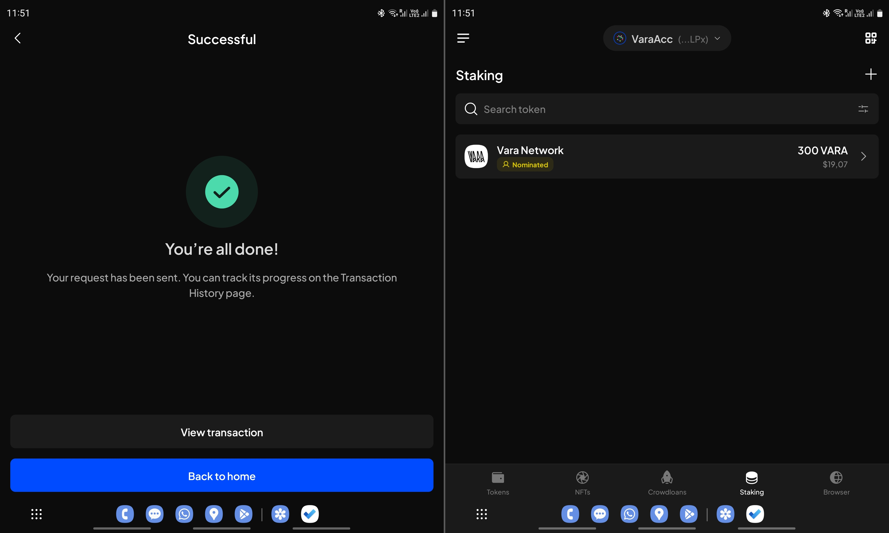

### Via Polkadot.\{js\} app

Go to the Polkadot.\{js\} app, navigate to the Network → Staking → [Accounts](https://polkadot.js.org/apps/?rpc=wss%3A%2F%2Frpc.vara.network#/staking/actions) section, and click `+ Nominator`:

1. Select the stash and controller accounts, along with the amount you wish to bond. You can see in the screenshot what Stash and Controller accounts are. If you have not created your controller account, you can use the same one for both.

2. Choose a validator (or validators) you'd like to nominate. You can select up to 16 validators, and the algorithm will determine how to distribute your funds effectively for each Era. It's advisable to choose only reliable validators with a good reputation to ensure they won't be slashed.

3. Click `Bond & Nominate` and sign the transaction. If everything is correct, your bonded VARA will appear in the Nominators list.

Your nominations will take effect in the next era.

## Nomination pools

Vara Staking Pools empower users to actively participate in the network's development and receive rewards, regardless of their token holdings. With Staking Pools, even if a user has only 1 VARA token, they can start earning rewards by staking natively on Vara. Additionally, anyone who has at least 50 VARA tokens can create their own pool.

These pools enable users to join forces by pooling their VARA tokens together on-chain. Through this collaborative effort, participants can nominate validators and collectively stake their tokens, significantly enhancing the network's scalability and security.

### Create Nomination Pool

#### Via Vara Staking Dashboard

1.	To create your own pool, go to the Pools tab and click the Create Pool button.
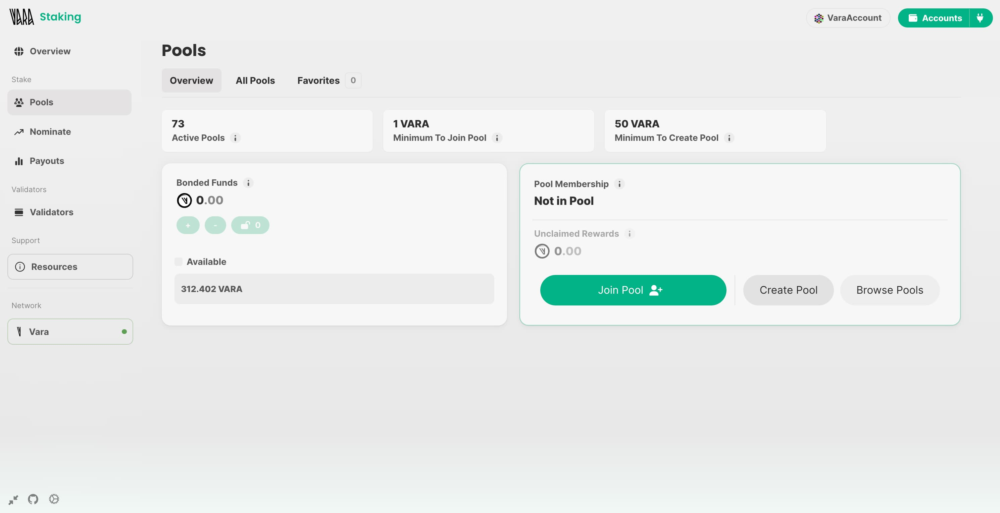
2.	Set a custom name for your pool and click Continue.
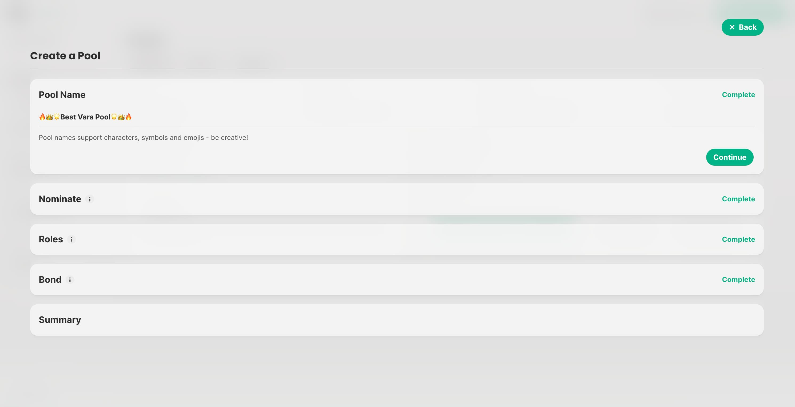
3.	Select the validators to nominate with the pool’s funds. You can choose automatically from the suggested options or manually.
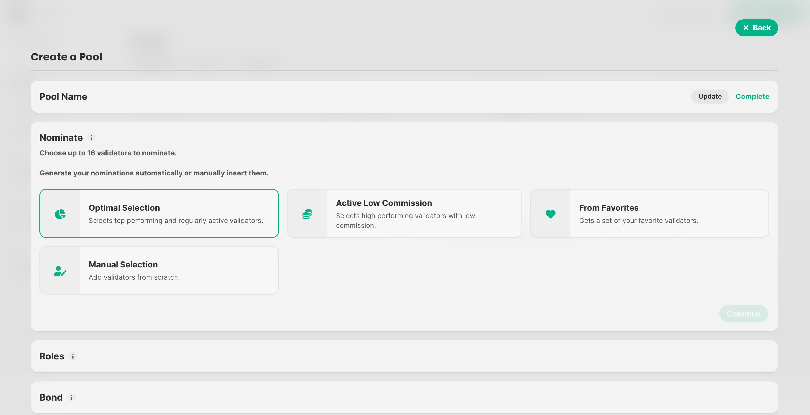
4.	Assign addresses for the Root, Nominator, and Bouncer roles. By default, these are all set to your currently connected account.
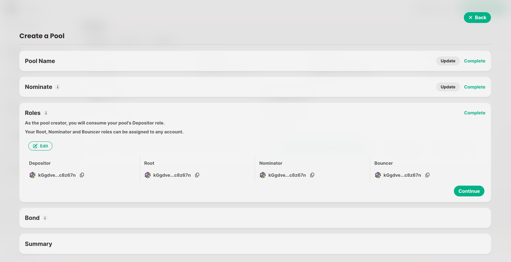
5.	Specify the amount to bond initially to the pool (minimum 50 VARA).
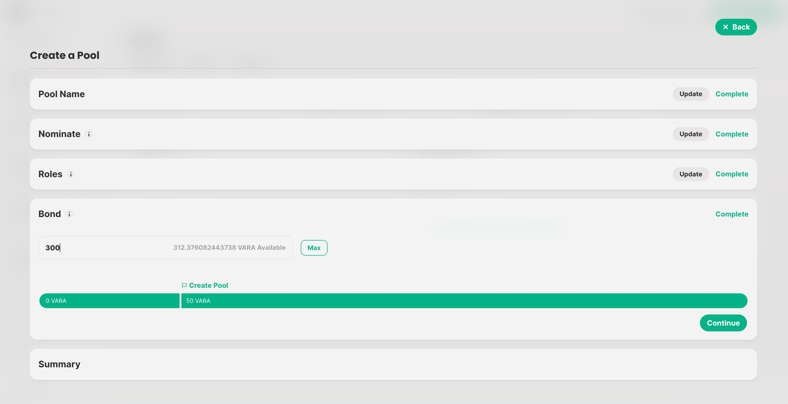
6.	Review the entered parameters, and if everything is correct, click Create Pool and sign the transaction.
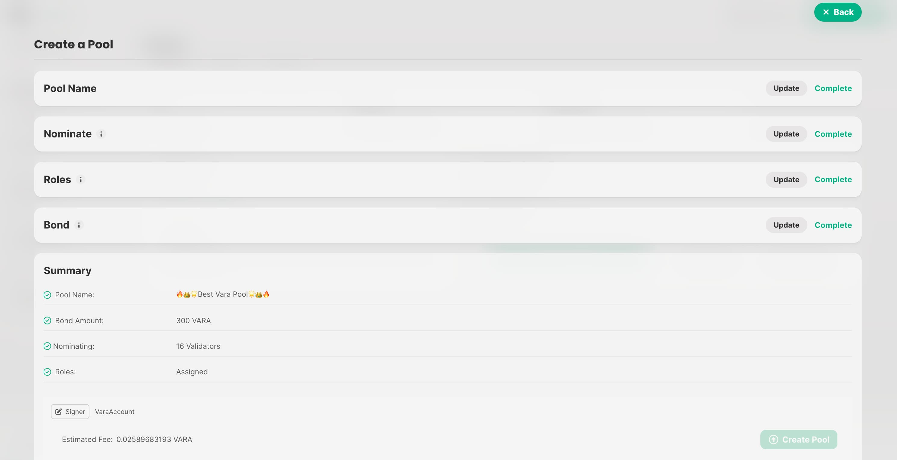
7.	Done! Your pool has been created. You can now invite other nominators to nominate through your pool.
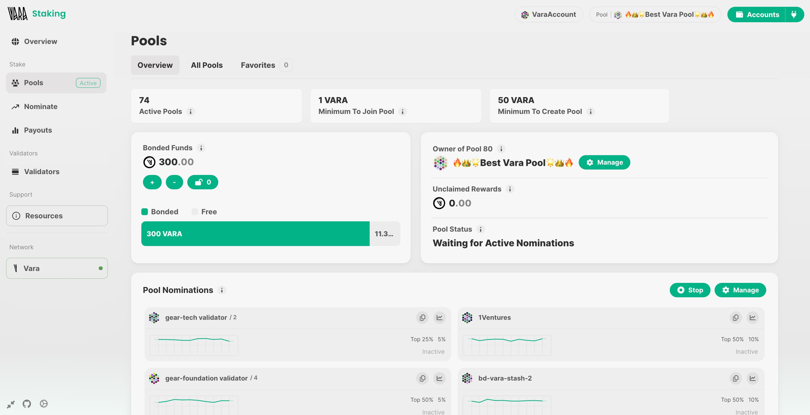

### Join Nomination Pools

#### Via Vara Staking Dashboard

1. Navigate to the 'Pools' section in the [Vara Staking Dashboard](https://staking.vara.network/#/pools) and click the `Join` button:

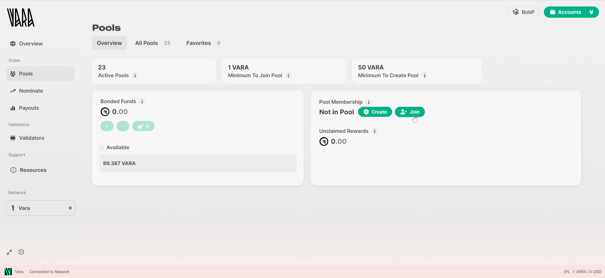

2. Select any pool you like:

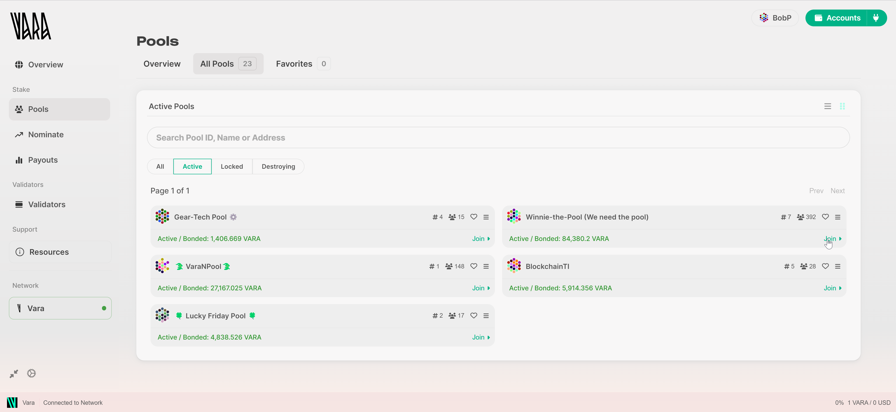

:::note
Select only pools that have active nominations; staking in a pool with `Not Nominating` status does not yield rewards.
:::

3. Specify the amount of VARA to stake and click `Submit`:

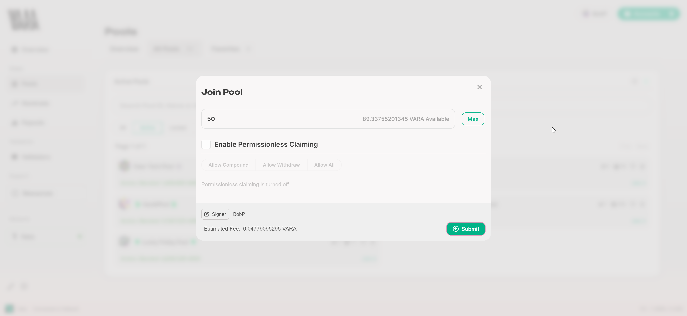

:::note
It's advisable not to stake the maximum amount of tokens, but rather keep a small balance to cover gas fees for future transactions. Limited access to claiming rewards and withdrawals may occur if tokens are not readily available.
:::

4. Congratulations! You have successfully staked VARA in the pool. You will begin earning staking rewards from the next era.

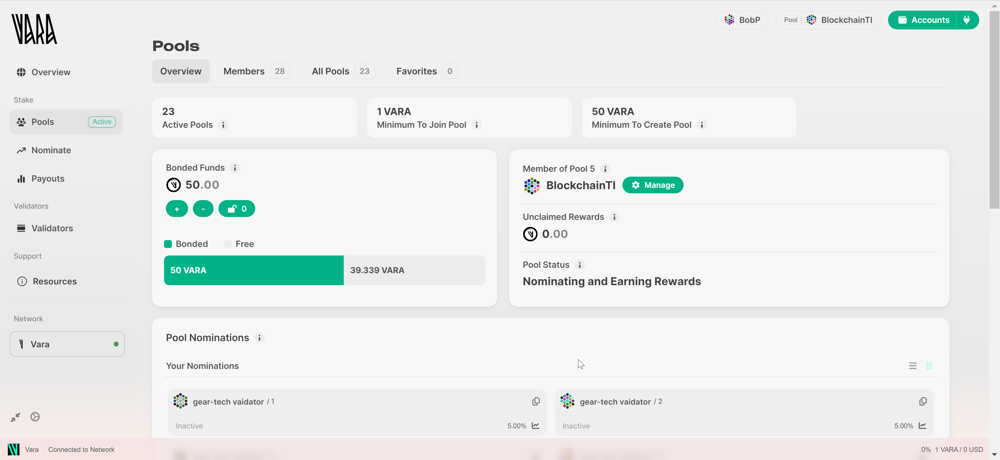

:::note
Pool staking rewards are not claimed automatically by default. You have to periodically check for available rewards and claim them.
:::

#### Via Polkadot.js app using SubWallet browser as an example

1. If you have some VARA tokens in your account in the SubWallet mobile application, click **[this link](https://mobile.subwallet.app/browser?url=https%3A%2F%2Fslink.subwallet.app%2Fpolkadot-vara)** to open the Polkadot.js application directly in the wallet's browser.

2. Select the `Network` drop-down, and then click `Staking`:

3. Choose `Pools`, navigate to `All pools`, select any desired pool, and click `Join`:

4. Specify your account and the amount of VARA you wish to stake:

5. Review the transaction details and click `Sign and Submit`:

6. Approve the transaction by signing in to the Wallet application:

7. Your nominations will take effect in the next era.

    You can check your stake at `Pools - Own pools` as well as `Accounts - Pooled`:

:::note
This instruction is also valid for using this app on Laptop/Desktop devices via **[this link](https://polkadot.js.org/apps/?rpc=wss://rpc.vara.network#/staking/pools)**.
:::

## Rewards and Withdrawals

[Payouts](https://staking.vara.network/#/payouts) represent staking rewards on Vara and depend on the accumulation of 'Era Points' by your nominated validators over time. These rewards are determined at the end of each Era, which spans 12-hour periods.

### Direct Nomination Rewards

To claim staking rewards, a Payout needs to be requested (Claimed). Any nominator supporting the relevant validator can initiate this request. **One request** triggers the reward payout for **all nominators**. Consequently, for most nominators, payouts are received **automatically**.

As per the user's staking options, rewards will either automatically bond with the current bond or can be sent to the stash, controller, or an external account.

The [Nominate](https://staking.vara.network/#/nominate) section of the Vara Staking Portal provides an overview of Bonded Funds and Nominator Status. Additionally, it offers a `Claim` option for available Pending Payouts.

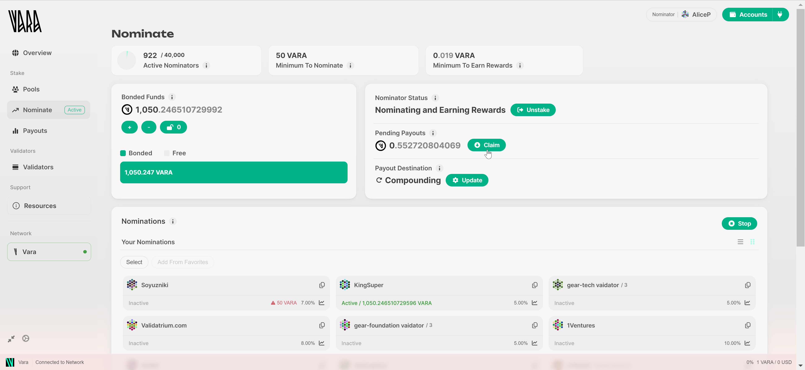

Depending on the interface used for staking, the available options may vary.

### Pool Nomination Rewards

Unlike direct nominators, [Pool](https://staking.vara.network/#/pools) members are required to **manually claim** their rewards.

Users have two choices for claiming rewards:

- Reinvest them into the pool (`Compound`), increasing the pool share and accumulating further rewards.
- `Withdraw` them from the pool to the user's account as free (transferable) VARA.

:::note
To perform transactions (such as claiming, withdrawing, unlocking, and others), having a small amount of free VARA tokens in your balance is necessary to cover gas fees. If the balance is insufficient to cover these fees, transactions will not be possible until the balance is replenished.
:::

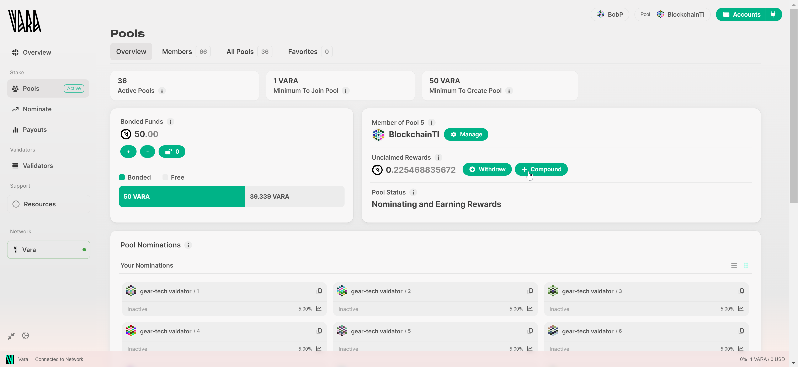

### Unstaking

When users require their tokens to be transferable, they must unstake them first.

- For direct nominators, click the `Unstake` button in the [Nominate](https://staking.vara.network/#/nominate) section.
- As a [Pool](https://staking.vara.network/#/pools) member, click `Manage` and then select the `Leave pool` option. Your funds will be unbonded, and your account will exit the nomination pool.

Once unbonded, users' funds will be unlocked **after 7 days**. Users must click the `padlock` icon to withdraw their funds to their wallet.
