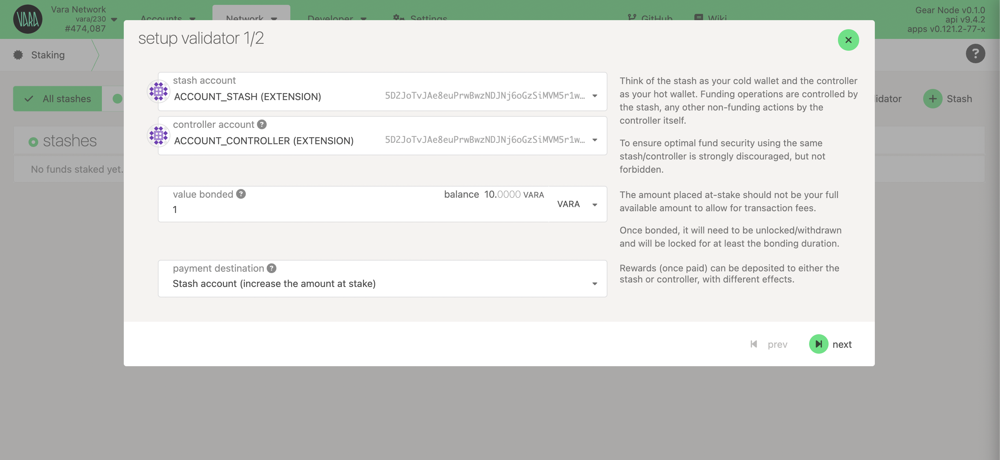
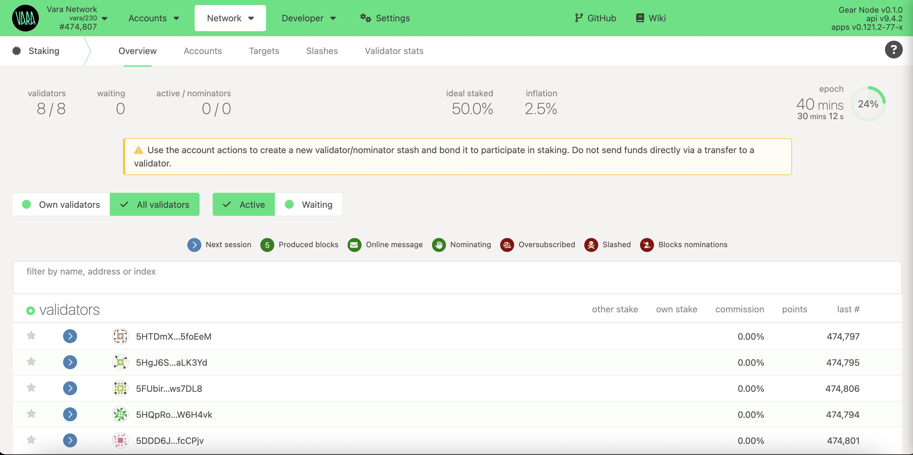

import Tabs from '@theme/Tabs';
import TabItem from '@theme/TabItem';
import CodeBlock from '@theme/CodeBlock';

Validators are essential contributors to a successful blockchain network. When chosen to be part of a `validator set`, they help produce blocks and receive rewards for their contributions to the platform.

Holding such responsibility requires careful commitment from each validator because of personal and nominator stakes that may be at risk; however, working as a network validator is also highly rewarding!

Check out the [Vara Validators Dashboard](https://validators.vara.network/) that provides statistical information about the existing validators, including their status, installed node version, hardware details, staking info, slashing history, and more.

## Hardware Requirements

:::info
Beginners can start their validator setup on Linux-based cloud servers. Select the VPS provider that best meets the requirements below to maximize performance and run securely.
:::

- `OS:` Ubuntu 22.04+ (or any distribution with GLIBC 2.35+)
- `CPU:` 2vCPUs @ 3.4GHz (Intel Ice Lake or equivalent)
- `Memory:` 8GB RAM
- `Storage:` minimum 80GB SSD storage. Should be increased as the blockchain grows.

## Initial Set Up

### Install Vara Node

Download the latest stable release of the `gear` node from the builds repo and unpack (choose the binary according to your host operating system):

````mdx-code-block
<Tabs>
<TabItem value="linux" label="Linux x64" className="unique-tabs" default>

Terminal:

```bash
curl https://get.gear.rs/gear-v1.9.2-x86_64-unknown-linux-gnu.tar.xz | tar xJ
```

or

**Linux x64**: [gear-v1.9.2-x86_64-unknown-linux-gnu.tar.xz](https://get.gear.rs/gear-v1.9.2-x86_64-unknown-linux-gnu.tar.xz)

Run the node:

```
❯ ./gear --version
gear 1.9.2-5ef221109b8
```

</TabItem>
<TabItem value="mac-arm" label="macOS ARM">

Terminal:

```bash
curl https://get.gear.rs/gear-v1.9.2-aarch64-apple-darwin.tar.xz | tar xJ
```

or

**macOS ARM**: [gear-v1.9.2-aarch64-apple-darwin.tar.xz](https://get.gear.rs/gear-v1.9.2-aarch64-apple-darwin.tar.xz)

Run the node:

```
❯ ./gear --version
gear 1.9.2-5ef221109b8
```

</TabItem>
<TabItem value="mac-intel" label="macOS x64">

Terminal:

```bash
curl https://get.gear.rs/gear-v1.9.2-x86_64-apple-darwin.tar.xz | tar xJ
```

or

**macOS Intel x64**: [gear-v1.9.2-x86_64-apple-darwin.tar.xz](https://get.gear.rs/gear-v1.9.2-x86_64-apple-darwin.tar.xz)

Run the node:

```
❯ ./gear --version
gear 1.9.2-5ef221109b8
```

</TabItem>
</Tabs>
````

### Generate a node key

Generate a unique libp2p secret key at the default path, which determines the Peer ID of the node in the p2p network.

```bash
gear key generate-node-key --default-base-path --chain vara
```

Running the command won't overwrite existing keys. If no existing key is found, it will print the path to the generated secret key along with the Peer ID. Example:

```
Generating key in "$HOME/.local/share/gear/chains/vara_network/network/secret_ed25519"
12D3KooWFmqMyz4fNHcm9X38rvZsSQ8RMt4K4vsWU7EJEiGZSkFz
```

You only need to back up the secret key if you want to preserve the Peer ID during migration. Never reuse the same key across nodes, as each node requires a unique Peer ID.

### Run Vara Node as a Service

Copy the `gear` executable to the `/usr/bin` directory:

```bash
sudo cp gear /usr/bin
```

To run the Vara node as one of the Linux services, you need to configure the systemd file:

```bash
cd /etc/systemd/system
sudo nano vara-node.service
```

Configure and save:

```bash
[Unit]
Description=Vara Node
After=network.target

[Service]
Type=simple
User=root
Group=root

ExecStart=/usr/bin/gear \
    --chain vara  \
    --rpc-cors all \
    --name "VALIDATOR_NAME" \
    --telemetry-url "wss://telemetry.rs/submit 1" \
    --validator
Restart=always
RestartSec=3
LimitNOFILE=10000

[Install]
WantedBy=multi-user.target
```

:::note
Declaration `ExecStart` points to the location of the `gear` binary file. In this case, it is in `/usr/bin` directory.
The example is configured to run the service from the `root` user.
:::

Save & Exit.
That’s it. Now we can start the service.

```sh
sudo systemctl start vara-node.service
```

### Syncing the Blockchain

If you follow all the instructions, the node will require time to synchronize with the blockchain.
To check the service status in real time use:

```sh
sudo journalctl --follow -u vara-node.service
```

You can also see your running node in telemetry portal: https://telemetry.rs

## Create Stash and Controller Accounts

Create two accounts: Stash and Controller, for security reasons. Ensure each of them has enough funds to pay the transaction fee. Store most of the funds on the Stash accounts, which are the optimal location for saving staking funds safely and securely.

Use the prompt to generate a new seed phrase:

```sh
./gear key generate --network vara
```

:::note
Save both seed phrases in a secure place. Skip the previous step if you intend to use your seed phrase. If you want to use your seed phrase, skip this step. You can use [Polkadot.\{js\}](https://polkadot.js.org/apps/#/accounts) or [Polkadot extension](https://polkadot.js.org/extension/)
:::

## Get Session Keys

You need to tell the chain your Session keys. If you are on a remote server, it is easier to run this command on the same machine (while the node is running with the default HTTP RPC port configured):

```sh
curl -H "Content-Type: application/json" -d '{"id":1, "jsonrpc":"2.0", "method": "author_rotateKeys", "params":[]}' http://localhost:9944
```

Output:

```
{“jsonrpc”:”2.0",”result”:”0x5e977ddcc0c69a6aed067052d5bd8f6bd365fae03562fd447d434e9814ac415d7c9ffe722364922bda314e44654f5c0cdc00d152470d5433f12cb73d078061863ac769d5f17b5460f042d221edf0099d2ce4c23edbe96ac943452cc4d3ad6d72”,”id”:1}
```

The output will have a hex-encoded `result` field. Copy and save it!

## Setup Validator

Once your node is live, synchronized, and appears in telemetry, and session keys are prepared, it's time to set up the validator.

Go to Polkadot.\{js\} app and navigate to Network → Staking → [Account actions](https://polkadot.js.org/apps/?rpc=wss%3A%2F%2Frpc.vara.network#/staking/actions) section and click `+Validator`:

Choose your stash and controller accounts and specify your stake amount. It's recommended to utilize distinct accounts both stash and controller.

:::info
The minimum self-stake required to become an active Validator is currently 100_000 VARA, but it is subject to change over time.
:::



Set the `session key` and reward commission.


Sign the transaction. Ensure you're added to the stash account and wait for the next Era to start. Once it begins, the network will add your validator.



## Update Validator

Regularly updating your validator is critical for keeping up with current maintenance requirements.

The fastest and simplest way to update the validator:

1. Download the latest binary version
2. Swap binaries
3. Restart your service

```sh
sudo systemctl start vara-node.service
```

👏👏👏 Congratulations! You’ve successfully set up your validator node. 👏👏👏 If you encounter challenges or need help — reach out in the [Validators Chat](https://discord.com/channels/891063355526217738/1014177678473035777)!

## Using Snapshots to Speed Up Node Sync

When initializing your Vara validator node, syncing from the genesis block can be slow — especially on machines with limited I/O or bandwidth. To accelerate the setup, Vara provides regularly updated **[snapshots](https://snapshots.vara.network)** of the blockchain state.

Snapshots allow your node to start from a recent block instead of syncing the entire history, reducing setup time from hours to minutes.

### 📦 Steps to Use a Snapshot

1. **Stop the node** (if already running).
2. **Download and extract the latest snapshot**:
```bash
curl -o - -L https://snapshots.vara-network.io/vara-mainnet-latest.tar.lz4
  | lz4 -c -d -
  | tar -x -C /home/ubuntu/gear-data/chains/vara_network/db
```
3. **Restart your node**:
```bash
gear --chain vara --base-path /home/ubuntu/gear-data/ --database rocksdb --pruning 256
```

📌 Note: Always use snapshots from the official Vara source to ensure trust and integrity: https://snapshots.vara.network.