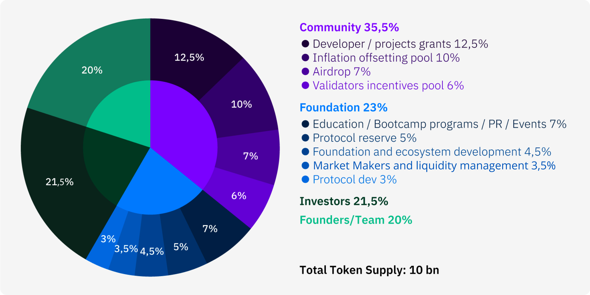

# VARA Token Utility & Crypto Economics

This article covers Vara Network's crypto-economics, highlighting key components, features, and the core utility of VARA. It also discusses measures taken to balance incentives and ensure ecosystem stability.

A visualization of network tokenomics is available on the [Vara website](https://vara.network/tokenomics).

## VARA Utility & Token Distribution

**Total Token Supply: 10 Billions VARA**

The vesting periods for the initial mint of VARA tokens are as follows:

- **Founders/Team/Advisors** - Fully locked for 12 months, then 36 months linear vesting (no lump-sum unlock).
- **Investors** - Fully locked for 12 months, then 12 months linear vesting (no lump-sum unlock).

VARA tokens maintain core utility features required for the network to operate: **transaction fees**, **staking** and network security, and **governance**. 

All transfers of the gas token or interactions with smart contracts on the network require VARA, including developers deploying smart contracts. Developers can also pre-fund their smart contracts with gas for future execution using Gas Pools. This enables one of Vara Network’s exciting features — **self-executing smart contracts**.

VARA tokens also play a crucial role in the consensus model of the Vara Network, where token holders help contribute to network security by staking their VARA tokens in exchange for a portion of the block reward. 

Incentives on the Vara Network have been carefully aligned to encourage the continued engagement of participants and support decentralization. Typically, most protocols award the entire network rewards (block rewards, tx fees, etc.) to the nodes who were selected to produce the latest block, with some protocols diverting a portion of these funds to a protocol treasury. This model is straightforward, reliable, and battle-tested. However, there is potential room to unlock additional token utility for growing decentralized ecosystems and create value for all stakeholders; Contributors to the Gear protocol are exploring the mechanics of how to distribute a portion of block rewards directly toward dApp developers in order to incentivize the creation of world-class dApps on the network. Subject to a governance decision, an automatic or semi-automatic rewards distribution program could be employed, where, for example, a part of block rewards and/or the tx fees go to the dApp developers, or optionally to stakers who support those dApps. 

With this model, a portion of VARA block rewards and/or the transaction fees in each block or epoch would go directly to dApp developers. The size of this reward could be based on several possible on-chain and off-chain metrics, like transaction volume, user activity, total gas spend, and total value locked. These rewards could also be allocated to dApps to, for example, fund their own gas pool used to subsidize transaction fees for end-users.
Rewarding developers is an important principle that may ultimately help build a stronger ecosystem for all participants — however, it is crucial that any new reward mechanism be thoroughly tested. Therefore, there are different implementations of automated developer reward systems (as well as mechanics of developer contribution validation ) that might be considered by contributors to the Vara Network for maximum security and efficiency. Final mechanics are subject to governance voting before being rolled out in several phases. 

According to initial research, by including developers and dApps within the network’s core incentive and rewards mechanisms, Vara Network could:
- Enable transparent rewards for developer's efforts in building and deploying dApps.
- Provide additional resources for developers and an opportunity for projects to bootstrap their projects’ own continued development by increasing user activity.
- Support the flexibility for dApps to use the rewards however they see fit to benefit their users and ecosystem (For example, by using them for developer incentives, community airdrops, or staking these funds to help operate a dedicated node, etc.) This allows for new business models, as well as adding extra points of engagement for dApps and their target audience.
- Create a capture and distribution flywheel for VARA token consumption, and could also stimulate base protocol token accumulation within the hands of stakeholders who are inherently interested in base network development.

Community members participating in the Vara Network will have the opportunity to vote on the exact implementation for developer incentives.

## VARA Inflation and Anti-inflation Mechanics

Excessive inflation is one of the most criticized features of Layer 1/Layer 2 projects due to the impact it can have on financial sustainability and the community. Overly high inflation for a protocol’s token may cause: 
- A concentration of token ownership, i.e. the accumulation of large shares of supply by team members and early community backers by staking their locked allocations
- Excessive token liquidation pressure
- Rising ecosystem rates, forcing dApps to over-inflate incentive programs

These factors become even more critical when market conditions are subject to increased turbulence, thus less liquidity and demand.

Vara is designed such that protocol rewards would not affect network decentralization or concentration through periods of changes in liquidity. At the same time, the protocol must sufficiently reward stakers for contributing to network security. To achieve this, several mechanics were implemented to offset inflationary pressure and protect the development of the protocol and VARA token:

1. The maximum inflation rate for year 1 is 6.00%. VARA has been designed with a decreasing inflation rate in mind. Below is a sample inflation rate schedule, however, the exact rates will be determined by governance voting:

    |Year since genesis|Inflation rate|
    |---|---|
    |Year 1|6.00%|
    |Year 2|5.50%|
    |Year 3|5.00%|
    |Year 4|4.75%|
    |Year 5 - onwards|gradual decrease to the minimum level of 3-4%|

2. **Limit the amount of stakeable tokens to decrease the annual inflation rate.**
Team and investor locked tokens are not stakeable until they are vested (this helps by reducing the potential inflation by more than 50% in the first 12 months and, more importantly, protecting against any increase in the centralization of token ownership)

3. An Inflation Offsetting Pool to **reduce TTS Inflation to 0% for the first 24+ months**. 10% of Total Token Supply (TTS) is allocated to a separate pool **(the Inflation Offsetting Pool)** to offset the increase of TTS caused by token emission from block rewards. Tokens from this pool are set to be automatically sent to a zero address (or “burned”) proportionally to the number of minted inflationary tokens. This will remain in effect unless otherwise allocated by the community for other resource building initiatives (e.g. for **developer grants/rewards pool**), as voted upon and changed by the community.
    
    About ⅓  of the Foundation’s staking rewards will replenish the Inflation Offsetting Pool, with the remaining 2/3 going to fund Foundation operations and further protocol initiatives and development. Staking rewards received by Developer grants and Education/Bootcamp programs/PR/Events pools are going to fund the respective pools activities.

4. **Provide in-market staking** incentives over time as the market continues to mature.
    The Vara Network maintains the Ideal Staking Rate by incentivizing or disincentivizing staking. Any downside divergence from the ideal staking rate will result in a higher ROI for stakers, providing a greater incentive to stake until the ideal stake rate has been achieved. Inversely, a staking rate higher than the ideal staking rate would yield a diluted return for stakers, encouraging token holders to unstake.

    **The Ideal Staking Rate on Vara is 85%**. Based on preliminary research provided by community enthusiasts and observations of the other L1/L2 protocols, we expect the Ideal Staking Rate to decrease 75% within 12 months since the PoS launch (subject to governance voting)  before settling around 50-67%. This would allow the protocol to align the staking rate and inflation levels with the maturing circulating supply. 

These measures have the capacity to allow for maintenance of the same total token supply within the next 24+ months and, with the entire ecosystem in a more mature development stage, maintain an inflation rate in the low single-digits thereafter. 

To encourage system flexibility, the community could choose to initiate a governance proposal to decide whether:

- The Inflation Offsetting Pool allocation should be kept in full to continue offsetting TTS inflation, 
- or 25-100% of this allocation should be moved to the developer grants pool

In addition, the DAO will also decide on switching to the treasury fueling model where up to 10% of the total block rewards go to the protocol treasury in order to fuel further protocol development.

Based on early research, the ideal time to implement these changes would be roughly 12-24 months from genesis. The implementation will be determined by the community via governance vote.

## Block Reward Curve, Staking Rate, and ROI Models

Vara was designed with a decreasing annual inflation model in mind, instead of a flat predetermined inflation rate. This may be implemented by governance vote and aims to prevent an excess of tokens being minted that would be out of line with ecosystem growth, mitigating inflation and preventing token holders from becoming unnecessarily diluted.

Staking ROI is driven by both the staking rate (the percentage of stakeable tokens staked) and the block rewards curve. The block rewards curve effectively represents the total protocol inflation with hardcoded Minimum Inflation (constant = 1%) and Maximum inflation. The Maximum Inflation level decreases (see above) as the Network and the Ecosystem mature. 

Vara uses [Polkadot’s standard inflation model](https://wiki.polkadot.network/docs/learn-inflation) to calculate the distribution of block rewards, with several key modifications: 

1. **Staking rate:**

    :::info
    Staking Rate = number of tokens staked / number of stakeable tokens
    
    Number of stakeable tokens = TTS - Locked Team tokens - Locked Investors tokens  - Inflation offsetting pool tokens
    :::

    At Genesis the stakeable tokens amount to 48.5% of TTS. This initially allows the protocol to have 51.5% less inflation while providing competitive market rates for staking ROI. While tokens are getting unlocked and/or expended, the number of stakeable tokens trends towards the TTS. 

    The proven and battle-tested block reward curve and ROI model implemented by Polkadot also supports the Vara network to incentivize token holders to maintain the Ideal Staking Rate.

    Within the first 24 months, the Ideal Staking Rate will be decreased from 85% to 50-67% level (subject to governance voting as mentioned above), in line with token vesting unlocks and depending on the Foundation’s spending schedules/overall ecosystem development.

2. **Variable inflation rate**

    Effective inflation of total token supply is a variable, not a constant, in the developed model. To calculate the total amount of tokens issued as block rewards, each block uses the block rewards curve instead of a fixed percentage. This is a divergence from Polkadot’s model, where a fixed inflation rate is minted before being divided between stakers and the Foundation treasury. 

    Instead, the network mints only the number of tokens actually required to reward participation by validators in the network. In this model, Polkadot’s inflation model is used to determine the actual number of tokens minted, by aligning this with the Staking ratio. Another difference from the Polkadot model is the staking ROI cap: in case the staking ratio is significantly lower than the Ideal Staking Rate and ROI increases above a certain level, the surplus ROI surplus will be distributed to the treasury.

    This enables Vara to issue only the amount of new tokens required to reward the percentage of stakeable tokens that were staked, so that the absolute inflation level is aligned with the participation of token holders staking to the network.

3. **Block rewards curve**

    - To form the Block rewards curve, the following rates are used: 
    - The minimum inflation rate: constant  1% each year in case Staking rate = 0% 
    - The maximum Inflation rate, which is constant for 12 months. 
    - The max inflation rate will then be decreased as the network and the ecosystem mature (subject to governance vote as described above). 
    - From Minimum to Maximum inflation rates (i.e from 0% tokens staked to Ideal Staking Rate), the Block rewards curve grows gradually according to a linear equation (as in the standard Polkadot model).
    - In case the % of tokens staked > Ideal Staking Rate, the curve decreases to the Minimum inflation level according to a hyperbolic equation (as in the standard Polkadot model).

The staking ROI curve is driven by the block rewards curve and % of tokens staked: Block rewards curve / % of stakeable tokens staked. It decreases hyperbolically until the Ideal Staking Rate is reached and then falls hyperbolically in case % of the tokens staked increases beyond the Ideal Staking Rate.

A maximum ROI of 30% has been implemented - if the staking rate falls below the Ideal Staking Rate, stakers receive a higher ROI than they would at the Ideal Staking Rate. Any staking rewards surplus on top of the 30% ROI cap goes to the Vara treasury.
