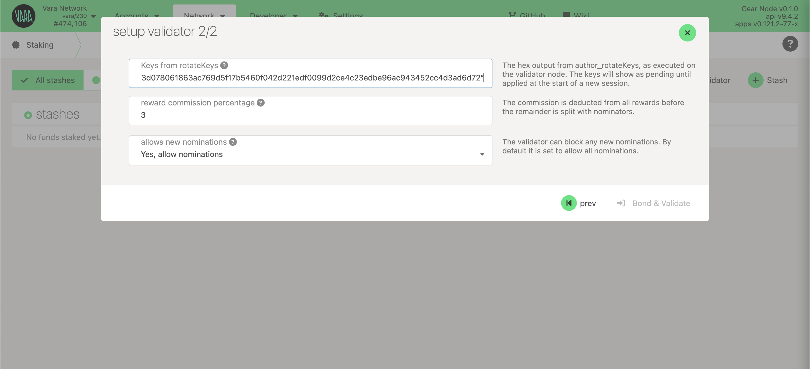

import Tabs from '@theme/Tabs';
import TabItem from '@theme/TabItem';
import CodeBlock from '@theme/CodeBlock';

Validators are special network participants who, if selected in an active `validator set`, produce blocks for the chain. Validators receive a reward for their bets.

Running a validator on a live network is a responsible role. The validators are responsible not only for their own stake, but also for the stake of their current nominators. Nevertheless, this is an important role that is also well rewarded.

## Hardware requirements

:::info
The most common way for a beginner to run a validator is on a cloud server running Linux. To do this, choose whatever VPS provider corresponds to the characteristics below.
:::

- `OS:` Ubuntu 20.04 or later, Amazon Linux 2 or later
- `CPU:` 4vCPUs @ 3.4GHz; (it coud be Intel Ice Lake, Xeon or Core series, even AMD Zen3)
- `Memory:` 16GB RAM
- `Storage:` minimum 160GB SSD storage. Should be increased as the blockchain grows.

## Initial Set Up

### Install Vara Node

Download `gear` node from the nightly builds repo and unpack (choose the binary according to your host operating system):

````mdx-code-block
<Tabs>
<TabItem value="win64" label="Windows x64" className="unique-tabs" default>

Terminal:

```bash
curl -O https://get.gear.rs/gear-nightly-windows-x86_64.zip
```

or

**Windows x64**: [gear-nightly-windows-x86_64.zip](https://get.gear.rs/gear-nightly-windows-x86_64.zip)

Unzip the downloaded package then you can try to run the node:

```
❯ gear.exe --version
gear.exe 0.1.3-dda96e01adf
```

</TabItem>
<TabItem value="mac-arm" label="MacOS ARM">

Terminal:

```bash
wget https://get.gear.rs/gear-nightly-macos-m.tar.gz && \
tar xvf gear-nightly-macos-m.tar.gz && \
rm gear-nightly-macos-m.tar.gz && \
chmod +x gear
```

or

**macOS M1/M2**: [gear-nightly-macos-m.tar.gz](https://get.gear.rs/gear-nightly-macos-m.tar.gz)

You can try to run the node:

```
❯ ./gear --version
gear 0.1.3-dda96e01adf
```

</TabItem>
<TabItem value="mac-intel" label="MacOS x64">

Terminal:

```bash
wget https://get.gear.rs/gear-nightly-macos-x86_64.tar.gz && \
tar xvf gear-nightly-macos-x86_64.tar.gz && \
rm gear-nightly-macos-x86_64.tar.gz && \
chmod +x gear
```

or

**macOS Intel x64**: [gear-nightly-macos-x86_64.tar.gz](https://get.gear.rs/gear-nightly-macos-x86_64.tar.gz)

You can try to run the node:

```
❯ ./gear --version
gear 0.1.3-dda96e01adf
```

</TabItem>

<TabItem value="linux" label="Linux x64">

Terminal:

```bash
wget https://get.gear.rs/gear-nightly-linux-x86_64.tar.xz && \
tar xvf gear-nightly-linux-x86_64.tar.xz && \
rm gear-nightly-linux-x86_64.tar.xz && \
chmod +x gear
```

or

**Linux x64**: [gear-nightly-linux-x86_64.tar.xz](https://get.gear.rs/gear-nightly-linux-x86_64.tar.xz)

You can try to run the node:

```
❯ ./gear --version
gear 0.1.3-dda96e01adf
```

</TabItem>
</Tabs>
````

### Run Vara node as service

Copy the `gear` executable to the `/usr/bin` directory:

```bash
sudo cp gear /usr/bin
```

To run the Gear node as one of the Linux services, you need to configure the systemd file:

```bash
cd /etc/systemd/system
sudo nano vara-node.service
```

Configure and save:

```bash
Description=Vara Node
After=network.target

[Service]
Type=simple
User=root
Group=root

ExecStart=/usr/bin/gear \
    --chain vara  \
    --rpc-cors all \
    --name "VALIDATOR_NAME" \
    --port 30333 \
    --rpc-port 9933 \
    --ws-port 9944 \
    --telemetry-url "wss://telemetry.rs/submit 0" \
    --validator
Restart=always
RestartSec=3
LimitNOFILE=10000

[Install]
WantedBy=multi-user.target
```

:::note
Declaration `ExecStart` points to the location of the `gear` binary file. In this case, it is in `/usr/bin` directory.
The example is configured to run the service from the `root` user.
:::

Save & Exit.
That’s it. Now we can start the service.

```sh
sudo systemctl start vara-node.service
```

### Syncing the Blockchain

If you do everything correctly, the node will need some time to synchronize with the blockchain.
To check the service status in realtime use:

```sh
sudo journalctl --follow -u vara-node.service
```

You can also see your running node in telemetry portal: https://telemetry.rs

## Create Stash and Controller accounts

For security reasons, we recommend creating two separate accounts: `Stash` and `Controller`. It's important to make sure that each of them has enough funds to pay the transaction fee. Most of the funds should be stored on the stash account since it's meant to store staking funds.

To generate new seed phrase:

```sh
./gear key generate --network vara
```

:::note
Both seed phrases should be carefully saved in a secure place. If you want to use your own seed phrase, you can skip the previous step. Also you can use [Polkadot.{js}](https://polkadot.js.org/apps/#/accounts) or [Polkadot extension](https://polkadot.js.org/extension/)
:::

## Get session keys

You need to tell the chain your Session keys. If you are on a remote server, it is easier to run this command on the same machine (while the node is running with the default HTTP RPC port configured):

```sh
curl -H "Content-Type: application/json" -d '{"id":1, "jsonrpc":"2.0", "method": "author_rotateKeys", "params":[]}' http://localhost:9933
```

Output:

```
{“jsonrpc”:”2.0",”result”:”0x5e977ddcc0c69a6aed067052d5bd8f6bd365fae03562fd447d434e9814ac415d7c9ffe722364922bda314e44654f5c0cdc00d152470d5433f12cb73d078061863ac769d5f17b5460f042d221edf0099d2ce4c23edbe96ac943452cc4d3ad6d72”,”id”:1}
```

The output will have a hex-encoded `result` field. Copy and save it!

## Setup Validator

If your node is live and synchronized, appears in telemetry, and session keys are prepared it's time to set up the validator.

Go to Polkadot.{js} app and navigate to Network → Staking → [Account actions](https://polkadot.js.org/apps/?rpc=wss%3A%2F%2Fvara.gear.rs#/staking/actions) section and click `+Validator`:

Select stash and controller account and specify the amount of own stake. It's recommended to use different accounts for stash and controller.

:::info
How much VARA do I need to become a Validator? Now the minimum amount of own stake to be selected equals **1 VARA**. Anyhow the minimum stake that is necessary to be elected as an active validator is dynamic and can change over time.
:::


Set the `session key` and reward commission.



And sign the transaction. Make sure that you have been added to the stash account and wait for the next Era.
When the next Era starts, your validator will be added.


## Update Validator

Updating one’s validator is an important maintenance requirement. You cannot skip it or forget.

The fastest and simplest way to update the validator:

1. Download the latest binary version
2. Swap binaries
3. Restart your service

```sh
sudo systemctl start vara-node.service
```

👏👏👏 Gongratulations! 👏👏👏
If you need help — reach out in the [Validators Chat](https://discord.com/channels/891063355526217738/1014177678473035777)!
