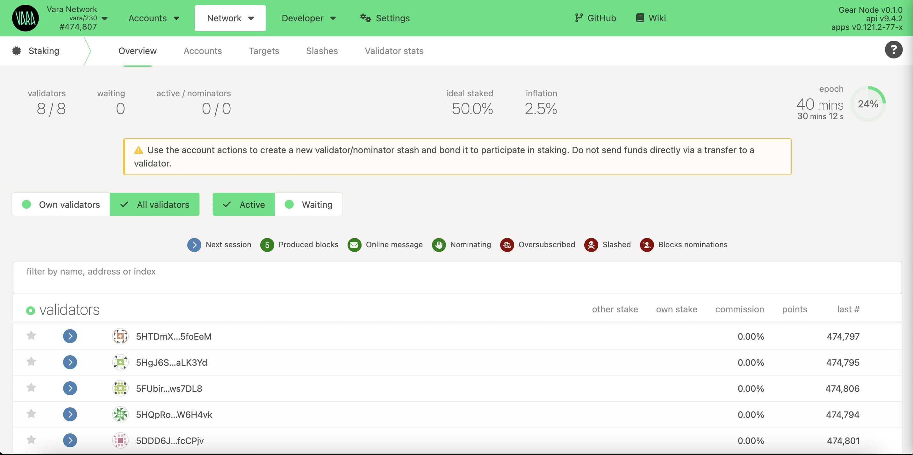

import Tabs from '@theme/Tabs';
import TabItem from '@theme/TabItem';
import CodeBlock from '@theme/CodeBlock';

Validators are essential contributors to a successful blockchain network. When chosen to be part of a `validator set`, they help produce blocks and receive rewards for their investments in the platform.

Holding such responsibility requires careful commitment from each validator because of personal and nominator stakes that may be at risk; however, working as a network validator is also highly rewarding!

## Hardware requirements

:::info
Beginners can start their validator setup on Linux-based cloud servers. Select the VPS provider that best meets the requirements below to maximize performance and run securely.
:::

- `OS:` Ubuntu 20.04 or later, Amazon Linux 2 or later
- `CPU:` 4vCPUs @ 3.4GHz; (it coud be Intel Ice Lake, Xeon or Core series, even AMD Zen3)
- `Memory:` 16GB RAM
- `Storage:` minimum 160GB SSD storage. Should be increased as the blockchain grows.

## Initial Set Up

### Install Vara Node

Download `gear` node from the nightly builds repo and unpack (choose the binary according to your host operating system):

````mdx-code-block
<Tabs>
<TabItem value="win64" label="Windows x64" className="unique-tabs" default>

Terminal:

```bash
curl -O https://get.gear.rs/gear-nightly-windows-x86_64.zip
```

or

**Windows x64**: [gear-nightly-windows-x86_64.zip](https://get.gear.rs/gear-nightly-windows-x86_64.zip)

Unzip the downloaded package then you can try to run the node:

```
❯ gear.exe --version
gear.exe 0.1.3-dda96e01adf
```

</TabItem>
<TabItem value="mac-arm" label="MacOS ARM">

Terminal:

```bash
wget https://get.gear.rs/gear-nightly-macos-m.tar.gz && \
tar xvf gear-nightly-macos-m.tar.gz && \
rm gear-nightly-macos-m.tar.gz && \
chmod +x gear
```

or

**macOS M1/M2**: [gear-nightly-macos-m.tar.gz](https://get.gear.rs/gear-nightly-macos-m.tar.gz)

You can try to run the node:

```
❯ ./gear --version
gear 0.1.3-dda96e01adf
```

</TabItem>
<TabItem value="mac-intel" label="MacOS x64">

Terminal:

```bash
wget https://get.gear.rs/gear-nightly-macos-x86_64.tar.gz && \
tar xvf gear-nightly-macos-x86_64.tar.gz && \
rm gear-nightly-macos-x86_64.tar.gz && \
chmod +x gear
```

or

**macOS Intel x64**: [gear-nightly-macos-x86_64.tar.gz](https://get.gear.rs/gear-nightly-macos-x86_64.tar.gz)

You can try to run the node:

```
❯ ./gear --version
gear 0.1.3-dda96e01adf
```

</TabItem>

<TabItem value="linux" label="Linux x64">

Terminal:

```bash
wget https://get.gear.rs/gear-nightly-linux-x86_64.tar.xz && \
tar xvf gear-nightly-linux-x86_64.tar.xz && \
rm gear-nightly-linux-x86_64.tar.xz && \
chmod +x gear
```

or

**Linux x64**: [gear-nightly-linux-x86_64.tar.xz](https://get.gear.rs/gear-nightly-linux-x86_64.tar.xz)

You can try to run the node:

```
❯ ./gear --version
gear 0.1.3-dda96e01adf
```

</TabItem>
</Tabs>
````

### Run Vara node as service

Copy the `gear` executable to the `/usr/bin` directory:

```bash
sudo cp gear /usr/bin
```

To run the Gear node as one of the Linux services, you need to configure the systemd file:

```bash
cd /etc/systemd/system
sudo nano vara-node.service
```

Configure and save:

```bash
Description=Vara Node
After=network.target

[Service]
Type=simple
User=root
Group=root

ExecStart=/usr/bin/gear \
    --chain vara  \
    --rpc-cors all \
    --name "VALIDATOR_NAME" \
    --telemetry-url "wss://telemetry.rs/submit 0" \
    --validator
Restart=always
RestartSec=3
LimitNOFILE=10000

[Install]
WantedBy=multi-user.target
```

:::note
Declaration `ExecStart` points to the location of the `gear` binary file. In this case, it is in `/usr/bin` directory.
The example is configured to run the service from the `root` user.
:::

Save & Exit.
That’s it. Now we can start the service.

```sh
sudo systemctl start vara-node.service
```

### Syncing the Blockchain

If you follow all the instructions, the node will require time to synchronize with the blockchain.
To check the service status in real time use:

```sh
sudo journalctl --follow -u vara-node.service
```

You can also see your running node in telemetry portal: https://telemetry.rs

## Create Stash and Controller accounts

We recommend creating two accounts: Stash and Controller, for security reasons. Ensure each of them has enough funds to pay the transaction fee. Store most of the funds on the Stash accounts, which are the optimal location for saving staking funds safely and securely.

Use the prompt to generate a new seed phrase:

```sh
./gear key generate --network vara
```

:::note
Save both seed phrases in a secure place. Skip the previous step if you intend to use your seed phrase. If you want to use your seed phrase, skip this step. You can use [Polkadot.{js}](https://polkadot.js.org/apps/#/accounts) or [Polkadot extension](https://polkadot.js.org/extension/)
:::

## Get session keys

You need to tell the chain your Session keys. If you are on a remote server, it is easier to run this command on the same machine (while the node is running with the default HTTP RPC port configured):

```sh
curl -H "Content-Type: application/json" -d '{"id":1, "jsonrpc":"2.0", "method": "author_rotateKeys", "params":[]}' http://localhost:9933
```

Output:

```
{“jsonrpc”:”2.0",”result”:”0x5e977ddcc0c69a6aed067052d5bd8f6bd365fae03562fd447d434e9814ac415d7c9ffe722364922bda314e44654f5c0cdc00d152470d5433f12cb73d078061863ac769d5f17b5460f042d221edf0099d2ce4c23edbe96ac943452cc4d3ad6d72”,”id”:1}
```

The output will have a hex-encoded `result` field. Copy and save it!

## Setup Validator

Once your node is live, synchronized, and appears in telemetry, and session keys are prepared, it's time to set up the validator.

Go to Polkadot.{js} app and navigate to Network → Staking → [Account actions](https://polkadot.js.org/apps/?rpc=wss%3A%2F%2Fvara.gear.rs#/staking/actions) section and click `+Validator`:

Choose your stash and controller accounts and specify your stake amount. It's recommended to utilize distinct accounts both stash and controller.

:::info
The minimum stake required to become an active Validator is currently **_ 1 VARA _**, but it is subject to change over time.
:::


Set the `session key` and reward commission.


Sign the transaction. Ensure you're added to the stash account and wait for the next Era to start. Once it begins, the network will add your validator.



## Update Validator

Regularly updating your validator is critical for keeping up with current maintenance requirements.

The fastest and simplest way to update the validator:

1. Download the latest binary version
2. Swap binaries
3. Restart your service

```sh
sudo systemctl start vara-node.service
```

👏👏👏 Congratulations! You’ve successfully set up your validator node. 👏👏👏 If you encounter challenges or need help — reach out in the [Validators Chat](https://discord.com/channels/891063355526217738/1014177678473035777)!
